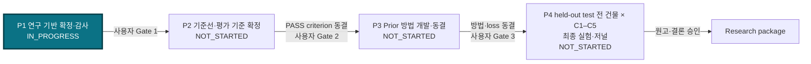
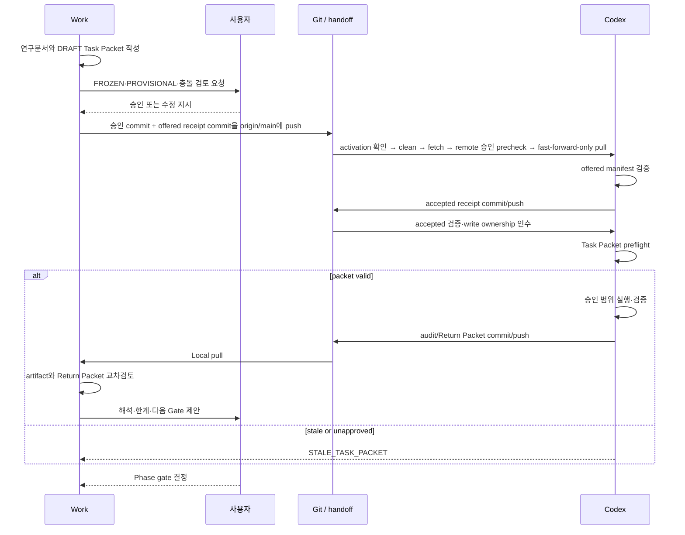

# JointBuildGS Master Roadmap

- 문서 버전: `P1_AUDIT_v1`
- 작성일: 2026-07-31
- P1 audit workstream: `USER APPROVED / HANDOFF PREPARATION`
- 저장소 유효 상태: `P2 / Fusion W1 ACTIVE`
- 승인 상태: `USER APPROVED FOR P1 AUDIT — 2026-07-31`
- 역할: 현재 P2/Fusion W1을 변경하지 않는 P1 설계·준비도 audit roadmap

> Research anchor: 불완전하지만 재사용 가능한 기구축 3D 자산과 최신 항공영상을
> 상보적으로 결합하여 자동 LoD2 생성이 가능한 건물 범위를 확대한다.

## 상태 패널

```text
[●] P1 연구 기반 확정·감사       — HANDOFF PREPARATION (audit workstream)
[ ] P2 기준선·평가 기준 확정     — NOT_STARTED
[ ] P3 Prior 방법 개발·동결       — NOT_STARTED
[ ] P4 최종 실험·저널 작성        — NOT_STARTED
```

Current task: `P1_AUDIT_v1 source snapshot and handoff`

Next: source snapshot → packet approval commit → offered receipt → P1 Codex
read-only 감사

> **중요:** 위 패널은 P1 audit이 검토할 향후 P1–P4 연구 흐름이다.
> `AGENTS.md`와 `phases/p2-gsjso/README.md`가 선언한 repository 유효 상태는 계속
> P2/Fusion W1이다. P1 audit은 이를 rollback/supersede하지 않고 active
> files/results/locks를 read-only protected scope로 유지한다. Audit packet은
> source snapshot과 offered receipt가 완성될 때까지 `DRAFT`로 잠겨 있다.

## P1–P4 전체 흐름



P2의 평가 criterion은 prior-guided held-out-building 결과를 보기 전에 동결한다.
P3의 최종 방법과 loss는 P4 held-out-building 실행 전에 동결한다.

여기서 held-out은 방법·threshold 개발 중 보지 않은 **건물 test group**이다.
“P4 전체 실험”은 전체 후보 건물이 아니라, held-out test에 배정된 모든 건물에
동결된 C1–C5 전체 condition matrix를 실행한다는 뜻이다. 같은 건물에서 학습에 쓰지
않은 camera view를 뜻하는 held-out view와 구분한다.

## Work–Codex–사용자 왕복 흐름



OpenAI 공식 설명은 Codex app이 task별 thread/worktree와 변경 검토를 지원한다고
설명한다. 이 저장소의 Task Packet 상태기계, two-host manifest, 과학적 승인권은
OpenAI 제품 기능이 아니라 본 프로젝트가 제안한 별도 governance이다
([OpenAI, Codex app](https://openai.com/index/introducing-the-codex-app/)).

## Evidence-to-acceptance chain

정식 artifact, Sheet A–D, table schema와 G0–G4 정의는
[Result and Acceptance Contract](04_RESULT_AND_ACCEPTANCE_CONTRACT_v0.md)를 따른다.

```mermaid
flowchart LR
    GN["G_native<br/>Gaussian/surfel"] --> SX["S_extracted<br/>surface/mesh"]
    SX --> PR["P_Roofer<br/>exact classified point set"]
    PR --> HL["H_LoD2<br/>Roofer LoD2.2"]
    HL --> G0["G0 generated"]
    G0 --> G1["G1 schema/semantic"]
    G1 --> G2["G2 geometry/topology"]
    G2 --> G3["G3 roof structure"]
    G3 --> G4["G4 geometric accuracy"]
    G4 --> PASS["PASS_usable"]
```



| 최초 실패 위치 | 기본 귀속 | 후속 진단 |
|---|---|---|
| `G_native` | GS training/regularization | native primitive와 fixed-view diagnostics |
| `S_extracted` | surface extraction | direct fusion vs TSDF, hole/ridge/boundary |
| `P_Roofer` | adapter | filtering, sampling, class 2/6, density, crop/buffer |
| `H_LoD2` | Roofer/roofprint/terrain/parameter | process, semantic shell, topology |
| `G0–G4` | acceptance dimension | criterion version과 reference audit |

## Phase 계약

| Phase | 목적 | Entry criteria | Work 산출물 | Codex 산출물 | Exit gate | 상태 |
|---|---|---|---|---|---|---|
| P1 | 무엇을 연구하고 현재 repo/data가 지원하는지 확정 | bootstrap 요청, 현행 정본 확인 | charter, roadmap, novelty, data/result/handoff contracts, audit packet | read-only audit 9종, Return Packet | 사용자 정본 전환·범위 승인, audit 검토 | `IN_PROGRESS` 제안 |
| P2 | LiDAR/MVS/Image-only GS 기준선과 acceptance 동결 | P1 audit `READY_FOR_REVIEW`, 데이터 계보와 공통 set 확정 | baseline protocol, split, threshold 결정안 | pilot+validation의 C1–C3 baseline, adapter 비교, validation evidence | held-out building 결과 전 criterion 동결 | `NOT_STARTED` |
| P3 | 관찰된 실패에 맞춘 두 prior 방법 개발·동결 | P2 criterion 동결 | loss/method 설계와 ablation 계약 | pilot+validation의 frozen C3 control 및 C4/C5 구현·ablation, Return Packet | held-out building 접근 전 사용자 최종 방법·schedule 동결 | `NOT_STARTED` |
| P4 | held-out test 전 건물 × C1–C5 최종 실험과 원고 | P3 method freeze, data/reference/split freeze | 결과 해석, manuscript | held-out 전 건물 runs, metrics, case sheets, receipts | 사용자 결론·원고 승인 | `NOT_STARTED` |

### Phase별 building 접근 범위

| Phase | 접근 가능한 building | 허용 목적 | held-out building |
|---|---|---|---|
| P1 | manifest와 파일 목록만 감사 | 가용성·계보·split 가능성 확인 | 결과 접근·실행 금지 |
| P2 | spatial pilot + validation | C1–C3 baseline, adapter, threshold/criterion 동결 | 접근 금지 |
| P3 | spatial pilot + validation | C3는 동결 control로만 재실행/재사용; C4/C5 개발·ablation·schedule 동결 | 접근 금지 |
| P4 primary | held-out test의 모든 building | 동결된 C1–C5 최종 비교 | 최초 접근 |
| P4 supplementary, sampled fallback일 때 선택 | 모든 `E_paired` building | primary 잠금 후 census coverage atlas·보조 기술통계 | primary 결론 변경 금지 |

따라서 P3까지 모든 eligible building을 실험하는 설계가 아니다. 정확한 building 수와
공간 경계는 P1 감사 결과를 바탕으로 P2에서 결과를 보기 전에 동결한다.

### P4 확장과 전수/표본 결정 계획

현재 exact building 수와 split ID는 아직 안정화되지 않은 `PROVISIONAL` 항목이다.
임의로 P4에서 성공 사례를 추가하는 방식으로 확장하지 않는다.

1. **P1 audit:** `U_target`과 `E_paired`의 후보 수, asset/reference coverage,
   후보 AOI별 공통 footprint·연속성·면적, 공간 group, 결측 사유, C1–C5 예상
   compute/storage 비용을 산출한다. 성능 결과는 실행하거나 열지 않는다.
2. **P2 pre-result Gate S0:** 첫 baseline 결과를 보기 전에 사용자가 다음 중 하나를
   승인한다. 이때 exact AOI boundary도 공통 data footprint, stable-ID coverage,
   연구 대상 지역의 연속성·면적과 비용만으로 먼저 동결한다.
   - `EXHAUSTIVE_PARTITION` — 기본 우선안. `E_paired` 전 건물을
     development/validation/held-out으로 나눈다.
   - `STRATIFIED_SAMPLE` — 전수가 비용·시간·데이터 가용성상 불가능할 때만 사용한다.
     spatial block과 비-GT input-side metadata로 group-stratified sample을 만들고,
     paired PASS 차이의 목표 정밀도/검정력과 attrition을 근거로 표본 수를 정한다.
3. **Split freeze:** building IDs, split, seed/algorithm, strata, source manifest hash,
   eligibility/exclusion reasons, sample-size rationale와 비용 상한을 immutable
   split manifest로 동결한다. roof type, LoD2 RoofSurface 또는 method 결과를
   split 변수로 쓰지 않는다.
4. **P2/P3:** 동일한 development+validation pool을 사용한다. P3는 development에서
   C4/C5를 개발하고 validation에서 방법을 선택·동결한다. 동결 후 C4/C5를
   development+validation 전 건물에 final coverage run으로 적용한다. C1/C2는
   exact-compatible P2 결과를 재사용하고, C3는 hash가 맞는 frozen result를
   재사용하거나 protocol-matched rerun하여 C1–C5 matrix를 완성한다.
5. **P4:** 사전에 동결된 held-out building 전부에 C1–C5를 실행한다.

`EXHAUSTIVE_PARTITION`이면 P4 자체는 held-out remainder만 실행하지만, P2/P3 결과와
합치면 프로그램 종료 시 `E_paired` 전체에 대한 C1–C5 matrix가 완성된다.
`STRATIFIED_SAMPLE`이면 primary inference는 동결 표본에 한정하고, 전수 확장은 P4
primary 잠금 뒤 별도 census로 수행한다. 이 census를 완료하지 않으면
“`E_paired` 전체로 확장”을 주장하지 않는다.

## P1 작업 보드

| 항목 | Owner | 상태 | 산출물/근거 | Blocker 또는 next |
|---|---|---|---|---|
| 연구 헌장 v1 | Work | `USER_APPROVED / SOURCE_SNAPSHOT_PENDING` | `00_RESEARCH_CHARTER.md` | source snapshot commit |
| Master Roadmap v1 | Work | `USER_APPROVED / SOURCE_SNAPSHOT_PENDING` | 이 문서 | source snapshot commit |
| Novelty map v1 | Work | `USER_APPROVED / SOURCE_SNAPSHOT_PENDING` | `02_NOVELTY_MAP.md` | full-text 확대 검토는 계속 |
| Data/baseline scope v1 | Work | `USER_APPROVED / SOURCE_SNAPSHOT_PENDING` | `03_DATA_AND_BASELINE_SCOPE.md` | 실제 파일·시점·계보 감사 |
| Result/acceptance contract v1 | Work | `USER_APPROVED / SOURCE_SNAPSHOT_PENDING` | `04_RESULT_AND_ACCEPTANCE_CONTRACT_v0.md` | numerical threshold P2 |
| Handoff protocol/templates | Work | `USER_APPROVED / SOURCE_SNAPSHOT_PENDING` | `05_*`, templates, index | source snapshot commit |
| P1 repository audit | Codex | `HANDOFF_PREPARATION` | DRAFT Task Packet | source + approval + offered commits |
| P1 audit integration | Work | `NOT_STARTED` | future roadmap/decision update | audit Return Packet 필요 |

## Decision Status Register

### FROZEN — 새 프로그램 채택 시

| ID | 항목 | 변경 권한 |
|---|---|---|
| F-01 | 연구 목적과 TUM2TWIN 사용 | 사용자 |
| F-02 | 다섯 reconstruction conditions와 각 역할 | 사용자 |
| F-03 | LiDAR prior와 LoD1 prior는 별도 arm | 사용자 |
| F-04 | LoD1 prior는 LoD2 roof prior가 아님 | 사용자 |
| F-05 | 개별 건물 paired comparison | 사용자 |
| F-06 | `G_native → S_extracted → P_Roofer → H_LoD2` | 사용자 |
| F-07 | Sheet A–D, building × method 결과 | 사용자 |
| F-08 | G0–G4와 `PASS_usable` | 사용자 |
| F-09 | usable PASS, fail-to-pass, pass-to-fail endpoint | 사용자 |
| F-10 | P1–P4 순서와 사용자 phase gate | 사용자 |
| F-11 | Current UAS/Drone LiDAR `L_upper`와 Existing ALS `P_LiDAR`는 별도 asset·역할이며 비교 감사 필수 | 사용자 |

### PROVISIONAL

| ID | 현재 기본안 | 이유 | 변경 증거 조건 | 최종 Phase |
|---|---|---|---|---|
| P-01 | TUM2TWIN Current UAS/Drone LiDAR를 `L_upper` 후보 | 영상과 동시 campaign의 고품질 sensor 후보 | 실제 date, density, accuracy, coverage와 alignment 감사 | P2 |
| P-02 | Existing/real ALS를 `P_LiDAR` 후보 | 기구축 자산 재사용 시나리오 | UAS LiDAR와 파일·시점·platform·density·coverage·quality regime이 다름을 비교표로 입증하고 overlap 확보 | P1/P2 |
| P-03 | TUM2TWIN LoD1을 `P_LoD1` 후보 | coarse building prior 필요 | 실제 LoD1 파일과 LoD2 roof 정보 비포함 계보 확인 | P2 |
| P-04 | UAS LiDAR를 geometry reference 후보 | 정밀 3D sensor 후보 | independent uncertainty/currentness 검증 | P2 |
| P-05 | 검수 LoD2/LoD3를 structure reference 후보 | roof semantics/plane 필요 | 시점·ID·leakage audit | P2 |
| P-06 | direct depth-to-point fusion을 main diagnostic adapter 후보 | depth evidence를 직접 추적 가능 | 재현성·completeness·boundary artifact 비교 | P2 |
| P-07 | TSDF mesh sampling을 robustness adapter 후보 | 2DGS 계열에서 널리 쓰이는 surface extraction 경로 | 공정한 parameter protocol과 sensitivity | P2 |
| P-08 | `R_derived` reference-independent roofprint protocol; `R_ext` 비실행 | 현행 no-external-roofprint와 end-to-end 목적 유지 | 동일 derivation rule/config와 method별 polygon/hash 검증 | P1/P2 |
| P-09 | P1 audit 뒤 P2 pre-result Gate S0에서 `EXHAUSTIVE_PARTITION` 우선, 불가능할 때만 `STRATIFIED_SAMPLE` | leakage·tuning 억제와 최종 coverage 명확화 | `U_target`/`E_paired` 수, C1–C5 비용, 공간 group, 목표 정밀도/검정력 | P1/P2 |
| P-10 | 각 phase의 접근 허용 split 전체에 경량 sheet, 대표 subset에 mechanism sheet | 투명성과 지면 효율 절충 | 자동생성 비용·가독성 검증 | P2/P3/P4 |

### TO VERIFY

- TUM2TWIN image/camera/trajectory, Current UAS/Drone LiDAR, photogrammetric point cloud,
  Existing/real ALS
- UAS LiDAR–ALS의 파일·취득일·platform/sensor·density·accuracy·coverage·classification·
  CRS/vertical datum·registration·temporal change·building overlap 비교
- LoD1, LoD2/LoD3 reference, common building ID와 roofprint
- acquisition date, accuracy, density, coverage, CRS, vertical datum
- LoD1 생성 계보와 evaluation reference 공유정보
- current GS backbone, training/renderer/export
- RGB/depth/normal/alpha/distortion/expected/median depth
- native position/rotation/scale/opacity/normal/semantic export
- direct fusion, TSDF, mesh/point export
- Roofer LAS class 2/6, crop/buffer/terrain/roofprint adapter
- Roofer version/parameters, CityJSONSeq handling, cjval/val3dity/roof-plane metrics
- 기존 9-case와 `dense_baseline_qualitative_v5.pdf`의 script/config/artifact
- runtime, memory, storage, Docker reproduction risk

### DEFERRED

| 항목 | 결정 시점 |
|---|---|
| G3/G4 numerical threshold, final PASS criterion | P2 |
| final surface adapter | P2 |
| prior loss equations, weights, schedule | P3 |
| confidence equation/threshold | P3 pilot |
| final representative building IDs | P4 |
| temporal currentness 최종 주장 | data/change audit 후 |

## Handoff status

| Handoff ID | 방향 | 버전 | 상태 | 실행 가능 |
|---|---|---:|---|---|
| `P1-W2C-REPO-AUDIT` | Work→Codex | v1 | `DRAFT` | 아니오 |

실행 전 필요한 순서:

1. 문서 source snapshot commit
2. Task Packet `source_commit` 입력
3. `status: APPROVED_FOR_EXECUTION`, `user_approval` 기록과 approval commit
4. immutable offered receipt commit과 validator
5. `origin/main` push 후 원격 validator
6. Experiment Host activation/preflight

## Blockers

1. 기존 4조건 기하–의미론 연구와 새 5조건 prior 연구의 장기 정본 관계가 미정이다.
2. TUM2TWIN LoD1의 존재·계보가 확인되지 않았다.
3. numerical acceptance threshold와 surface adapter는 의도적으로 미정이다.

P1 실행 blocker였던 phase와 roofprint 충돌은 `DEC-P1-006`으로 범위를 제한해
해소했다. 저장소 유효 단계는 P2/Fusion W1이며, P1은 read-only audit
workstream이고 `R_derived`만 primary다.

## User approval required

P1 audit 뒤 후속 연구 동결 전 사용자는 최소한 다음을 결정해야 한다.

- TUM2TWIN 중심 재설계와 기존 데이터/결과의 관계
- `FROZEN` 목록의 채택 여부
- `PROVISIONAL` 데이터·reference·split·adapter 기본안

## Completed artifacts

| Artifact | Status |
|---|---|
| `docs/research/00_RESEARCH_CHARTER.md` | `P1_AUDIT_v1 / SOURCE_SNAPSHOT_PENDING` |
| `docs/research/01_MASTER_ROADMAP.md` | `P1_AUDIT_v1 / SOURCE_SNAPSHOT_PENDING` |
| `docs/research/02_NOVELTY_MAP.md` | `P1_AUDIT_v1 / SOURCE_SNAPSHOT_PENDING` |
| `docs/research/03_DATA_AND_BASELINE_SCOPE.md` | `P1_AUDIT_v1 / SOURCE_SNAPSHOT_PENDING` |
| `docs/research/04_RESULT_AND_ACCEPTANCE_CONTRACT_v0.md` | `P1_AUDIT_v1 / SOURCE_SNAPSHOT_PENDING` |
| `docs/research/05_HANDOFF_PROTOCOL.md` | `P1_AUDIT_v1 / SOURCE_SNAPSHOT_PENDING` |
| `docs/research/06_DECISION_LOG.md` | `P1_AUDIT_v1 / SOURCE_SNAPSHOT_PENDING` |
| `docs/handoffs/HANDOFF_INDEX.md` | `P1_AUDIT_v1 / SOURCE_SNAPSHOT_PENDING` |
| Work→Codex/Codex→Work templates | `APPROVED TEMPLATE / INSTANCES DEFAULT TO DRAFT` |
| `docs/handoffs/P1_W2C_REPO_AUDIT_v1.md` | `DRAFT / EXECUTION_LOCKED` |

P1 Codex audit 결과와 Return Packet은 아직 없다.

## Direction alignment check

| 질문 | 답 |
|---|---|
| 연구 목적이 모든 문서에서 같은가? | 예; 상호검수 완료 |
| 다섯 조건이 같은 순서·명칭인가? | `C1`–`C5` canonical IDs 사용 |
| `L_upper ≠ P_LiDAR`인가? | 예 |
| `P_LoD1`이 roof topology를 주는가? | 아니오 |
| threshold/loss가 동결되었는가? | 아니오, `DEFERRED` |
| P1 packet이 실행 가능한가? | 아니오, `DRAFT` |
| P1 실행 authority 충돌이 해결되었는가? | 예; `DEC-P1-006`으로 active P2 보호와 `R_derived` primary를 고정 |

## Change history

| Date | Version | Change | Approval |
|---|---|---|---|
| 2026-07-31 | `DRAFT_v0` | bootstrap 요구를 구조화하고 현행 정본 충돌을 병기 | 미승인 |
| 2026-07-31 | `P1_AUDIT_v1` | 사용자 요구, P1 audit authority, no-external-roofprint 범위와 handoff gate 동결 | 사용자 승인 |
