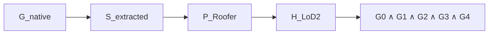

# Result and Acceptance Contract v0

- Document status: `USER_APPROVED_AUDIT_CONTRACT`
- Criterion version: `P1_AUDIT_v1`
- 작성일: 2026-07-31
- 상태: `PROVISIONAL UNTIL P2 CRITERION FREEZE`
- Final verdict policy: `PENDING` until P2 criterion freeze
- Numerical threshold: `DEFERRED`

## 1. 목적

평가의 기본 단위는 `building × reconstruction condition`이다. 평균 rendering
metric 또는 보기 좋은 mesh 하나로 최종 성공을 판정하지 않는다. 모든 GS arm은
native representation, extracted surface, exact Roofer input, LoD2 outcome을
연결해 저장한다.

## 2. Artifact chain

| Stage | Canonical name | 내용 | 최소 provenance | 질문 |
|---|---|---|---|---|
| 1 | `G_native` | trained Gaussian/surfel representation | run/config/commit, primitive schema, coordinate frame | GS 자체가 구조적으로 안정적인가? |
| 2 | `S_extracted` | rendered-depth fusion point set, TSDF mesh 또는 sampled surface | adapter/version/parameters/views | extraction에서 ridge/plane/hole/boundary가 손상되는가? |
| 3 | `P_Roofer` | filtering/sampling/classification/crop 완료된 exact Roofer input | LAS/LAZ hash, class 2/6, roofprint/terrain hash, CRS | adapter가 정보를 잃는가? |
| 4 | `H_LoD2` | Roofer-generated LoD2.2 semantic building model | Roofer version/config/log/output hash | evidence가 valid/accurate LoD2로 변환되는가? |
| 5 | `A_acceptance` | G0–G4와 `PASS_usable` | criterion/reference version | 사용할 수 있는가? |



### Failure location

- `G_native`부터 잘못됨 → training/regularization 문제
- `G_native` 정상, `S_extracted` 실패 → surface extraction 문제
- `S_extracted` 정상, `P_Roofer` 실패 → filtering/sampling/class/density/crop 문제
- `P_Roofer` 적절, `H_LoD2` 실패 → Roofer/roofprint/terrain/parameter 문제
- `H_LoD2` 생성, gate 실패 → conformance/topology/structure/accuracy 차원 기록

원인 귀속은 자동 단정이 아니라 해당 stage evidence를 바탕으로 한 진단 label이다.

## 3. Native diagnostic contract

GS arm에서 가능한 primitive fields:

- position
- orientation/rotation
- normal
- scale
- opacity
- semantic attribute
- view support
- prior confidence
- image–prior conflict

필수 fixed-view 후보:

- top orthographic
- common oblique
- principal section
- geometry-only shading
- normal-color
- height-color
- 필요 시 opacity/scale

RGB texture가 geometry error를 가릴 수 있으므로 textured viewer만으로 판단하지 않는다.

## 4. Surface extraction contract

P2 비교 후보:

1. direct rendered-depth-to-point fusion
2. TSDF integration + Marching Cubes
3. mesh-derived point sampling

2DGS 공식 구현은 depth-based meshing/TSDF fusion 경로를 제공한다
([official repository](https://github.com/hbb1/2d-gaussian-splatting)). 그러나 본
연구의 final adapter는 재현성, boundary artifact, accuracy, completeness, runtime,
Roofer downstream 결과를 P2에서 비교한 뒤 동결한다.

각 adapter는 동일한 view set 또는 명시적 adapter-specific protocol, depth truncation,
voxel size, sampling density, normal rule을 기록한다.

## 5. Exact Roofer input contract

`P_Roofer`는 다음 처리가 끝난 실제 input이다.

- filtering/outlier removal
- sampling/density normalization
- building crop/buffer
- ground class 2 / building class 6
- terrain handling
- roofprint alignment와 hash
- CRS, vertical datum, local/global transform

Roofer 공식 CLI 문서는 pointcloud source의 `ground_class=2`,
`building_class=6`, roofprint polygon source, CityJSONSequence output 및
여러 quality attributes를 기술한다
([official docs](https://innovation.3dbag.nl/roofer/cli_application.html)).
실제 repository version/config는 `TO VERIFY`이다.

## 6. Qualitative case sheets

모든 panel은 `building_id`, `method_id`, `run_id`, `criterion_version`,
`reference_version`, `surface_adapter`를 표시한다.

### Sheet A — Input and native reconstruction

공통 context:

- building ID, size, height
- reference roof-plane 수와 roof complexity
- observation category
- current RGB, Current UAS/Drone LiDAR, current MVS
- Existing ALS LiDAR prior, existing LoD1 prior
- `R_derived` roofprint protocol과 실제 method별 polygon, geometry/structure reference

방법 열:

1. Current UAS/Drone LiDAR (`L_upper`)
2. MVS
3. Image-only GS
4. Image + Existing ALS-prior GS (`P_LiDAR`)
5. Image + LoD1-prior GS

결과 행:

- native 3D top
- native 3D common oblique
- native principal section
- normal/height diagnostic

LiDAR/MVS는 native point cloud, GS는 native Gaussian/surfel representation을 보인다.

### Sheet B — Extraction and exact Roofer input

결과 행:

- extracted mesh/surface
- exact Roofer input top/oblique/section
- class 2/6 role view
- input-quality metric strip

목적은 surface extraction과 Roofer adapter의 정보 유지/손실을 분리하는 것이다.

### Sheet C — LoD2 outcome and acceptance

결과 행:

- LoD2.2 top + reference overlay
- common oblique + reference overlay
- principal section + reference
- roof-plane TP/FP/FN 또는 matching map
- continuous metrics
- G0–G4 strip
- final verdict와 criterion version

Criterion 동결 전:

```text
Final verdict: PENDING
Criterion version: P1_AUDIT_v1
```

### Sheet D — GS mechanism analysis

대표 subset에서 다음 세 GS arm을 비교한다.

- Image-only GS
- Image + LiDAR-prior GS
- Image + LoD1-prior GS

표시 후보:

- held-out-view RGB rendering: 같은 building의 training image에서 제외한 camera view이며
  P4 held-out building과는 별도
- rendered depth/normal
- semantic/building confidence
- prior confidence
- image–prior conflict
- native surfels
- extracted surface

RGB rendering은 current-image fidelity 보존을 설명하는 보조 evidence이며 primary
LoD2 result가 아니다.

## 7. Visual fairness

방법 간 다음을 고정한다.

- XY crop, Z range
- top/oblique camera
- principal section 위치
- Z exaggeration
- point size
- height/normal/error color scale
- roofprint/reference rendering style
- point-density protocol
- surface adapter
- output resolution

Per-method auto zoom과 유리한 view 재선택을 금지한다. 불가피한 결측은 빈 panel과
failure reason으로 남긴다.

## 8. Main manuscript와 supplementary

### Main

- 사전 규칙으로 고른 대표 fail-to-pass
- LiDAR-prior와 LoD1-prior가 서로 다른 실패를 회복한 사례
- pass-to-fail 또는 잔여 실패
- gate funnel과 최종 PASS net change
- residual gap to `L_upper`

### Supplementary

- 해당 phase에서 접근이 허용된 split 전체/확장 building case sheets
- 추가 views와 모든 continuous metrics
- threshold sensitivity
- 성공·실패·악화 사례
- adapter sensitivity와 missing/fallback details

대표 사례 선택 규칙은 P2/P3에서 결과를 보기 전에 동결한다.

## 9. Building-method metric table

Bootstrap가 요청한 logical artifact:

`results/metrics/building_method_metrics.parquet`

현재 저장소는 top-level `results/`를 허용하지 않으므로 실제 large payload는
`JBGS_ARTIFACT_ROOT` 아래 run namespace에 저장하고, Git에는 manifest와 compact
summary를 승격한다. 최종 resolver/path는 P1 audit에서 `TO VERIFY`이다.

### Identity and provenance

| Field | Type / rule |
|---|---|
| `building_id` | stable string |
| `method_id` | canonical C1–C5 ID |
| `run_id` | immutable run namespace |
| `git_commit` | full SHA |
| `task_packet_id` | approved packet ID |
| `config_hash` | content hash |
| `data_version` | immutable data manifest ID |
| `reference_version` | geometry + structure refs |
| `surface_adapter` | name + version |
| `criterion_version` | `P1_AUDIT_v1`, frozen version later |

### Input and surface evidence

- `point_count`
- `point_density`
- `roof_coverage`
- `nodata_ratio`
- `plane_fit_residual`
- `normal_dispersion`
- `boundary_leakage`
- `roof_ground_height_overlap`
- `outlier_or_floater_ratio`
- `plane_fragmentation_index`

정의, 단위, valid range, missingness를 schema에 추가한다.

### GS-native and extraction

- `native_primitive_count`
- `primitive_scale_statistics`
- `surface_thickness` 또는 double-layer 후보 지표
- `extracted_surface_accuracy`
- `extracted_surface_completeness`
- `unsupported_surface_ratio`
- `extraction_adapter`
- `extraction_runtime`
- `memory_usage`

C1/C2의 non-applicable fields는 0이 아니라 explicit null + reason으로 둔다.

### Roofer and LoD2

- `roofer_process_success`
- `lod22_exists`
- `fallback_used`
- `roof_surface_count`
- `wall_surface_count`
- `ground_surface_count`
- `schema_validation`
- `semantic_validation`
- `val3dity_result`
- `roof_plane_completeness`
- `roof_plane_correctness`
- `roof_plane_quality`
- `oversegmentation`
- `undersegmentation`
- `RMSXY`
- `RMSZ`
- `surface_distance`
- `height_error`
- optional `normal_angular_error`

## 10. Acceptance gate table

Logical artifact:

`results/metrics/building_acceptance_gates.csv`

| Field | Meaning |
|---|---|
| `building_id`, `method_id` | paired key |
| `G0_generated` | generation gate |
| `G1_schema_semantic` | conformance gate |
| `G2_geometry_topology_valid` | geometric validity gate |
| `G3_roof_structure_acceptable` | roof fidelity gate |
| `G4_geometric_accuracy_acceptable` | positional accuracy gate |
| `final_usable_pass` | conjunction |
| `failure_gate` | first failed gate + all failure flags |
| `criterion_version` | frozen rule ID |
| `missing_reason` | explicit missingness/fallback |

Gate는 boolean 결과와 근거 continuous value/error code를 함께 저장한다.

## 11. Dataset-level outputs

Logical names:

- `method_summary.csv`
- `gate_funnel.csv`
- `transition_matrix.csv`
- `stratified_summary.csv`
- building spatial transition map
- threshold sensitivity results
- `run_registry.jsonl`

Primary comparison은 `C3_GS_image` 대비 C4/C5 각각이다. 각 prior arm `m`의
primary estimand는 동일 eligible paired set에서 다음과 같다.

```text
T_plus(m)  = count(C3 fail, m pass)
T_minus(m) = count(C3 pass, m fail)
Delta_N_pass(m) = N_pass(m) - N_pass(C3) = T_plus(m) - T_minus(m)
```

C4-vs-C3와 C5-vs-C3는 사전 지정한 두 primary contrasts다. 두 방향 transition,
denominator, uncertainty interval을 함께 보고하며 multiplicity 처리 방식은 P2에서
criterion과 함께 동결한다.

- usable PASS 건물 수와 비율
- fail-to-pass
- pass-to-fail
- net transition
- paired uncertainty interval

Secondary:

- C1–C3 baseline gap
- failure gate별 transition
- roof complexity/coverage/observation stratum
- runtime/memory/storage

Method failure와 missing output은 denominator에서 사후 제거하지 않는다. Eligibility와
execution failure를 구분해 보고한다.

## 12. Acceptance formula

```text
PASS_usable = G0 AND G1 AND G2 AND G3 AND G4
```

단일 평균 score로 gate failure를 상쇄하지 않는다.

### G0 — 생성 성공

후보 항목:

- Roofer process 정상 종료
- 대상 Building/BuildingPart 존재
- LoD2.2 geometry 존재
- RoofSurface, WallSurface, GroundSurface 존재
- disallowed fallback 없음

Fallback LoD1.1의 성공 취급 여부는 `DEFERRED TO P2`.

### G1 — 파일·schema·semantic conformance

- 실제 output serialization parse
- schema validation
- vertex/reference consistency
- semantics array consistency
- Roof/Wall/Ground semantics
- parent-child consistency

CityJSON의 schema/internal consistency와 geometry validity는 별도 검사이다
([CityJSON validation](https://www.cityjson.org/tutorials/validation/)).

### G2 — 3D geometry/topology validity

- val3dity
- invalid ring/self-intersection 없음
- polygon planarity
- shell error 없음
- output contract상 필요할 때 watertight solid

val3dity는 ISO 19107 기반 3D primitive validity를 검사한다
([official docs](https://val3dity.readthedocs.io/)). G2 통과는 G3/G4를 보장하지 않는다.

### G3 — Roof structure fidelity

- roof-plane completeness/correctness/quality
- oversegmentation/undersegmentation
- severe topology error
- ridge/adjacency error

ISPRS protocol은 asymmetric plane-overlap correspondence와 per-plane/per-building
metrics를 제공한다
([official protocol](https://www.isprs.org/resources/datasets/benchmarks/UrbanSemLab/results/EvaluationBuildingReconstructionDocument/EvaluationBuildingReconstruction.html)).
Matching rule은 P2에서 reference uncertainty와 함께 동결한다.

### G4 — Positional/geometric accuracy

- RMSXY/RMSZ
- surface-to-reference distance
- height error
- optional normal angular error

Threshold는 application requirement와 reference uncertainty 없이 임의 설정하지 않는다.

## 13. Threshold 결정 절차

P1에서 동결하는 것은 gate 구조, metric families, building-level endpoint뿐이다.
P2에서 다음 순서로 numerical threshold를 정한다.

1. geometry/structure reference uncertainty 정량화
2. Current UAS/Drone LiDAR baseline 분포
3. MVS baseline 분포
4. Image-only GS 분포
5. validation buildings의 명백한 success/failure blind review
6. application requirement
7. matching/threshold sensitivity
8. ambiguous zone과 adjudication rule
9. criterion code/test/문서 동결
10. prior-guided held-out-building result 접근 금지 후 freeze receipt

기존 benchmark의 example threshold는 metric 구현 검증에 사용할 수 있지만 universal
building acceptance threshold로 자동 이식하지 않는다.

## 14. Criterion versioning

| Version state | 허용 |
|---|---|
| `DRAFT_v0` | historical bootstrap draft; verdict는 `PENDING` |
| `P1_AUDIT_v1` | current audit contract; schema/layout/gate 가능성 판정, verdict는 `PENDING` |
| `VALIDATION_CANDIDATE_vN` | validation set에서 calibration, held-out-building 접근 금지 |
| `FROZEN_vN` | 코드/hash/reference/split 포함, P3/P4 primary |
| `SUPERSEDED_vN` | 이유/Decision ID와 successor 기록, 과거 결과 보존 |

모든 table/sheet/report는 criterion version을 표시한다. Criterion 변경 뒤 과거 score를
덮어쓰지 않고 새 namespace로 재평가한다.

### 14.1 Held-out scope

- P2는 pilot/development와 validation에서 C1–C3 baseline과 criterion을 확정한다.
- P3는 같은 허용 split에서 C3를 튜닝하지 않는 frozen comparator로 두고, C4/C5를
  개발·선택하여 최종 method/loss/schedule을 동결한다. C3는 protocol-matched control로
  재실행하거나 exact-compatible P2 결과를 재사용하며 그 선택과 hash를 기록한다.
- P3 method freeze 뒤 frozen C4/C5를 development+validation 전 건물에 적용하고,
  exact-compatible C1/C2와 frozen C3 결과를 결합해 그 pool의 final C1–C5 matrix를
  만든다.
- P4 primary에서 held-out building test를 처음 열고, 그 split의 모든 building에
  동결된 C1–C5를 실행한다.
- “전체 실험”은 held-out test 전 건물 × C1–C5를 뜻하며 전체 eligible corpus와
  동의어가 아니다.
- P2 Gate S0의 기본안은 `E_paired` 전 건물을 세 split으로 나누는
  `EXHAUSTIVE_PARTITION`이다. 이 경우 P2/P3와 P4 결과를 합친 최종 table이
  `E_paired` 전체를 포함한다.
- 전수가 불가능해 `STRATIFIED_SAMPLE`을 동결한 경우, all-eligible census는
  primary 결과 잠금 뒤 별도 coverage analysis로 수행한다. 완료하지 않으면
  `E_paired` 전체 coverage claim을 금지한다.

## 15. PENDING principle

`FROZEN_vN` 전에는:

- final usable PASS를 확정하지 않는다.
- fail-to-pass/pass-to-fail을 primary conclusion으로 쓰지 않는다.
- threshold를 만족한 것처럼 색칠하지 않는다.
- `PENDING`과 continuous value만 표시한다.

## 16. 아직 미정인 항목

- numerical threshold와 ambiguous-zone adjudication
- final surface adapter/parameters/view set
- `R_derived` 세부 derivation algorithm/parameter와 method별 polygon/hash
- fallback 허용 여부
- geometry/structure reference와 matching implementation
- metric definitions의 세부 단위/aggregation
- representative case selection rule
- logical `results/` name의 external artifact resolver
- minimum eligible building count와 statistical interval

## 17. Consistency review

- `RESOLVED FOR P1`: 현행 footprint-free Stage 3를 유지해 `R_derived`만 primary로
  사용하고 external `R_ext`는 별도 정책 승인 전까지 실행하지 않는다.
- `MAJOR`: bootstrap logical `results/` 경로가 top-level repository contract와 충돌해
  외부 artifact path로 매핑해야 한다.
- `MAJOR`: 현행 `EXPERIMENT_PLAN.md`의 기존 gate/metric과 새 G0–G4의 관계가
  supersession되지 않았다.
- `DEFERRED`: numerical PASS threshold와 prior loss는 이 문서에서 결정하지 않았다.
