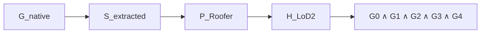

# Result and Acceptance Contract v0

- Document status: `E1E6_DUAL_OUTPUT_DESIGN_USER_REVIEW_PENDING`
- Criterion version: `E1E6_CANON_v3`
- 작성일: 2026-07-31
- 정성·정량 표시 계약 개정: 2026-08-03 (`DEC-P1-016`)
- 상태: `PROVISIONAL UNTIL P2 CRITERION FREEZE`
- Final verdict policy: `PENDING` until P2 criterion freeze
- Numerical threshold: `OFFICIAL FREEZE DEFERRED`; development diagnostic
  `ROOFER_G3G4_DEVELOPMENT_V0P1_NOT_FROZEN` active under `DEC-P1-022`

## 1. 목적

평가의 기본 단위는 `building × reconstruction condition`이다. 평균 rendering
metric 또는 보기 좋은 mesh 하나로 최종 성공을 판정하지 않는다. 모든 GS arm은
native representation, extracted surface, exact Roofer input, LoD2 outcome을
연결해 저장한다.

`E1`은 current-sensor upper context, `E2`는 기존 current-image MVS→Roofer LoD2
product baseline이다. `E3_GS_image`의 canonical condition name은
image-only/no-external-prior GS이며 prior 효과를 분리하는 mechanism ablation이다.
`E4`는 unweighted ALS prior reproduction, `E5`는 같은 ALS의 conflict-aware arm,
`E6`는 LoD-prior diagnostic이다.
“자동 LoD2 생성 가능 범위 확대”는 같은 사전 동결 building set에서
평균 RMSE 개선이 아니라 `PASS_usable`의 `fail→pass − pass→fail` 순증가로 판정한다.
자동성은 per-building 수동 method 선택·geometry 수리·GT 입력을 금지하고, retry와
fallback을 결과 전 동결된 규칙으로만 허용한다는 뜻이다.

### 1.1 두 개의 독립 output contract

본 연구는 아래 두 output을 하나의 success field로 합치지 않는다.

| Field | 평가 대상 | Human `O` | Human `X` | 통계적 역할 |
|---|---|---|---|---|
| `roofer_lod2_ox` | structured Roofer/LoD2 | assessable output이 Roofer hard gate와 고정 human usability rubric을 모두 통과 | assessable output이 하나 이상 실패 | 자동 LoD2 범위확대의 confirmatory primary |
| `semantic_textured_mesh_ox` | georeferenced semantic textured surface mesh | assessable output의 geometry, semantics와 texture가 모두 mesh contract에서 수용 | assessable output의 필수요소 하나 이상 실패 | 독립 rescue/regression을 갖는 key secondary |

Mesh에는 `mesh_geometry_ox`, `mesh_semantic_ox`, `mesh_texture_ox`를 함께 기록하고
세 필수요소가 모두 O일 때만 overall mesh O가 된다. Roofer O/X는 photographic texture를
평가하지 않고, mesh O/X는 CityJSON shell이나 Roofer plane topology를 요구하지 않는다.
따라서 `R_O/M_O`, `R_O/M_X`, `R_X/M_O`, `R_X/M_X` 네 joint cell을 모두 보고한다.

O/X를 부여하기 전에 output별 `assessment_status ∈ {ASSESSABLE, UNASSESSABLE,
NOT_RUN}`를 결정한다. Missing output은 generation hard-gate X지만, reference/panel/
provenance 결측으로 품질을 판정할 수 없는 경우는 `UNASSESSABLE`이며 X로 대체하지 않는다.
사람 O/X와 automatic gate는 별도 필드다. 기존 `P2-ROOFER-HUMAN-OX-v1`의 기술개발
O/X가 G0–G4 또는 공식 `PASS_usable`을 자동 대체하지 않는다.

각 output에는 `temporal_status`를 결합한다. 변화 건물에서 prior를 재현한 결과는
Roofer 또는 mesh O일 수 있지만, `temporal_status=PRIOR_REPRODUCTION`이면 current
reconstruction rescue로 집계하지 않는다. current evidence가 부족한 경우 geometry
생성보다 currentness claim에 기권한다.

### 1.2 Proposed hard-gate split

| Output | Hard gates before human quality O/X | Human review views | Overall O rule |
|---|---|---|---|
| Roofer/LoD2 | `R0` output/target ID/LoD2 exists; `R1` parse/schema/semantic bindings valid; `R2` required Roof/Wall/Ground geometry and topology valid | fixed geometry-only top/oblique/section plus independent roof reference overlay | `R0–R2` pass and fixed roof-form/major-defect usability review O; texture is ignored |
| Semantic textured mesh | `M0` mesh/material/texture load and georeference valid; `M1` required surface support exists; `M2` semantic binding complete; `M3` texture binding and coverage exist | same fixed geometry-only views, semantic-class view and texture view | `mesh_geometry_ox = mesh_semantic_ox = mesh_texture_ox = O` |

Roofer human quality는 dominant roof form, severe hole/collapse/intersection, gross
boundary/height error와 unusable over/undersegmentation을 본다. Mesh geometry는 completeness,
accuracy와 unsupported surface, semantics는 required-class assignment, texture는 coverage,
held-out-view fidelity와 seam/ghosting을 본다. 정확한 tolerance와 ambiguous-zone rule은
validation에서 동결하며, 판정자는 condition을 가린다.

## 2. Artifact chain

| Stage | Canonical name | 내용 | 최소 provenance | 질문 |
|---|---|---|---|---|
| 1 | `G_native` | trained Gaussian/surfel representation | run/config/commit, common image/pose base와 derivative manifest hash, external-prior type, primitive schema, coordinate frame | GS 자체가 구조적으로 안정적인가? |
| 2 | `S_extracted` | rendered-depth fusion point set, TSDF mesh 또는 sampled surface | adapter/version/parameters/views | extraction에서 ridge/plane/hole/boundary가 손상되는가? |
| 3 | `P_Roofer` | filtering/sampling/classification/crop 완료된 exact Roofer input | LAS/LAZ hash, class 2/6, roofprint/terrain hash, CRS | adapter가 정보를 잃는가? |
| 4 | `H_LoD2` | Roofer-generated LoD2.2 semantic building model | Roofer version/config/log/output hash | evidence가 valid/accurate LoD2로 변환되는가? |
| 5 | `A_acceptance` | G0–G4와 `PASS_usable` | criterion/reference version | 사용할 수 있는가? |

Semantic textured mesh의 평행 chain은 `G_native → S_extracted → M_semantic_textured →
M_acceptance`다. `M_semantic_textured`는 source views, texture/material atlas,
per-face/per-vertex semantic binding, coordinate frame와 mesh adapter hash를 기록한다.
이 chain의 O/X는 Roofer chain의 `P_Roofer`, `H_LoD2`, G0–G4에서 추론하지 않는다.



### Failure location

- `G_native`부터 잘못됨 → training/regularization 문제
- `G_native` 정상, `S_extracted` 실패 → surface extraction 문제
- `S_extracted` 정상, `P_Roofer` 실패 → filtering/sampling/class/density/crop 문제
- `P_Roofer` 적절, `H_LoD2` 실패 → Roofer/roofprint/terrain/parameter 문제
- `H_LoD2` 생성, gate 실패 → conformance/topology/structure/accuracy 차원 기록

원인 귀속은 자동 단정이 아니라 해당 stage evidence를 바탕으로 한 진단 label이다.

### 2.1 Condition-flow provenance

Gate S0가 동결한 `B_current`는 exact current image/pose members와 그 members에서만
파생한 SfM sparse, dense MVS, depth, normal, confidence의 manifest다. E3–E6는
동일한 `B_current` ID와 component hashes를 가져야 한다. E4/E5는 exact same Existing
ALS를 공유하고 conflict weighting만 다르며, E6는 LoD prior만 추가한다. E3는
external prior가 없어야 한다.

E2와 E3가 같은 MVS-derived component를 사용해도 artifact chain은 다르다. E2는
MVS geometry를 GS 없이 `P_Roofer`로 직접 변환하고, E3는 image-derived geometry와
support를 `G_native`에서 재최적화한 뒤 `S_extracted → P_Roofer`를 거친다. 결과표는
이 `condition_flow`를 필수 provenance로 기록한다. 기존 1,104-image vendor MVS는
Gate S0 common-base manifest와 exact하게 결합되기 전에는 primary E2/E3 비교에
포함하지 않는다.

## 3. Native diagnostic contract

GS arm에서 가능한 primitive fields:

- position
- orientation/rotation
- normal
- scale
- opacity
- semantic attribute
- view support
- image-derived confidence와 external-prior confidence의 분리 기록
- image–prior conflict

필수 fixed-view 후보:

- top orthographic
- common oblique
- principal section
- geometry-only shading
- normal-color
- height-color
- 필요 시 opacity/scale

RGB texture가 geometry error를 가릴 수 있으므로 textured viewer만으로 판단하지 않는다.

## 4. Surface extraction contract

P2 비교 후보:

1. direct rendered-depth-to-point fusion
2. TSDF integration + Marching Cubes
3. mesh-derived point sampling

2DGS 공식 구현은 depth-based meshing/TSDF fusion 경로를 제공한다
([official repository](https://github.com/hbb1/2d-gaussian-splatting)). 그러나 본
연구의 final adapter는 재현성, boundary artifact, accuracy, completeness, runtime,
Roofer downstream 결과를 P2에서 비교한 뒤 동결한다.

각 adapter는 동일한 view set 또는 명시적 adapter-specific protocol, depth truncation,
voxel size, sampling density, normal rule을 기록한다.

## 5. Exact Roofer input contract

`P_Roofer`는 다음 처리가 끝난 실제 input이다.

- fixed scene-AOI/context crop and any filtering/outlier rule
- sampling/density normalization policy, including explicit `none`
- Roofer-internal building crop/buffer; external per-building pre-crop is prohibited
- ground class 2 / building class 6
- terrain handling
- roofprint alignment와 hash
- CRS, vertical datum, local/global transform

Roofer 공식 CLI 문서는 pointcloud source의 `ground_class=2`,
`building_class=6`, roofprint polygon source, CityJSONSequence output 및
여러 quality attributes를 기술한다
([official docs](https://innovation.3dbag.nl/roofer/cli_application.html)).
실제 repository version/config는 `TO VERIFY`이다.

## 6. Building-level qualitative–quantitative comparison matrix

정식 정성 결과는 Sheet A–D로 분리하지 않는다. 한 건물의 입력, 중간 형상과 최종
LoD2를 한 장에서 위에서 아래로 따라갈 수 있는 **단일 building comparison matrix**를
사용한다. 정성 그림과 정량값은 같은 `building × method × run × stage × output ×
reference`를 가리켜야 한다.

### 6.1 공통 header와 panel binding

한 장의 공통 header에는 다음을 표시한다.

- `building_id`, split/selection role, building size와 roof complexity
- `matrix_id`, `criterion_version`, method별 `run_id/git_commit/config_hash`
- geometry reference와 structure reference 각각의 version, lineage와 independence class
- `common_image_pose_base_id`, `surface_adapter`, `R_shared` protocol

각 panel은 다음 exact binding key를 panel sidecar manifest에 기록한다.

```text
matrix_id, panel_id, building_id, method_id, run_id, stage_id,
ordered_source_artifact_manifest_sha256, panel_artifact_sha256,
renderer_implementation_hash, renderer_config_hash,
geometry_reference_version, geometry_reference_artifact_sha256,
geometry_reference_independence_class,
structure_reference_version, structure_reference_artifact_sha256,
structure_reference_independence_class,
criterion_version, view_spec_hash, evaluation_support_hash,
projection_receipt_sha256, overlay_status,
geometry_projected_visible_count, geometry_projected_occluded_count,
structure_projected_visible_count, structure_projected_occluded_count,
projected_clipped_count
```

`ordered_source_artifact_manifest_sha256`는 panel을 만든 scientific source bytes의
순서 있는 manifest이고 `panel_artifact_sha256`는 사용자가 실제로 보는 PNG/HTML tile의
hash다. 각 metric row는 `metric_id`, `panel_id`, `reference_role`, evaluator
implementation/config hash, unit, validity와 위 source/panel/reference/support hash를 직접
기록한다. 그림과 metric의 binding key가 하나라도 다르면 그 metric은 정식 결과가
아니다. 긴 hash는 panel 안에 모두 반복하지 않고 공통 header, 짧은 artifact ID와
sidecar manifest로 연결한다. 서로 다른 phase의 exact-compatible run을 결합할 때는
method별 run identity와 compatibility receipt를 matrix manifest에 기록한다.

### 6.2 열: 고정된 네 시점

맨 위 current-image 행은 지붕 관측과 각도 다양성이 사전 규칙을 만족하는 서로 다른
네 camera image를 사용한다. 각 image에는 평가용 지붕 reference를 exact camera
calibration으로 투영한다. 이 camera 선택은 E1–E6 결과를 보기 전에 고정한다.

모든 3D 행은 다음 열을 공유한다.

1. `TOP`: top orthographic
2. `OBLIQUE_1`: common oblique 1
3. `OBLIQUE_2`: common oblique 2
4. `PRINCIPAL_SECTION`: 동일 위치·방향의 주 단면

단면에서는 reference roof surface와의 교차 profile을 투영한다. 이미지와 3D 행의 열은
서로 다른 camera 정의를 사용할 수 있으나, method 사이에서는 절대로 바꾸지 않는다.
exact camera intrinsic/extrinsic 또는 3D view/projection matrix, section plane equation,
image clipping, surface visibility/occlusion/back-face rule, line width/opacity와 overlay
primitive를 machine-readable view spec으로 저장하고 hash한다. 이 view spec과 camera
선정 ledger는 method 결과를 보기 전에 봉인한다.

### 6.3 행: 입력에서 최종 LoD2까지

행 순서는 다음과 같다.

| 블록 | 표시 행 | 의미 |
|---|---|---|
| 공통 영상 | `RAW_CURRENT_IMAGES_WITH_ROOF_PROJECTION` | 지붕이 실제 영상에서 어떻게 관측되는지 |
| E1 Current UAS LiDAR | `LIDAR_INPUT`, `LIDAR_ROOFER_OUTPUT` | current UAS point cloud와 동일 Stage 3 결과 |
| E2 Current-image MVS | `MVS_INPUT`, `MVS_ROOFER_OUTPUT`, `MVS_SEMANTIC_TEXTURED_MESH` | common-base MVS의 Roofer와 mesh output |
| E3 Image-only GS | `GS_RENDER_RGB_SEMANTIC`, `GS_SURFACE_SEMANTIC`, `GS_ROOFER_OUTPUT`, `GS_SEMANTIC_TEXTURED_MESH` | no-external-prior GS의 두 output |
| E4 ALS-unweighted GS | 같은 네 행 | 동일 GS base + unweighted existing ALS |
| E5 ALS-conflict-aware GS | 같은 네 행 | 동일 GS base + same ALS × conflict/currentness weight |
| E6 LoD-prior GS | 같은 네 행 | LoD prior diagnostic; independence 상태 표시 |

outer block 순서는 항상 E1→E2→E3→E4→E5→E6이며, 각 block 안의 행 순서와 수는 위 표로
고정한다. E1/E2와 E3–E6의 행을 renderer가 재배열하거나 조건별로 합치지
않는다.

`GS_SURFACE_SEMANTIC`은 실제 Roofer로 전달되는 extracted mesh 또는 sampled point
cloud를 우선 표시한다. native primitive가 별도 원인 진단에 필요하면 보조 matrix에
추가하되 정식 행을 대체하지 않는다. E2는 MVS를 직접 Roofer로 전달하고 E3는 같은
image-derived geometry/support를 GS에서 재최적화한다는 branch 차이를 행 label에
명시한다.

아직 실행하지 않은 E4/E5/E6, 생성 실패, reference 결측도 행을 삭제하지 않는다.
각각 `NOT_RUN`, `OUTPUT_MISSING`, `REFERENCE_MISSING`과 사유를 빈 panel에 표시한다.

### 6.4 모든 panel의 지붕 투영

**원본 영상, input point cloud, GS rendering, extracted mesh/point cloud, Roofer
output을 포함한 모든 panel에 해당 건물에 지정된 동일 geometry/structure 평가용 지붕
reference를 역할별로 투영한다.**

- 영상/rendering: camera calibration으로 roof boundary/surface를 image plane에 투영
- top/oblique: reference roof surface/boundary/points를 같은 3D camera에 overlay
- principal section: 동일 section plane에서 reference roof profile을 overlay
- Roofer output: prediction surface와 reference roof를 동시에 표시

색과 선의 의미는 전 결과에서 고정한다. geometry reference와 structure reference가
다르면 별개의 overlay와 legend를 사용한다.

- geometry 평가 reference: 녹색 점/반투명 면
- structure 평가 reference: 연두색 실선/roof-plane 경계
- 해당 condition의 external prior: 파란 점선/반투명 면
- reconstructed/extracted evidence: 회색 또는 청록
- Roofer prediction: 주황/적색 면과 경계
- semantic class: 별도 고정 palette와 legend

visible reference는 실선, occluded/back-facing reference는 점선으로 구분하고 화면 밖
clipping 수를 기록한다. prediction과 z-fighting이 생겨도 reference가 사라지지 않는
고정 draw order를 사용한다.

각 required panel은 projection receipt를 생성한다. `overlay_status`는 reference가
있으면 `PROJECTED`, 해당 role의 reference가 없으면 `REFERENCE_MISSING`이어야 하며,
visible/occluded/clipped primitive count와 projection input/output hash를 기록한다.
reference가 있는데 `overlay_status`가 `PROJECTED`가 아니거나 projection receipt와 실제
panel hash가 맞지 않으면 matrix 생성은 실패다.

reference가 없는 건물은 prior나 같은 계보의 산출물을 독립 reference처럼 대신
투영하지 않는다. 빈 overlay와 `REFERENCE_MISSING`을 표시한다. 같은 UAS/LoD2 계보가
입력과 평가에 함께 쓰인 경우에는 `SELF_REFERENCE_DIAGNOSTIC`을 눈에 띄게 표시하고
독립 정확도 주장에 사용하지 않는다. LoD2-derived LoD1은 같은 계보 평가에서 계속
`REFERENCE_DERIVED_DIAGNOSTIC_ONLY`이며 독립 reference를 대체하지 않는다.
E1에서 UAS input과 geometry reference가 같은 경우에는 모든 E1 panel과 metric strip에
`SELF_REFERENCE_UPPER_BASELINE` watermark를 표시하고 independent score 집계에서
제외한다.

지붕 reference 투영은 method output과 대표 사례 ID를 봉인한 뒤 수행하는 사후
평가·시각화 단계다. 학습, crop, instance 분리, Roofer 입력, parameter 선택 또는
재시도 판단에는 전달하지 않는다.

### 6.5 정량값과 정성 panel의 1:1 대응

각 method 블록 바로 옆 또는 바로 아래에 해당 블록의 metric strip을 둔다.

| 대응 stage | 최소 정량 표시 |
|---|---|
| raw current images | 사용 camera 수, 지붕 투영 가시율/coverage, 관측 결측 사유 |
| LiDAR/MVS input | point count/density, roof coverage, nodata, outlier, plane residual |
| GS rendering/native | rendering 지표와 semantic support; geometry 판단을 대신하지 않음 |
| extracted mesh/point cloud | surface accuracy/completeness, unsupported ratio, semantic support, extraction 상태 |
| semantic textured mesh | geometry completeness/accuracy, semantic IoU/F1, texture coverage, held-out-view fidelity, seam/ghosting, `M_geometry/M_semantic/M_texture/overall OX` |
| Roofer LoD2 | roof-plane correctness/completeness/quality, over/undersegmentation, RMSXY, RMSZ, surface/height error, G0–G4, verdict |

metric은 그림에 투영된 exact reference와 `evaluation_support_hash`가 같은 영역에서만
계산한다. `evaluation_support`는 CRS, polygon/cell 또는 section band, resolution,
boundary 포함 규칙, buffer/dilation, prediction outside-support 처리 규칙을 가진
canonical artifact다. output 봉인 뒤 평가에만 적용하며 generation/instance split로
역류시키지 않는다. panel에는 full output/context를 숨기지 않고 scored support 경계를
함께 그려 support 밖 false positive도 눈으로 확인할 수 있게 한다.

정량값이 있으면 그 값이 평가한 prediction/reference/support를 같은 `panel_id`에서 볼
수 있어야 한다. G3는 `structure` reference role, G4와 positional metric은 `geometry`
reference role을 명시한다. 반대로 output 또는 해당 role의 reference가 없으면 관련
metric을 0으로 쓰지 않고 `null + reason`으로 둔다.

G3/G4 criterion이 동결되기 전에는 continuous value와 diagnostic candidate만
표시하며 정식 gate와 `PASS_usable`은 다음처럼 유지한다.

```text
Final verdict: PENDING
Criterion version: E1E6_CANON_v3
```

### 6.6 보조 mechanism matrix

depth, normal, confidence, image–prior conflict, primitive scale/opacity 등 GS 내부
기전은 대표 subset의 보조 matrix로 분리한다. 보조 panel도 §6.4의 지붕 reference
투영과 §6.1의 binding을 따라야 한다. RGB rendering은 current-image fidelity 보존을
설명하는 보조 evidence이며 primary LoD2 result가 아니다.

## 7. Visual fairness

방법 간 다음을 고정한다.

- XY crop, Z range
- top/oblique 1/oblique 2 camera와 principal section
- principal section 위치
- Z exaggeration
- point size
- height/normal/error color scale
- reference/prior/prediction rendering style와 legend
- point-density protocol
- surface adapter
- output resolution

Per-method auto zoom, 유리한 view 재선택, 결과를 본 뒤 camera나 section을 바꾸는
행위를 금지한다. 정성 overlay와 정량 계산은 동일 crop, evaluation support,
reference version을 사용한다. 불가피한 결측은 빈 panel과 failure reason으로 남긴다.

## 8. Main manuscript와 supplementary

### Main

- 결과를 보기 전에 고른 3–5동의 building comparison matrix
- 독립 reference, one-building/one-component 연결, 공간 분리와 크기·지붕 복잡도
  다양성을 만족하도록 고른 사례와 선정 이유
- 동결 criterion 뒤에는 대표 fail-to-pass, pass-to-fail과 잔여 실패
- gate funnel과 최종 PASS net change
- residual gap to `L_upper`

### Supplementary

- 해당 phase에서 접근이 허용된 모든 building comparison matrix; `U_target=199` 전수
  기술 실행에서는 199동을 사후 제외 없이 모두 포함
- 추가 views와 모든 continuous metrics
- threshold sensitivity
- 성공·실패·악화 사례
- adapter sensitivity와 missing/fallback details

대표 3–5동의 exact ID와 선정 ledger는 새 comparison matrix 결과를 보기 전에
동결한다. 대표 사례는 전체 결과를 대신하지 않으며, 전체 building × method 정량표와
전수 matrix가 분모를 결정한다.

## 9. Building-method metric table

Bootstrap가 요청한 logical artifact:

`results/metrics/building_method_metrics.parquet`

현재 저장소는 top-level `results/`를 허용하지 않으므로 실제 large payload는
`JBGS_ARTIFACT_ROOT` 아래 run namespace에 저장하고, Git에는 manifest와 compact
summary를 승격한다. 최종 resolver/path는 Gate S0/P2에서 `TO VERIFY`이다.

### Identity and provenance

| Field | Type / rule |
|---|---|
| `building_id` | stable string |
| `method_id` | canonical E1–E6 ID |
| `run_id` | immutable run namespace |
| `git_commit` | full SHA |
| `task_packet_id` | approved packet ID |
| `config_hash` | content hash |
| `data_version` | immutable data manifest ID |
| `reference_version` | geometry + structure refs |
| `surface_adapter` | name + version |
| `criterion_version` | `E1E6_CANON_v3`, frozen version later |
| `common_image_pose_base_id` | Gate S0 frozen member/pose manifest ID + hash |
| `image_derived_base_manifest` | SfM sparse/dense MVS/depth/normal/confidence의 producer·config·frame·role·payload hashes |
| `external_prior_type` | `none`, `existing_als`, `lod_prior`; E3는 반드시 `none` |
| `prior_weighting` | `none`, `unweighted`, `conflict_aware`; E4/E5를 구분 |
| `condition_flow` | `mvs_direct_roofer` 또는 `gs_reoptimized_then_roofer` |
| `temporal_status` | `UNCHANGED_CONFIRMED`, `CURRENT_SUPPORTED`, `PRIOR_REPRODUCTION`, `CHANGE_UNRESOLVED` |
| `roofer_assessment_status`, `mesh_assessment_status` | `ASSESSABLE`, `UNASSESSABLE`, `NOT_RUN`; O/X denominator 통제 |
| `roofer_lod2_ox` | nullable `O`/`X`; mesh O/X와 독립 |
| `semantic_textured_mesh_ox` | nullable `O`/`X`; Roofer O/X와 독립 |

### Input and surface evidence

- `point_count`
- `point_density`
- `roof_coverage`
- `nodata_ratio`
- `plane_fit_residual`
- `normal_dispersion`
- `boundary_leakage`
- `roof_ground_height_overlap`
- `outlier_or_floater_ratio`
- `plane_fragmentation_index`

정의, 단위, valid range, missingness를 schema에 추가한다.

### GS-native and extraction

- `native_primitive_count`
- `primitive_scale_statistics`
- `surface_thickness` 또는 double-layer 후보 지표
- `extracted_surface_accuracy`
- `extracted_surface_completeness`
- `unsupported_surface_ratio`
- `extraction_adapter`
- `extraction_runtime`
- `memory_usage`

E1/E2의 non-applicable fields는 0이 아니라 explicit null + reason으로 둔다.

### Semantic textured mesh

- `mesh_exists_and_loadable`
- `mesh_geometry_ox`
- `mesh_semantic_ox`
- `mesh_texture_ox`
- `semantic_textured_mesh_ox`
- `surface_accuracy`, `surface_completeness`, `unsupported_surface_ratio`
- `semantic_iou_or_f1`
- `texture_coverage`, `heldout_view_texture_fidelity`
- `texture_seam_or_ghosting_status`
- `mesh_missing_or_failure_reason`

Mesh O/X는 Roofer output 존재, val3dity 또는 `PASS_usable`에서 계산하지 않는다.

### Roofer and LoD2

- `roofer_process_success`
- `lod22_exists`
- `fallback_used`
- `roof_surface_count`
- `wall_surface_count`
- `ground_surface_count`
- `schema_validation`
- `semantic_validation`
- `val3dity_result`
- `roof_plane_completeness`
- `roof_plane_correctness`
- `roof_plane_quality`
- `oversegmentation`
- `undersegmentation`
- `RMSXY`
- `RMSZ`
- `surface_distance`
- `height_error`
- optional `normal_angular_error`

## 10. Acceptance gate table

Logical artifact:

`results/metrics/building_acceptance_gates.csv`

| Field | Meaning |
|---|---|
| `building_id`, `method_id` | paired key |
| `G0_generated` | generation gate |
| `G1_schema_semantic` | conformance gate |
| `G2_geometry_topology_valid` | geometric validity gate |
| `G3_roof_structure_acceptable` | roof fidelity gate |
| `G4_geometric_accuracy_acceptable` | positional accuracy gate |
| `final_usable_pass` | conjunction |
| `failure_gate` | first failed gate + all failure flags |
| `criterion_version` | frozen rule ID |
| `missing_reason` | explicit missingness/fallback |

Gate는 boolean 결과와 근거 continuous value/error code를 함께 저장한다.

## 11. Dataset-level outputs

Logical names:

- `method_summary.csv`
- `gate_funnel.csv`
- `transition_matrix.csv`
- `stratified_summary.csv`
- building spatial transition map
- threshold sensitivity results
- `run_registry.jsonl`

Roofer와 mesh에는 별도의 transition matrix를 만든다. 자동 LoD2 프로그램의 product
primary comparison은 기존 current-image MVS→Roofer `E2_MVS` 대비 deployable
conflict-aware ALS `E5`다. `E4-vs-E2`는 unweighted-prior product contrast다.
`E4/E5-vs-E3`는 prior incremental mechanism, `E5-vs-E4`는 conflict weighting,
`E6`는 independence-gated diagnostic이다. 각 prior arm `m`의 product paired estimand는
다음과 같다.

```text
T_plus_R_product(m)  = count(E2 Roofer X, m Roofer O)
T_minus_R_product(m) = count(E2 Roofer O, m Roofer X)
Delta_N_R_product(m) = T_plus_R_product(m) - T_minus_R_product(m)

T_plus_M_product(m)  = count(E2 mesh X, m mesh O)
T_minus_M_product(m) = count(E2 mesh O, m mesh X)
Delta_N_M_product(m) = T_plus_M_product(m) - T_minus_M_product(m)

T_plus_R_prior(m) = count(E2 Roofer X, E3 Roofer X, m Roofer O)
T_plus_M_prior(m) = count(E2 mesh X, E3 mesh X, m mesh O)
```

두 output의 양방향 transition, denominator와 uncertainty interval을 각각 보고한다.
Roofer와 mesh를 합친 단일 pass count는 만들지 않는다. Multiple confirmatory contrast를
열 경우 multiplicity 방식은 test output 접근 전에 동결한다.

- usable PASS 건물 수와 비율
- fail-to-pass
- pass-to-fail
- net transition
- paired uncertainty interval

Secondary:

- E1–E3 baseline gap
- failure gate별 transition
- roof complexity/coverage/observation stratum
- runtime/memory/storage

Method failure와 missing output은 denominator에서 사후 제거하지 않는다. Eligibility와
execution failure를 구분해 보고한다.

### 11.1 Paired estimands and baseline-quality interaction

각 output `Y ∈ {R, M}`와 method `m`에 대해 다음을 사전 등록한다.

- **Product rescue rate:** `P(m_Y=O | E2_Y=X, assessable/attempted)`와 exact paired
  numerator/denominator. Generation failure는 X에 남기고 assessment gap은 별도다.
- **Prior-incremental rescue rate:** product rescue 중 `E3_Y=X`도 만족하는 건물의 비율과
  exact count를 보고한다. `E2 X, E3 O, m O`는 GS-only rescue maintained로 분리하며
  prior 고유 rescue로 부르지 않는다.
- **Current rescue rate:** product rescue 중 `UNCHANGED_CONFIRMED` 또는
  `CURRENT_SUPPORTED`인 비율. Changed + `PRIOR_REPRODUCTION/CHANGE_UNRESOLVED`는
  product rescue에는 남지만 current rescue에는 포함하지 않는다.
- **Non-degradation/non-inferiority:** E2 O 건물에서 `m`의 O 유지율과 regression rate를
  보고한다. Frozen margin `δ_Y`에 대해 regression-rate upper confidence bound가
  `δ_Y`보다 작은지를 검정한다. `δ_Y`는 application cost와 reviewer error를 근거로
  held-out 접근 전에 정하며 Roofer와 mesh에 별도로 둔다.
- **Quality delta:** 동일 building의 frozen continuous quality vector/score에 대해 product
  delta `Q_Y(m)-Q_Y(E2)`와 mechanism delta `Q_Y(m)-Q_Y(E3)`의 median, robust mean과
  paired interval을 각각 보고한다. O/O 사례만
  골라 분석하지 않고 failure/missingness policy와 component metric을 함께 공개한다.
- **Continuous baseline-quality interaction:** E2의 사전 정의 continuous product-baseline
  quality `q_Y`와 method effect의 interaction을 spline 또는 사전 지정 monotone term으로
  추정한다. `E2 O/X` 이분법만으로 rescue를 설명하지 않는다. `q_R`은 G3/G4 signed
  margin의 weakest-link score, `q_M`은 geometry/semantic/texture signed margin의
  weakest-link score 후보이며 exact normalization은 validation에서 lock한다.

Primary model은 building paired effect와 spatial group을 반영하고, change status와
input-side observation support를 사전 지정 effect modifier로 둔다. Binary transition,
continuous delta, joint O/X 네 cell은 서로 대체하지 않는다.

## 12. Acceptance formula

```text
PASS_usable = G0 AND G1 AND G2 AND G3 AND G4
```

단일 평균 score로 gate failure를 상쇄하지 않는다.

### G0 — 생성 성공

후보 항목:

- Roofer process 정상 종료
- 대상 Building/BuildingPart 존재
- LoD2.2 geometry 존재
- RoofSurface, WallSurface, GroundSurface 존재
- disallowed fallback 없음

Fallback LoD1.1의 성공 취급 여부는 `DEFERRED TO P2`.

### G1 — 파일·schema·semantic conformance

- 실제 output serialization parse
- schema validation
- vertex/reference consistency
- semantics array consistency
- Roof/Wall/Ground semantics
- parent-child consistency

CityJSON의 schema/internal consistency와 geometry validity는 별도 검사이다
([CityJSON validation](https://www.cityjson.org/tutorials/validation/)).

### G2 — 3D geometry/topology validity

- val3dity
- invalid ring/self-intersection 없음
- polygon planarity
- shell error 없음
- output contract상 필요할 때 watertight solid

val3dity는 ISO 19107 기반 3D primitive validity를 검사한다
([official docs](https://val3dity.readthedocs.io/)). G2 통과는 G3/G4를 보장하지 않는다.

### G3 — Roof structure fidelity

- roof-plane completeness/correctness/quality
- oversegmentation/undersegmentation
- severe topology error
- ridge/adjacency error

ISPRS protocol은 asymmetric plane-overlap correspondence와 per-plane/per-building
metrics를 제공한다
([official protocol](https://www.isprs.org/resources/datasets/benchmarks/UrbanSemLab/results/EvaluationBuildingReconstructionDocument/EvaluationBuildingReconstruction.html)).
Matching rule은 P2에서 reference uncertainty와 함께 동결한다.

### G4 — Positional/geometric accuracy

- RMSXY/RMSZ
- surface-to-reference distance
- height error
- optional normal angular error

Threshold는 application requirement와 reference uncertainty 없이 임의 설정하지 않는다.

## 13. Threshold 결정 절차

현재 정본에서 동결하는 것은 gate 구조, metric families, building-level endpoint뿐이다.
P2에서 다음 순서로 numerical threshold를 정한다.

1. geometry/structure reference uncertainty 정량화
2. Current UAS/Drone LiDAR baseline 분포
3. MVS baseline 분포
4. No-external-prior GS 분포
5. validation buildings의 condition-blind dual review와 reviewer disagreement 추정
6. application requirement, false-accept 비용과 output별 non-inferiority margin `δ_Y`
7. candidate threshold의 false-accept/false-reject와 matching sensitivity
8. assessment gap, ambiguous zone과 adjudication rule
9. Roofer와 mesh 각각의 metric dictionary, threshold, aggregation과 missingness policy 동결
10. criterion JSON/code/test/문서 hash 및 reviewer rubric 동결
11. prior-guided held-out-building result 접근 금지 후 freeze receipt

기존 benchmark의 example threshold는 metric 구현 검증에 사용할 수 있지만 universal
building acceptance threshold로 자동 이식하지 않는다.

### 13.1 Development G3/G4 v0.1 — 실제 사례 검토용, 비동결

`DEC-P1-022`에 따라 다음 기준은 199동 E1–E6 viewer에서 threshold의 시각적 의미와
분포를 확인하기 위한 **development candidate**로만 사용한다. 표기는 `O*`, `REVIEW*`,
`X*`이고 공식 G3/G4 또는 `PASS_usable`이 아니다.

- G3 structure proxy: current-UAS E1 Roofer의 10 m² 이상 주요 roof plane. E1 자체는
  self-reference이고 E2–E6에서도 method-derived proxy이므로 독립 reference가 아니다.
- plane correspondence: reference와 prediction 양쪽 overlap fraction `>=0.50`.
- G3 `O*`: area completeness `>=0.80`, correctness `>=0.80`, quality `>=0.70`.
- G3 `X*`: completeness `<0.70`, correctness `<0.70`, quality `<0.60` 중 하나 또는
  major-plane count gross mismatch. 그 사이는 `REVIEW*`다.
- G4 geometry proxy: exact shared footprint 안쪽 0.5 m support의 current-UAS class-6
  viewer points를 0.5 m cell로 집계하고 Roofer top surface와 비교한다.
- G4 `O*`: coverage `>=0.80`, RMSZ `<=1.0 m`, P95 absolute Z `<=2.0 m`,
  absolute median Z bias `<=0.5 m`.
- G4 `X*`: coverage `<0.70`, RMSZ `>1.5 m`, P95 absolute Z `>3.0 m`,
  absolute median Z bias `>1.0 m` 중 하나. 그 사이는 `REVIEW*`다.
- exact footprint centroid가 frozen Roofer target AOI 밖인 20동과 reference가 부족한
  건물은 `NOT_ASSESSED`; X에 합치지 않는다.

이 proxy의 구현·config·test와 v16 artifact를 함께 검토한 뒤 structure reference,
plane aggregation, reference uncertainty, false-accept 비용을 반영해 공식 criterion을
별도 decision/해시로 동결한다. 현재 `official_PASS_usable`과 `scientific_verdict`는 null이다.

### 13.2 Reference-based binary auto O/X v3 — 전용 viewer용, 비공식

`DEC-P1-024`에 따라 전용 Roofer viewer는 13.1의 method-derived proxy와 ambiguous
`REVIEW*`를 사용하지 않고, 평가 reference에 대해 `O` 또는 `X`를 자동 산출한다.
prediction/output 부재는 `X`이고, `NA`는 structure와 geometry 평가 reference 자체가
모두 없을 때만 허용한다. 전체 판정은 `O = G0 AND G1 AND G2 AND G3 AND G4`이며
어느 gate든 실패하면 `X`다.

- `G0`: stable building ID의 LoD2 output 존재.
- `G1`: CityJSON LoD와 Roof/Wall/Ground semantic contract 통과.
- `G2`: val3dity 2.6.0 feature validity 통과.
- `G3 support`: exact stable-ID Existing LoD2 `RoofSurface`와 prediction roof union의
  completeness/correctness/quality `>=0.80/0.80/0.70`.
- `G3 major planes`: 10 m² 이상 plane을 사용하되 plane이 모두 작으면 최대 plane 하나를
  유지한다. Primary `O50`은 양방향 overlap `>=0.50`, normal angle `<=10°`, 겹침
  위치에서 height delta `<=0.5 m`인 greedy one-to-one match를 요구한다. Matched plane
  area recall/precision은 각각 `>=0.80`이고 prediction/reference plane-count ratio는
  `[0.75, 1.50]`이어야 한다. `O60/O70/O80`은 overlap만 0.60/0.70/0.80으로 바꾼
  sensitivity다.
- `G4`: exact shared footprint의 0.5 m inset 안 current UAS class-6 support를 0.5 m
  cell로 집계한다. UAS support가 한 점도 없을 때만 exact stable-ID LoD2 RoofSurface를
  geometry fallback으로 쓴다. coverage `>=0.80`, RMSZ `<=1.0 m`, P95 absolute Z
  `<=2.0 m`, absolute median Z bias `<=0.5 m`를 모두 만족해야 한다.

Existing LoD2는 G3 평가에만 사용하며 Roofer 입력이나 parameter 선택에 전달하지 않는다.
변화가 있을 수 있으므로 첫 저널의 current-geometry inference는 독립적으로
`UNCHANGED_CONFIRMED`가 확인된 subset에서만 한다. E6는 동일 LoD2 계열 prior와의
similarity diagnostic일 뿐 independent performance evidence가 아니다. 이 v3 결과는
threshold 개발과 사례 검토용이며 `official_PASS_usable=null`, `scientific_verdict=null`이다.

## 14. Criterion versioning

| Version state | 허용 |
|---|---|
| `DRAFT_v0` | historical bootstrap draft; verdict는 `PENDING` |
| `P1_AUDIT_v1` | historical audit contract; verdict는 `PENDING` |
| `C1C5_CANON_v1` | pre-result sparse-only/dense-ban interpretation; `DEC-P1-010`으로 superseded |
| `C1C5_CANON_v2` | historical five-condition contract; `DEC-P1-021`로 superseded |
| `E1E6_CANON_v3` | current six-condition and dual-output contract; verdict는 `PENDING` |
| `ROOFER_G3G4_DEVELOPMENT_V0P1_NOT_FROZEN` | 199동 viewer용 O*/REVIEW*/X* proxy; 공식 PASS와 추론 금지 |
| `ROOFER_REFERENCE_AUTO_OX_DEVELOPMENT_v3_NOT_OFFICIAL` | exact stable-ID LoD2와 current UAS 기반 O50/O60/O70/O80 binary viewer; 공식 PASS와 추론 금지 |
| `VALIDATION_CANDIDATE_vN` | validation set에서 calibration, held-out-building 접근 금지 |
| `FROZEN_vN` | 코드/hash/reference/split 포함, P3/P4 primary |
| `SUPERSEDED_vN` | 이유/Decision ID와 successor 기록, 과거 결과 보존 |

모든 table/matrix/report는 criterion version을 표시한다. Criterion 변경 뒤 과거 score를
덮어쓰지 않고 새 namespace로 재평가한다.

### 14.1 Held-out scope

- P2는 pilot/development와 validation에서 E1–E3 baseline과 criterion을 확정한다.
- P3는 같은 허용 split에서 E3를 튜닝하지 않는 frozen comparator로 두고, E4/E5/E6를
  개발·선택하여 최종 method/loss/schedule을 동결한다. E3는 protocol-matched control로
  재실행하거나 exact-compatible P2 결과를 재사용하며 그 선택과 hash를 기록한다.
- P3 method freeze 뒤 frozen E4/E5/E6를 development+validation 전 건물에 적용하고,
  exact-compatible E1/E2와 frozen E3 결과를 결합해 그 pool의 final E1–E6 matrix를
  만든다.
- P4 primary에서 held-out building test를 처음 열고, 그 split의 모든 building에
  동결된 E1–E6를 실행한다.
- “전체 실험”은 held-out test 전 건물 × E1–E6를 뜻하며 전체 eligible corpus와
  동의어가 아니다.
- P2 Gate S0의 기본안은 사전 등록한 product/mechanism paired universe를 세 split으로 나누는
  `EXHAUSTIVE_PARTITION`이다. 이 경우 P2/P3와 P4 결과를 합친 final paired table이
  각 contrast universe를 포함하고, 가능한 건물은 `E_all6` matrix에도 포함한다.
- 전수가 불가능해 `STRATIFIED_SAMPLE`을 동결한 경우, all-eligible census는
  primary 결과 잠금 뒤 별도 coverage analysis로 수행한다. 완료하지 않으면
  사전 등록 contrast universe 전체 coverage claim을 금지한다.

## 15. PENDING principle

`FROZEN_vN` 전에는:

- final usable PASS를 확정하지 않는다.
- fail-to-pass/pass-to-fail을 primary conclusion으로 쓰지 않는다.
- threshold를 만족한 것처럼 색칠하지 않는다.
- `PENDING`과 continuous value만 표시한다.

## 16. 아직 미정인 항목

- numerical threshold와 ambiguous-zone adjudication
- final surface adapter/parameters/view set
- `R_derived` 세부 derivation algorithm/parameter와 method별 polygon/hash
- fallback 허용 여부
- geometry/structure reference와 matching implementation
- metric definitions의 세부 단위/aggregation
- representative 3–5동의 exact ID; 선정 원칙은 §8에서 동결
- logical `results/` name의 external artifact resolver
- minimum eligible building count와 statistical interval

## 17. Consistency review

- `RESOLVED BY DEC-P1-019`: exact same `R_shared` GroundSurface XY footprint와
  stable ID를 E1–E6에 제공한다. LoD2 Z/RoofSurface/roof type은 평가 전용이며,
  과거 `R_derived` component 결과는 formal building-level 결과가 아니다.
- `MAJOR`: bootstrap logical `results/` 경로가 top-level repository contract와 충돌해
  외부 artifact path로 매핑해야 한다.
- `SUPERSEDED BY DEC-P1-021`: G0–G4가 현재 E1–E6 Roofer contract이고 semantic
  textured mesh O/X는 별도 contract다. Historical `DEC-P1-008`은 당시 C1–C5를 통제했다.
  `docs/evidence/archive/pre_c1c5_research/EXPERIMENT_PLAN.md`의 기존 gate/metric은 역사 기록이다.
- `DEFERRED`: numerical PASS threshold와 prior loss는 이 문서에서 결정하지 않았다.
