# Work–Codex Handoff Protocol

- 문서 버전: `P1_AUDIT_v2`
- 작성일: 2026-07-31
- 상태: `USER APPROVED FOR P1 AUDIT HANDOFF`
- 적용: 연구문서 snapshot, task authorization, return evidence

## 1. 두 종류의 handoff

이 protocol은 두 층을 구분한다.

1. **Scientific task handoff:** 이 문서의 Work→Codex Task Packet과 Codex→Work
   Return Packet. 무엇을 왜 실행하는지와 과학적 변경 권한을 제한한다.
2. **Technical two-host handoff:** root `AGENTS.md`가 요구하는 immutable manifest와
   `scripts/repository/validate_two_host_handoff.py`. write ownership, exact artifact
   verification, dirty WIP snapshot을 다룬다.

Scientific packet은 technical manifest를 대체하지 않는다. 기술 검증의
`scientific_verdict`는 null이며, 과학적 판정은 사용자/Work 검토에서 별도로 남긴다.

## 2. Authority hierarchy

실행 시 우선순위:

1. root `AGENTS.md`
2. 사용자가 승인한 `00_RESEARCH_CHARTER.md`
3. 사용자가 승인한 `06_DECISION_LOG.md`
4. 최신 승인 범위의 `01_MASTER_ROADMAP.md`
5. 최신 Data/Result/Evaluation Contract
6. 현재 `APPROVED_FOR_EXECUTION` Task Packet
7. packet의 Launcher Prompt
8. bootstrap prompt

현재 00–06 문서는 P1 audit 용도로 사용자 승인됐지만 기존
`RESEARCH_CONTEXT.md`, `EXPERIMENT_PLAN.md`, 활성 preregistration/lock을
supersede하지 않는다. 데이터 사실·threshold·method 등 일부 과학 항목은
감사/후속 gate까지 `PROVISIONAL` 또는 `DEFERRED`다.

## 3. 역할

### Work

- 연구 목적/범위, RQ/Hypothesis, novelty 해석
- 데이터 역할과 leakage 해석
- result/acceptance contract와 method/loss 설계
- Codex 결과의 과학적 해석과 한계
- Decision Log, Master Roadmap, 다음 DRAFT packet
- manuscript

### Codex

- 승인된 packet 범위의 실제 repository/data 조사
- 파일/함수/config 확인, 구현, test, command
- baseline/experiment, metric, case sheet, run registry
- verification evidence와 Return Packet

Codex는 목적, 비교군, reference, threshold, 대표 사례, held-out 접근 후 방법,
building split 또는 phase status를 임의 변경하지 않는다. Held-out view 진단과
P4 held-out building test는 서로 다른 계약으로 취급한다.

### 사용자

- FROZEN/PROVISIONAL 범위와 Task Packet 승인
- 정본 supersession과 Work/Codex 전환
- Git commit/push/pull 및 two-host write handoff 승인
- phase gate, 연구 방향, 최종 방법/원고 승인

OpenAI 공식 문서는 Codex app의 thread/worktree와 diff review를 설명한다
([OpenAI](https://openai.com/index/introducing-the-codex-app/)). 위 연구 역할과
승인 state는 해당 제품 기능이 아니라 이 프로젝트의 governance이다.

## 4. Handoff states

| State | 의미 | 전이 권한 |
|---|---|---|
| `DRAFT` | 작성·검토 중, 실행 금지 | Work 작성 |
| `APPROVED_FOR_EXECUTION` | exact source commit과 사용자 승인 완료 | 사용자 승인 후 기록 |
| `IN_PROGRESS` | Codex preflight 통과 후 실행 중 | Codex |
| `READY_FOR_REVIEW` | required outputs/verification 제출 | Codex 제안 |
| `CLOSED` | 사용자/Work가 결과 검토 후 종료 | 사용자 |
| `SUPERSEDED` | 후속 packet이 대체, 실행 금지 | 사용자 승인된 변경 절차 |

Work/Codex는 사용자 승인 없이 DRAFT를 승인 상태로 바꾸지 않는다. Codex는 phase를
APPROVED/CLOSED로 바꾸지 않고 `READY_FOR_REVIEW`만 제안한다.

## 5. Task Packet 계약

Task Packet은 특정 commit의 연구문서 snapshot이자 실행 허가서다. 최소 metadata:

- `handoff_id`, `phase`, `direction`, `status`, `packet_version`
- `source_commit`, `target_branch`
- charter/roadmap/result/data version
- `decision_log_through`
- `supersedes`, `created_at`, `user_approval`

본문:

- Goal, Scientific context, Authoritative documents
- Current frozen decisions
- Inputs, In scope, Out of scope, Tasks
- Required outputs, Verification, Stop conditions, Done when
- Return packet path, Launcher prompt

표준 파일: `docs/handoffs/templates/W2C_TASK_PACKET_TEMPLATE.md`.

## 6. Return Packet 계약

Return Packet은 완료 주장보다 evidence index다. 최소 metadata:

- `handoff_id`, `phase`, `direction`, `status`
- `input_commit`, `output_commit`, `run_ids`, `completed_at`

본문:

- Executive summary, Completed tasks, Artifacts
- Verification evidence
- Findings (task-defined; P1 readiness audit:
  `READY`, `PARTIAL`, `MISSING`, `UNKNOWN`; downstream gate의 `BLOCKED`는 별도 기록)
- Changes made, Deviations, Frozen-decision compliance
- Unresolved issues, Proposed phase status
- Recommended next action, Launcher prompt for Work

표준 파일: `docs/handoffs/templates/C2W_RETURN_PACKET_TEMPLATE.md`.

## 7. Preflight

Codex는 어떤 source/code/config/data/experiment action 전에도 확인한다.

1. 사용자가 다음 activation tuple을 명시적으로 제공함:
   `handoff_id`, exact `offered_receipt_commit_sha`, `packet_path`,
   non-placeholder `source_commit`,
   `explicit_user_authorization: APPROVED_FOR_EXECUTION`
2. Experiment Host checkout이 sync 전 clean하며 unpushed WIP가 없음
3. fetch한 `origin/main`이 Work Host의 offered-receipt SHA와 일치
4. pull 전에 remote commit의 packet과 offered receipt를 read-only로 검사하여
   packet status와 사용자 승인이 `APPROVED_FOR_EXECUTION`이고,
   `source_commit`이 placeholder가 아니며 activation tuple과 일치하고,
   offered receipt의 `base_main`이 approval commit을, receipt가 scope/receiver를
   고정하고 그 approval tree의 exact packet을 activation tuple로 검증했음을 확인
5. `git pull --ff-only origin main` 뒤
   `HEAD == origin/main == offered receipt commit`
6. offered receipt가 validator를 통과하고 accepted receipt가 write ownership을 이전
7. packet `status == APPROVED_FOR_EXECUTION`
8. `source_commit`이 placeholder가 아니며 승인 전 연구문서 snapshot commit으로
   현재 checkout의 ancestor이고, packet이 선언한 문서 내용이 그 snapshot과 일치
9. target branch와 two-host write owner가 일치
10. charter/roadmap/result/data versions 일치
11. `decision_log_through`가 최신
12. 같은 handoff ID의 더 새 packet이 없음
13. repository effective phase와 packet의 `repository_effective_phase`가 일치하고,
    task phase/workstream 관계가 최신 승인 Decision과 일치
14. packet scope가 root `AGENTS.md`와 active lock을 위반하지 않음
15. technical receipt가 `required_for_task: true`로 선언한 external artifacts만
    exact record로 resolve되고 claim level이 적절함. Readiness audit의
    `TO VERIFY` 대상은 그 자체로 activation prerequisite가 아님
16. dirty WIP가 있으면 immutable snapshot/allowed scope가 검증됨

Activation tuple이 하나라도 없거나 packet이 DRAFT/unapproved이면 Experiment Host는
fetch, pull, receipt 생성, audit를 모두 실행하지 않고
`DRAFT_OR_UNAUTHORIZED_HANDOFF`를 반환한다.

불일치 시 코드/실험을 실행하지 않고 다음을 반환한다.

```text
STALE_TASK_PACKET
- mismatch:
- repository_state:
- current_versions:
- required_work_action:
```

P1 audit처럼 문서 출력만 허용된 task도 승인 전에는 실행하지 않는다.

## 8. Supersession

승인 packet을 수정해야 할 때:

1. 실행 중이면 안전하게 중단하고 partial evidence 보존
2. 기존 packet을 `SUPERSEDED`로 표시
3. 새 version/파일 생성
4. Decision ID 또는 변경 근거 연결
5. `supersedes`와 index 갱신
6. 새 source commit 생성
7. 사용자 재승인
8. 새 packet만 실행

승인된 파일을 같은 version으로 조용히 덮어쓰지 않는다. 과거 packet과 결과는
immutable lineage로 보존한다.

## 9. Git 및 원격 흐름

```mermaid
flowchart LR
    LW["Local Work"] --> D["Research docs + DRAFT packet"]
    D --> U["User review"]
    U -->|approve| CP["Approval commit"]
    CP --> H["Offered receipt commit + origin/main push"]
    H --> T["사용자 activation tuple 전달"]
    T --> F["Experiment Host clean check + fetch"]
    F --> R["Exact offered SHA + remote packet/receipt 승인 precheck"]
    R --> S["fast-forward-only pull"]
    S --> A["Offered 검증 + accepted receipt"]
    A --> RP["Task Packet preflight"]
    RP --> EX["Execute / verify"]
    EX --> CR["Audit/Return commit + push"]
    CR --> LP["Local pull"]
    LP --> RV["Work cross-review"]
    RV --> UG["User phase decision"]
```



### 9.1 Work Host → Experiment Host 시작 순서

현행 정본
`docs/research/reproducibility/CHATGPT_WORK_CODEX_HANDOFF.md`의
`serialized_main` transport를 적용한다.

#### Work Host

1. 승인된 research/task commit을 만든다.
2. `artifacts/manifests/handoffs/<handoff_id>/000-offered.json`을 별도 immutable
   event commit으로 추가한다. `offered_head: SELF`, exact allowed/protected scope,
   receiver role과 artifact requirement를 기록한다.
3. commit 후 push 전에는 handoff validator를 `--origin-ref HEAD`로 실행한다.
4. approval 및 offered receipt commits를 `origin/main`에 push한다.
5. push 후 기본 `origin/main` 기준으로 validator를 다시 통과시키고 write를 멈춘다.

#### Experiment Host

1. 사용자가 `handoff_id`, exact offered-receipt SHA, packet path,
   non-placeholder source commit,
   `explicit_user_authorization: APPROVED_FOR_EXECUTION`을 모두 제공했는지 확인한다.
   하나라도 없으면 어떤 command도 실행하지 않고
   `DRAFT_OR_UNAUTHORIZED_HANDOFF`를 반환한다.
2. local checkout이 clean하고 unpushed WIP가 없는지 확인한다. 있으면 pull하지
   않고 `blocked`로 보고한다.
3. `git fetch origin main`으로 remote를 갱신한다.
4. `origin/main` SHA가 activation tuple의 offered receipt commit과 정확히 같은지
   확인하고, 해당 remote commit의 packet과 receipt를 pull 전에 read-only로
   읽는다. packet status 및 사용자 승인이 `APPROVED_FOR_EXECUTION`인지,
   source commit이 non-placeholder이며 tuple과 일치하는지, receipt의 `base_main`이
   approval commit을 고정하고 scope/receiver가 일치하는지 확인한다.
5. SHA가 다르거나 packet이 DRAFT/unapproved이거나 source/receipt가 불일치하면
   pull하지 않고 중단한다.
6. `git pull --ff-only origin main`으로 exact offered commit을 local main에
   반영하고 `HEAD == origin/main == offered receipt commit`을 확인한다.
7. offered receipt를 기본 `origin/main` 기준으로
   `scripts/repository/validate_two_host_handoff.py`에 통과시킨다.
8. scope가 허용하면 `100-accepted.json`을 새 immutable event commit으로 만들고,
   push 전 `--origin-ref HEAD`, push 후 기본 `origin/main` 검증을 수행한다.
9. accepted receipt가 push되고 write ownership을 인수한 뒤에만 scientific Task
   Packet preflight와 승인 범위 작업을 시작한다.

단순 `git pull`로 remote 변경을 무조건 병합하거나, Work Host가 push하기 전에
Experiment Host가 작업을 시작하는 것은 허용하지 않는다. 이 sync/accept 절차는
scientific packet의 `APPROVED_FOR_EXECUTION`을 대신하지 않으며 둘 다 통과해야 한다.

Git 대상:

- research docs, Task/Return Packet
- reviewed config/manifest
- compact metric summary와 run receipt
- representative figure preview
- Decision Log

대용량 raw/intermediate/checkpoint/render는 repository에 무조건 넣지 않는다.

## 10. Artifact 전달

Technical handoff의 artifact prerequisite와 scientific readiness audit의 조사
대상을 구분한다.

- `required_for_task: true`이면 handoff가 지정한 exact artifact records가 task
  시작 전 필수다. URI, bytes, SHA-256과 live verification 없이는 accepted/
  verified 상태로 진행하지 않는다.
- `required_for_task: false`이면 external payload를 cross-host 전달해야 task를
  시작할 수 있다는 뜻이 아니다. Task가 artifact mount를 읽기 전용으로 조사할
  수는 있지만, 미발견·미검증 payload는 `MISSING` 또는 `UNKNOWN` finding으로 남긴다.
- readiness audit의 완료와 data/P2 readiness는 다르다. 특정 asset을 `READY`로
  주장하거나 Gate S0/P2 입력으로 동결할 때는 실제 사용 대상 파일·타일의 URI,
  bytes, SHA-256, CRS/datum, 계보, coverage를 표적 검증한다.
- 전체 workspace directory hash는 기본 요구가 아니다. 기존 checksum/receipt를
  우선 사용하고, 다수 파일은 deterministic per-file inventory와 inventory hash를
  사용할 수 있다. live bytes를 재해시하지 않았다면 `artifact_verified`를 주장하지
  않는다.

Large artifact entry는 다음을 포함한다.

| Field | Required |
|---|---:|
| `run_id` | 예 |
| `remote_path` 또는 `artifact://` URI | 예 |
| `config_hash` | 예 |
| `git_commit` | 예 |
| `file_count`, `size` | 예 |
| payload checksum/manifest | 예 |
| `representative_preview_path` | 가능할 때 |
| `verification_level` | `git_only` / `artifact_verified` |

Artifact backend를 읽지 못한 host는 `artifact_verified`를 주장하지 않는다.

## 11. Source commit

승인 전 알 수 없으면:

```yaml
source_commit: TO_BE_FILLED_BY_USER_BEFORE_APPROVAL
```

이 placeholder가 남아 있으면 packet은 `DRAFT`여야 한다. 자기 자신의 commit hash를
파일 안에 넣을 수 없으므로 다음 two-commit 절차를 사용한다.

1. DRAFT 연구문서와 packet을 commit한다. 이 commit을 `source_commit`으로 삼는다.
2. packet에 그 SHA와 사용자 승인 기록을 넣고 `APPROVED_FOR_EXECUTION`으로 바꾼 뒤
   approval commit을 만든다.
3. 별도 offered-receipt event commit의 `base_main`이 approval commit을 고정하고
   exact scope/receiver를 선언한다. v1 schema에는 packet-path 전용 필드가 없으므로
   approval commit tree의 packet path와 source SHA는 activation precheck에서 별도
   검증한다.
4. Work Host가 offered receipt까지 `origin/main`에 push한다.
5. 사용자가 complete activation tuple과 명시적 실행 승인을 Experiment Host에
   전달한다.
6. Experiment Host는 clean check와 fetch 뒤 exact SHA 및 remote commit의
   packet/receipt 승인을 read-only로 확인한다. 모두 일치할 때만
   fast-forward-only pull을 수행하고 offered receipt를 검증한 뒤 accepted receipt로
   write ownership을 인수한다.
7. Codex는 offered receipt commit을 checkout한 상태에서 `source_commit`이 ancestor인지,
   승인 대상 연구문서가 source snapshot에서 drift하지 않았는지 확인한다.

승인 기록에는 승인자, timestamp, scope를 포함한다.

## 12. Work post-result procedure

1. Return Packet과 actual artifact/manifest 교차검토
2. verification claim level 확인
3. RQ 관련 의미와 한계 분석
4. roadmap/data/result contract 갱신
5. 변경이면 Decision Log
6. phase exit gate 충족 여부 제안
7. 다음 또는 보완 packet을 `DRAFT`로 새로 생성
8. 사용자 검토/승인 요청

다음 packet은 이전 prompt 복사가 아니라 최신 authoritative documents에서 재생성한다.

## 13. Launcher Prompt template

```text
먼저 사용자가 handoff_id, exact offered-receipt SHA, packet path,
non-placeholder source_commit,
explicit_user_authorization: APPROVED_FOR_EXECUTION을 모두 제공했는지 확인하라.
하나라도 없으면 어떤 command도 실행하지 말고
DRAFT_OR_UNAUTHORIZED_HANDOFF를 반환하라.

승인 tuple이 완전할 때만 Experiment Host의 clean state를 확인하고
origin/main을 fetch하라. Work Host가 알린 offered receipt SHA와
origin/main이 일치하는지 확인한 다음, pull 전에 그 remote commit의 packet과
receipt를 read-only로 검사하라. packet status와 사용자 승인이
APPROVED_FOR_EXECUTION이고 source_commit이 tuple과 일치하는
non-placeholder 값이며 receipt의 base_main/scope/receiver와 approval tree의
exact packet이 activation tuple과 일치할 때만
git pull --ff-only origin main으로 exact commit을 반영하라.
offered handoff를 validator로 검증하고 accepted receipt로 write ownership을
인수하기 전에는 task action을 시작하지 마라.
승인된 {TASK_PACKET_PATH}를 읽어라.
root AGENTS.md와 packet의 authority/preflight를 먼저 적용하라.
packet status, source_commit, document versions, decision_log_through,
newer packet 존재 여부, phase, two-host handoff를 검증하라.
불일치하면 어떤 코드·config·data·실험도 실행하지 말고
STALE_TASK_PACKET과 필요한 Work 조치를 반환하라.
일치하면 In scope만 수행하고 Out of scope와 Stop conditions를 지켜라.
지정된 outputs, verification evidence, Return Packet을 작성하되
과학적 verdict나 phase approval을 임의로 내리지 마라.
```

## 14. P1 handoff status authority

실시간 packet 상태와 source commit을 이 protocol 본문에 중복 기록하지 않는다.
권위 있는 값은 다음 두 위치의 exact approval tree다.

1. `docs/handoffs/HANDOFF_INDEX.md`
2. index가 가리키는 exact packet instance

Technical lifecycle은 각 handoff ID 아래 add-once receipt가 권위다. v1의
`offered → blocked` 계보는 보존하며 재개하지 않는다. 후속 실행은 새 packet
version과 새 handoff ID를 사용한다. Generic template의 `DRAFT`/placeholder는
새 instance의 안전한 기본값이지 현재 packet 상태가 아니다.

## 15. Consistency review

- 기존 `docs/research/reproducibility/CHATGPT_WORK_CODEX_HANDOFF.md`와 root two-host
  invariant가 이미 유효하다. 이 P1 audit protocol이 이를 대체하지 않는다.
- bootstrap의 authority order에는 root `AGENTS.md`가 빠져 있었으나 실제 실행에서는
  항상 root instruction이 최우선이다.
- P1은 현행 P2/Fusion W1을 변경하지 않는 read-only audit workstream으로
  `DEC-P1-006`에서 범위가 고정되었으므로 phase rollback 충돌은 없다.
- External `R_ext`는 비실행 범위 밖이고 `R_derived`만 primary이므로 root
  no-external-roofprint invariant를 유지한다.
- P1 readiness audit에서 asset 부재나 검증 불능은 정직한 `MISSING/UNKNOWN`
  결과다. 이는 P1 문서 감사를 자동 차단하지 않지만 해당 data READY/P2 gate는
  차단한다.
