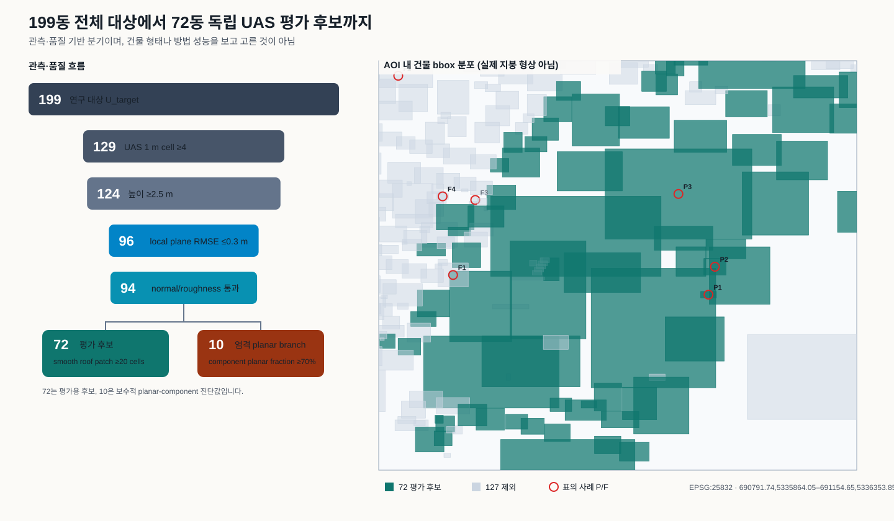

# Gate S0 UAS 평가대상 199→72 설명서 v1

## 한 문장 결론

**199동 모두에 UAS LiDAR가 충분히 관측된 것이 아니다.** 199동은 영상과 stable ID로
정한 전체 연구 대상이고, 그중 건물 bbox 안에 최소 4개의 1 m UAS 관측 cell이 있던
건물은 129동, 품질 필터를 통과한 독립 UAS 지붕 cell과 C1–C5 입력 지원을 함께 확보한
평가 후보는 72동이다. 이 선택은 방법 결과를 보기 전에 이루어졌다.

## 숫자의 의미

| 수 | 의미 | 현재 허용되는 해석 |
|---|---|---|
| 199 | U_target: 선택 AOI의 영상+stable-ID 전체 대상 | coverage 분모 |
| 129 | 각 건물 bbox 안에 raw UAS 1 m cell이 최소 4개 | UAS가 실제로 닿은 최소 관측 범위 |
| 94 | 높이·분산·이웃·평면 RMSE·normal·roughness cell 품질을 통과 | 아직 building evaluation roster는 아님 |
| 72 | 20-cell 이상 smooth roof patch와 모든 condition support를 확보 | 독립 UAS 평가가 가능한 pilot 후보 |
| 51 | 72 중 development split | DEC-P1-013의 C1/C2 실행 범위 |
| 11 | validation split | C3 설계 동안 보호 |
| 10 | held-out split | 최종 확인 전까지 보호 |

여기서 별도로 나타나는 `baseline_final=10`은 “평가 가능한 건물이 10동뿐”이라는 뜻이
아니다. 연결된 전체 component의 70% 이상이 planar cell이어야 한다는 매우 보수적인
reference-segmentation 진단 branch다. 현재 72 후보는 각 cell의 높이·local plane·normal·
roughness 검사를 유지하되, 그 70% component 비율 조건은 평가 roster 조건으로 쓰지 않은
`diagnostic_final` branch다. 따라서 72는 **pilot 평가 후보**이며 confirmatory 모집단으로
승격된 수가 아니다.

## 72동이 다른 점

각 후보 건물은 결과값과 무관하게 다음 입력 조건을 동시에 만족한다.

- 독립 UAS 지붕 reference cell: 계약상 최소 4개, 실제 72동의 최솟값은 5개
- 현재 영상 관측: 계약상 최소 2 view, 실제 최솟값은 54 view
- 공통 MVS support: 계약상 최소 4 cell, 실제 최솟값은 47 cell
- C4 existing-ALS support: 계약상 최소 4 cell, 실제 최솟값은 57 cell
- C5 LoD1 candidate 존재 및 입력 정합 준비. 단, 현재 것은 LoD2-derived
  `diagnostic-only`이며 이 조건만으로 primary C5 실행·평가가 READY가 되지는 않음

독립 UAS는 C2–C5의 reconstruction, registration, crop 또는 `R_derived` 생성에 들어가지
않고 **결과를 재는 자**로만 사용한다. C1은 같은 UAS 계열을 입력으로도 쓰므로
`SELF_REFERENCE_UPPER_BASELINE`으로 분리해 해석한다.

## 127동이 제외된 직접 이유

| 사유 조합 | 건물 | U_target 비율 |
|---|---|---|
| UAS reference만 부족 | 78 | 39.2% |
| UAS reference + MVS 부족 | 38 | 19.1% |
| UAS reference + MVS + C4 ALS 부족 | 9 | 4.5% |
| UAS reference + C4 ALS 부족 | 2 | 1.0% |

모든 제외 건물에 공통으로 독립 UAS reference 부족이 포함된다. 즉 현재 가장 큰 병목은
영상이나 LoD1이 아니라, 해당 building bbox 안에서 품질 필터를 통과한 UAS 지붕 cell이
4개 이상 남느냐이다. 일부는 MVS 또는 C4 ALS support도 함께 부족하다.

## 실제 통과·불통 사례

아래 bbox 크기는 건물의 대략적인 XY 범위를 보여 줄 뿐 실제 지붕 형상을 뜻하지 않는다.
현재 동결된 설명 자료에는 정사영상 crop이나 지붕 mesh가 없으므로, 형태가 쉬워 보여서
골랐다는 식의 사후 해석은 하지 않는다.

| 표시 | building | UAS cells | image views | MVS cells | C4 cells | bbox m | 판정/사유 |
|---|---|---|---|---|---|---|---|
| P1 | DEBY_LOD2_4959324 | 5 | 228 | 97 | 87 | 11.96×7.76 | PASS_ALL_INPUT_SUPPORT_RULES |
| P2 | DEBY_LOD2_4959793 | 97 | 241 | 282 | 193 | 16.84×19.9 | PASS_ALL_INPUT_SUPPORT_RULES |
| P3 | DEBY_LOD2_4959460 | 3543 | 399 | 8842 | 6740 | 111.51×107.96 | PASS_ALL_INPUT_SUPPORT_RULES |
| F1 | DEBY_LOD2_4907184 | 3 | 186 | 521 | 451 | 23.074×28.73 | INSUFFICIENT_INDEPENDENT_UAS_REFERENCE_SUPPORT |
| F2 | DEBY_LOD2_4907034 | 0 | 61 | 0 | 574 | 52.27×28.55 | INSUFFICIENT_INDEPENDENT_UAS_REFERENCE_SUPPORT;INSUFFICIENT_MVS_SUPPORT |
| F3 | DEBY_LOD2_4908166 | 0 | 85 | 40 | 3 | 7.082×7.031 | INSUFFICIENT_INDEPENDENT_UAS_REFERENCE_SUPPORT;INSUFFICIENT_C4_SUPPORT |
| F4 | DEBY_LOD2_4908164 | 0 | 63 | 0 | 0 | 8.691×6.887 | INSUFFICIENT_INDEPENDENT_UAS_REFERENCE_SUPPORT;INSUFFICIENT_MVS_SUPPORT;INSUFFICIENT_C4_SUPPORT |

전체 사례의 기계 판독 표는 `uas_eligibility_examples_v1.csv`, 전체 요약과 source binding은
`uas_eligibility_explainer_v1.json`에 있다.

## 이 72동으로 할 수 있는 것과 없는 것

- 가능: development 51동에서 C1/C2의 생성 성공, schema/semantic, 지붕 거리·높이·normal
  오차를 기술적으로 확인하고, 그 실패 유형을 바탕으로 C3 첫 학습전략 DRAFT를 설계한다.
- 불가: 72동을 72개의 완전히 독립적인 표본처럼 취급하거나, validation/held-out 결과로
  C3를 조정하거나, TUM2TWIN 전체에 대한 confirmatory 성능 결론을 내린다.
- 이유: 72동은 9개 공간/reference group이고 가장 큰 group에 47동이 몰려 있다. group 내
  상관을 0.05로 가정한 유효 표본수는 전체 28.05,
  held-out 8.33 수준이며 held-out group은 2개뿐이다.

따라서 현재 순서는 `R4에서 C1/C2 102행 완성 → 독립 검토 → 관찰된 실패 유형으로 C3
전략 DRAFT`가 맞다. 더 넓은 일반화 주장은 별도의 독립 reference/group 확장이 필요하다.

## Source와 판정 상태

- 결정 근거: `DEC-P1-013`
- 입력: 기존 R1 promoted CSV/JSON과 동결 config의 exact Git blobs만 사용
- raw UAS, MVS, LoD1/LoD2, Images.zip, OPF.zip 재열기·재해시: 0
- 성능 결과 사용: 0
- scientific_verdict: `null`
