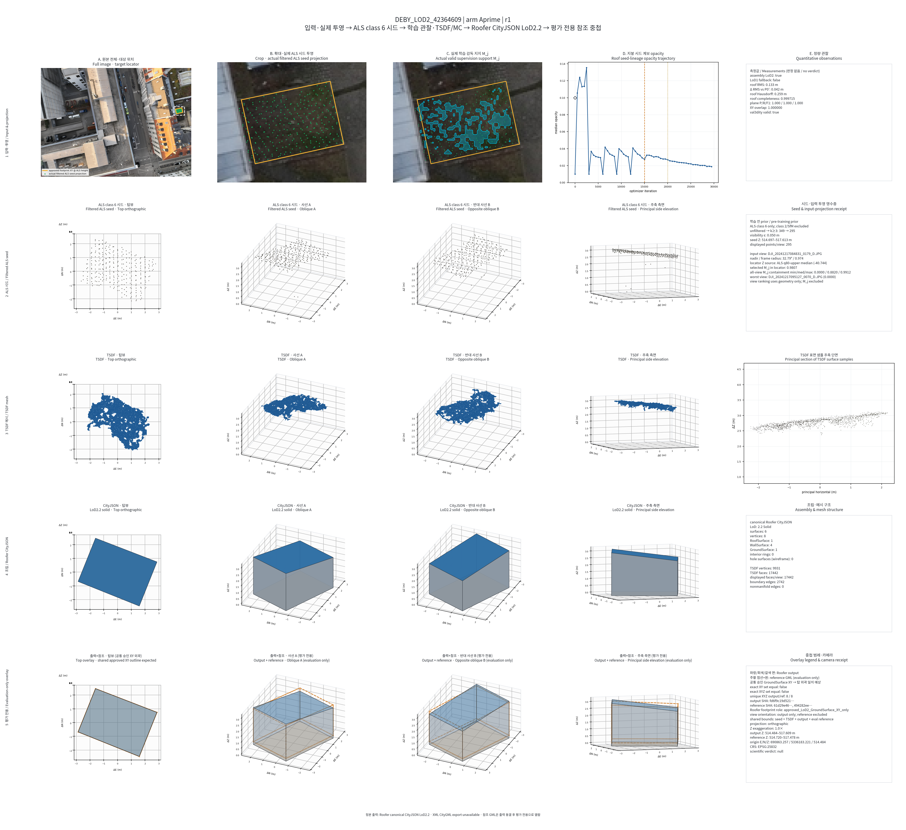
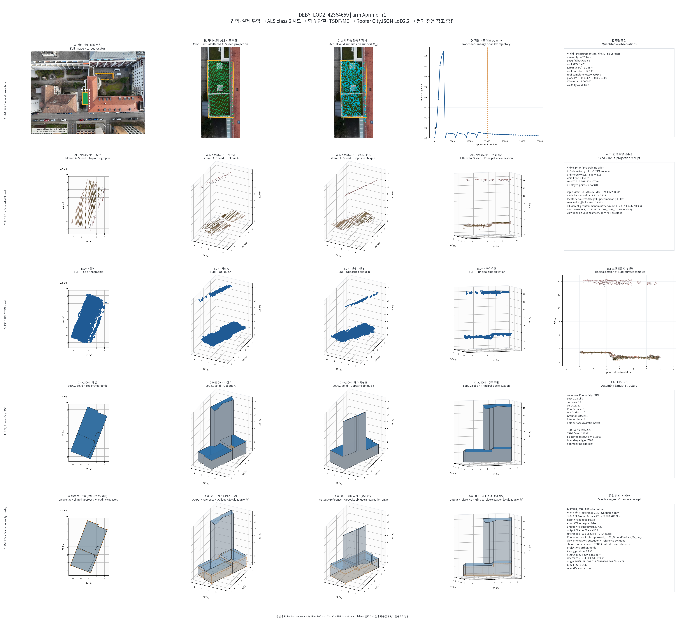

# A-prime 후처리 결과 인덱스

> 상태·측정값·산출물 위치만 기록한다. 과학적 판정은 포함하지 않는다.
> 각 job은 `30k 학습 → TSDF/MC → Roofer CityJSON → 정량 채점 → panel-v4`가
> 끝나야 `MEASURED`로 표시한다.

## 현재 집계

| 상태 | job 수 | 비고 |
|---|---:|---|
| `MEASURED` + panel-v4 | 2 | 아래 통합 패널과 정본 링크 제공 |
| 30k 학습 완료·후처리 대기 | 4 | `42364663`, `4907182`, `4907510`, `4908050` A-prime r1 |
| 신규 학습부터 대기 | 15 | A-prime r1 3개 + r2 9개 + B r1 3개 |

## 완료 job

| job | LoD2 | RMS (m) | completeness | plane F1 | val3dity | 통합 패널 | 정량 | Roofer CityJSON | TSDF mesh | opacity | 완료 receipt |
|---|---:|---:|---:|---:|---:|---|---|---|---|---|---|
| `42364609 A-prime r1` | true | 0.132732 | 0.999715 | 1.0 | true | [panel](review_v4/by_building/DEBY_LOD2_42364609/arm_Aprime/r1/panel.png) | [score](../20260727_fusion_w1_aprime_smoke_recovery/readout/by_building/DEBY_LOD2_42364609/arm_Aprime/r1/attempts/attempt_005/primary/score.json) | [CityJSON](review_v4/by_building/DEBY_LOD2_42364609/arm_Aprime/r1/roofer.city.json) | [mesh](../20260727_fusion_w1_aprime_smoke_recovery/readout/by_building/DEBY_LOD2_42364609/arm_Aprime/r1/attempts/attempt_005/tsdf/tsdf_mesh_filtered_epsg25832_orthometric.ply) | [CSV](review_v4/by_building/DEBY_LOD2_42364609/arm_Aprime/r1/opacity.csv) | [complete](review_v4/by_building/DEBY_LOD2_42364609/arm_Aprime/r1/complete.json) |
| `42364659 A-prime r1` | true | 3.425336 | 0.999840 | 0.8 | true | [panel](review_v4/by_building/DEBY_LOD2_42364659/arm_Aprime/r1/panel.png) | [score](readout/by_building/DEBY_LOD2_42364659/arm_Aprime/r1/attempts/attempt_001/primary/score.json) | [CityJSON](review_v4/by_building/DEBY_LOD2_42364659/arm_Aprime/r1/roofer.city.json) | [mesh](readout/by_building/DEBY_LOD2_42364659/arm_Aprime/r1/attempts/attempt_001/tsdf/tsdf_mesh_filtered_epsg25832_orthometric.ply) | [CSV](review_v4/by_building/DEBY_LOD2_42364659/arm_Aprime/r1/opacity.csv) | [complete](review_v4/by_building/DEBY_LOD2_42364659/arm_Aprime/r1/complete.json) |

### 42364609 A-prime r1

### 42364659 A-prime r1

## 다음 후처리 순서

1. `42364663 A-prime r1`
2. `4907182 A-prime r1`
3. `4907510 A-prime r1`
4. `4908050 A-prime r1`

위 네 job은 기존 30k 체크포인트를 재사용하고 신규 학습 없이 readout과 panel-v4를
먼저 생성한다. 이후에만 남은 신규 학습 job으로 넘어간다.

## 형식 주의

- 정본 조립 산출물은 Roofer CityJSON LoD2.2다.
- 신뢰 가능한 고정 변환기가 없어 직접 XML CityGML/GML 변환은 현재
  `UNAVAILABLE/CENSORED`다.
- 실패 attempt와 내부 로그는 원래 provenance 경로에 보존하며 이 인덱스로 복제하지 않는다.
