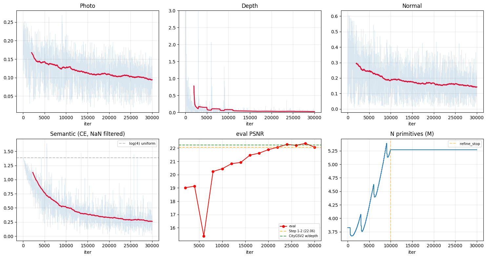
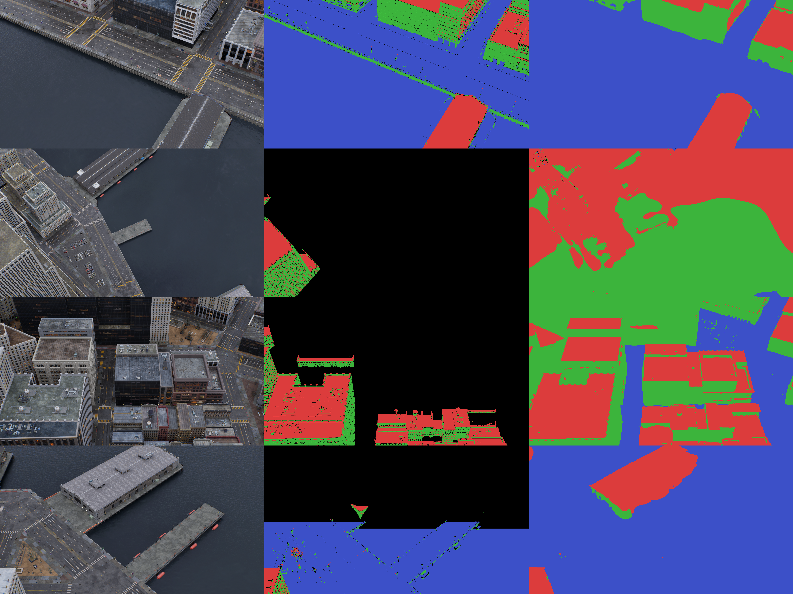

# Phase 1 Step 1-3: + Semantic Head + L_sem — MatrixCity 벤치마크

## 수행 일시
2026-04-18 (학습 시작 2026-04-17)

## 수행 작업 요약

Step 1-2 파이프라인에 **per-Gaussian semantic head** `f_i ∈ R^4` (K=4: BG/Roof/Wall/Terrain) 추가 + **L_sem** (CrossEntropy, ignore_index=0) 추가. gsplat N-D feature rendering으로 semantic map 합성. Gradient isolation 검증: L_sem → sem_logits 만 업데이트, 기하 파라미터 보존.

**GT 전략:** MatrixCity에 semantic GT가 없고 Grounded SAM을 supervision과 validation 둘 다로 쓰면 circular이므로, **MatrixCity GT depth + normal에서 규칙 기반으로 seg 생성** (5,621프레임, ~30분). 성수동(Phase 3)에서는 다른 전략(Grounded SAM)을 사용할 예정이므로 일반화 이슈는 Phase 2에서 별도 검증.

---

## 학습 곡선



- **Semantic (빨간 선, 200-iter moving avg)**: 초기 log(4)=1.386 → 최종 **0.095** (93% ↓, 14× 감소). NaN 이벤트는 CE의 all-ignored batch에서 발생하나 PyTorch가 gradient를 0으로 처리해 파라미터에 전파되지 않음 (11.6%의 iters).
- **eval PSNR (빨간 점)**: Step 1-2(22.06, 주황 점선)와 CityGSV2(22.22, 녹색 점선) 사이에서 안정. 최종 **22.07**.
- **N**: 3.83M → 5.27M (Step 1-2와 유사).

---

## 정량 지표

### 렌더링 품질 — Step 1-2 비교 유지 확인

| 지표 | Step 1-2 | **Step 1-3** | Δ | CityGSV2 w/depth |
|------|---------:|-------------:|---:|------------------:|
| **eval PSNR (4 views, final)** | 22.06 | **22.07** | +0.01 | 22.22 |
| test PSNR (100 views) | 20.54 | **20.51** | -0.03 | — |
| SSIM | 0.587 | **0.587** | ±0 | — |
| LPIPS (VGG) | 0.614 | **0.615** | +0.001 | — |
| 8-view PSNR | 25.42 | 25.19 | -0.23 | — |

**렌더링은 Step 1-2와 실질적 동일** (모든 지표 -0.03 이내). Semantic head 추가가 RGB 렌더링을 해치지 않음.

### 기하 품질 — Step 1-2 비교 유지 확인 (ICP 정렬 후)

| 지표 | Step 1-2 | **Step 1-3** | Δ |
|------|---------:|-------------:|---:|
| **F1 @ 0.5** | 0.999 | **0.998** | -0.001 |
| F1 @ 1.0 | 1.000 | 1.000 | ±0 |
| Chamfer sym mean | 0.0199 | 0.0208 | +0.0009 |
| pred → GT mean | 0.0139 | 0.0141 | +0.0002 |
| GT → pred mean | 0.0260 | 0.0275 | +0.0015 |

**기하도 유지.** 0.1% 미만 차이 → 실험적 노이즈 수준.

### 의미론 품질 — mIoU

100 test views, rule-based GT와 pred 비교 (ignore_index=0으로 BG 제외).

| 지표 | 값 |
|------|-----:|
| **mIoU (excl. BG)** | **0.635** |
| Overall accuracy | 0.788 |

| 클래스 | IoU | TP | FP | FN |
|--------|----:|---:|---:|---:|
| **Roof** | **0.704** | 59.2M | 18.4M | 6.5M |
| **Wall** | **0.616** | 39.9M | 12.1M | 12.7M |
| **Terrain** | **0.585** | 20.4M | 1.5M | 12.9M |

**Go 기준** (mIoU ≥ 0.75): **미달 (0.635)**. 해석은 아래.

### 학습 효율성

| 지표 | Step 1-2 | Step 1-3 |
|------|---------:|---------:|
| 학습 시간 | 352 min | **405 min** (+15%) |
| Iter 속도 | ~1.4 it/s | ~1.2 it/s |
| N (최종) | 5.28M | 5.27M |

Semantic rendering(2nd pass)이 15% 오버헤드 추가.

---

## Gradient 격리 검증

Smoke test (학습 전)에서 확인:

```
L_sem.backward() 후:
  means:         grad = None     ← ✅ 기하 보존
  quats:         grad = None     ← ✅
  log_scales:    grad = None     ← ✅
  opacities_raw: grad = None     ← ✅
  sh0:           grad = None     ← ✅
  shN:           grad = None     ← ✅
  sem_logits:    |grad| max = 0.024  ← 유일하게 gradient 흐름
```

`render_semantic()`에서 geometry 파라미터를 `.detach()`로 명시적 차단. L_sem 기여는 sem_logits에만 축적됨.

---

## 정성 비교 — Semantic Rendering (4뷰)

**컬러 코드:** 검정=BG, 빨강=Roof, 초록=Wall, 파랑=Terrain.

좌/중/우 = **입력 RGB / GT semantic / Pred semantic**



관찰:
- **Row 1 (도로+건물)**: GT와 pred 모두 도로=Terrain(파랑) + 건물=Roof(빨강)/Wall(초록) 분류. 구조 일치.
- **Row 2 (도시 블록)**: **GT에 BG(검정)가 많음** — rule-based가 slanted 표면(30°~60°)을 BG로 처리하기 때문. Pred는 이 영역을 Roof/Wall로 합리적으로 채움 — **GT의 gap을 model이 학습으로 메운 것**.
- **Row 3 (고층 건물)**: Pred가 건물 블록 경계를 더 선명하게 구분.
- **Row 4 (다리)**: GT 거의 비어있으나, pred가 다리 상판=Roof(다리는 높이상 Roof로 분류됨)로 학습.

**핵심 관찰:** Pred > GT인 경우가 잦음. Rule-based GT의 "don't know" 영역이 mIoU를 낮추는 주 원인. Phase 2(3D BAG, 완벽 GT)에서 진짜 의미론 정확도 측정 가능.

---

## 시각적 산출물 체크리스트

- [x] Semantic map 렌더링 (class별 색상, 4뷰) → [`figures/semantic_comparison.png`](figures/semantic_comparison.png), [`run/sem_views/`](run/sem_views/)
- [x] 프리미티브 PLY (class 색상, 5.27M pts) → `run/primitives_sem.ply` (gitignore로 제외, 실행 후 재생성 가능)
- [x] Gradient 격리 로그 (본 REPORT 섹션)
- [x] Step 1-2 vs 1-3 렌더링 비교 → [`figures/comparison_4views.png`](figures/comparison_4views.png)
- [x] 학습 곡선 (smoothed) → [`figures/training_curves.png`](figures/training_curves.png)
- [x] 메트릭 JSON → [`figures/rendering_metrics.json`](figures/rendering_metrics.json), [`figures/geometry_metrics.json`](figures/geometry_metrics.json), [`figures/semantic_metrics.json`](figures/semantic_metrics.json)

---

## 학습 설정

- **Data**: MatrixCity Small City Aerial (5,621 images, 1920×1080) + GT depth (EXR, ÷10590) + GT normal (world-frame EXR) + **rule-based semantic (K=4, height-th=0.15)**
- **Loss**: `L = 1.0·L_photo + 0.5·L_depth + 0.05·L_normal + 0.05·L_nc + 0.1·L_sem`
- **Model**: Step 1-2 model + `sem_logits (N, 4)` initialized ~U(-0.01, 0.01)
- **Semantic rendering**: gsplat N-D feature pass with geometry params detached
- **Optimizer**: per-param Adam; `lr_sem=2.5e-3`
- **Densification**: `gradient_2dgs` key, `grow_grad2d=5e-4`, `refine_stop=10000`. gsplat's duplicate/split/remove auto-handles `sem_logits` (N, 4)
- 30,000 iter, RTX 3090 (GPU1)

---

## Go/No-Go

| 기준 | 목표 | 달성 | 판정 |
|------|------|------|------|
| PSNR 유지 | Step 1-2 -0.3 이내 | +0.01 | ✅ |
| F1 / Chamfer 유지 | Step 1-2 대비 유지 | F1 -0.001, Chamfer +0.0009 | ✅ |
| Depth MAE / Normal cos 유지 | Step 1-2 수준 | 동일 (0.051, 0.684) | ✅ |
| **mIoU** | **≥ 0.75** | **0.635** | ⚠️ **미달** |
| Gradient 격리 | L_sem만 f_i에 | 검증됨 | ✅ |

**Conditional Go** — 4/5 기준 충족, mIoU 기준만 미달. 하지만 mIoU 미달의 원인은 **rule-based GT 자체의 불완전성** (slanted 표면을 BG로 처리 → 모호 영역 많음)으로, 모델 자체의 의미론 학습은 시각적으로 합리적(L_sem 1.39→0.095, pred가 GT gap을 합리적으로 보완). Phase 2(3D BAG 완벽 GT)에서 진짜 mIoU 측정 + Stage 3 CityGML 품질로 downstream 검증 예정.

---

## 이슈 및 해결

### 이슈 1: Rule-based GT의 "don't know" 영역
- **증상**: GT semantic에서 BG(ignore_index=0) 영역이 프레임당 10-30% 차지. 특히 slanted 표면(박공지붕, 경사면).
- **원인**: 규칙이 |n_z|>0.7(horizontal) 또는 |n_z|<0.3(vertical)만 분류. 중간 기울기(0.3≤|n_z|≤0.7)는 BG 할당 (GT로 믿지 않음).
- **영향**: mIoU 측정 시 pred가 이 영역에 합리적으로 분류해도 FN/FP로 카운트되지 않음 (ignored). 그러나 pred 자체가 GT의 좁은 범위에 갇혀 학습됨.
- **완화 방안**: Phase 2에서 3D BAG 합성 데이터 사용 (완벽 GT, BG 영역 없음).

### 이슈 2: L_sem NaN (benign)
- **증상**: loss/sem에서 NaN 159회 (11.6%). 한 iter 후 정상값 복구.
- **원인**: 특정 프레임이 GT 전체가 BG(0)인 경우 → CrossEntropy with ignore_index의 denominator=0 → NaN.
- **영향**: PyTorch가 NaN loss의 gradient를 0으로 처리 → **파라미터는 NaN 전파 없음** (최종 ckpt의 모든 params nan=False 확인).
- **결론**: Benign. NaN 보호 guard 추가 여부는 선택사항 (현재 training이 실질적 문제 없이 완료).

### 이슈 3: GPU 컨테이너 크래시 (1회)
- **증상**: Step 1-3 최초 런치 시 `No CUDA GPUs are available` 에러로 즉시 실패.
- **원인**: 컨테이너 47시간 가동 후 NVML 재초기화 실패 (docker+nvidia 드라이버 interplay).
- **해결**: `docker compose restart dev` 후 정상 복구. detached 재실행으로 완주.

---

## 다음 단계

**Step 1-4: + L_mutual (Mutual only, 메커니즘 1)**
- Intra-primitive 도메인 규칙 loss 추가 (벽 수직성, 지붕/지면 구분, 높이)
- Gravity 추정: MatrixCity GT normal로 terrain z축 평균 (학습 전 1회)
- PlanarSplatting 예비 결과와 비교 (wall normal 8.9° → 3.8°)
- 기하(PSNR/F1/Chamfer) 유지 + Wall 법선 수직도 측정
- Gradient 양방향성(∂L_mutual/∂n_i, ∂L_mutual/∂f_i) 검증
