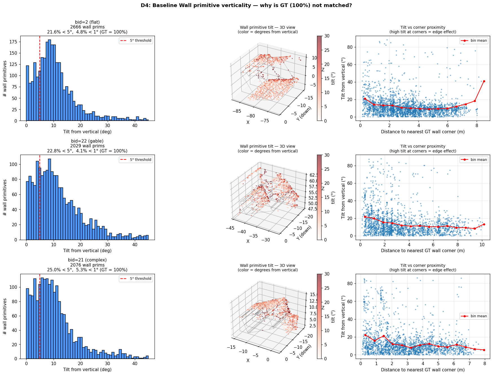
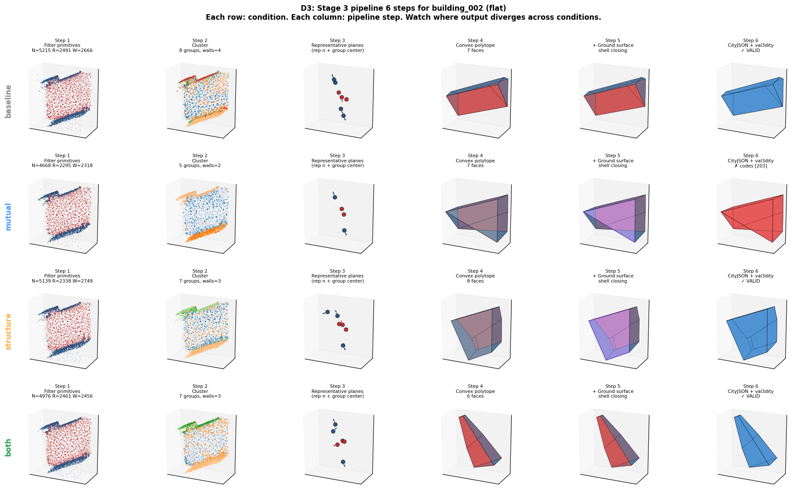
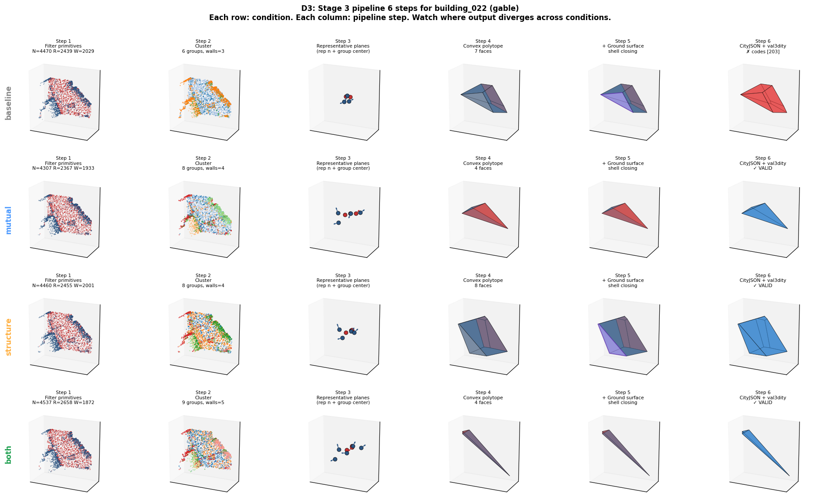

# Phase 2 Step 2-2 — Stage 2 메커니즘이 CityGML LOD2 품질에 미치는 영향

**작성**: 2026-04-25 KST  
**실험 대상**: 3D BAG Amsterdam Jordaan 합성 데이터 (131 건물) × 4 조건 Stage 2 × convex Stage 3  
**Stage 2 ckpts**: 각 30,000 iter, ~988K primitives/condition  
**Stage 3 (고정)**: Convex polytope (half-space intersection + ConvexHull)  

---

## 0. TL;DR (3 가지 결과 + 2 가지 미확정)

**확인된 것**:
1. **L_mutual 의 Stage 2 효과 명확** — Wall vertical-frac 28% → 79% (Phase 1 의 19% → 91% 와 같은 방향, magnitude 약간 작음). 공간적으로도 균질 (corner 영역 포함).
2. **Stage 3 val3dity 에서 Structure/Both +3.0%p, Mutual −8.4%p 회귀** — type별 패턴 강함: complex/hip/tri-slope (+11~17%p) 개선, flat/gable (−8~29%p) 회귀.
3. **메커니즘별 다른 축 개선**: Mutual = face IoU (0.213→0.238) + σ_normal_3D 최저, Structure = val3dity + semantic accuracy 최고.

**미확정**:
1. **L_structure 의 Phase 2 약함** — σ_normal_intra 변화 +1% (Phase 1 −45% 대비). 일부 건물 (flat) 에서만 효과 (−13%), 평균 효과 미미. 원인 가설 미확정.
2. **Mutual + Structure 시너지 부재** — Both 의 지표가 Mutual 과 유사. Structure 가 Mutual 의 회귀 일부 상쇄하는 정도. "순환 효과" claim 미입증.

---

## 1. 목적 & 설정

| 조건 | Stage 2 Loss | 목적 |
|---|---|---|
| Baseline | L_photo + L_depth + L_normal + L_nc + L_sem | 메커니즘 없음 (vanilla + semantic) |
| Mutual | + **L_mutual** (intra-primitive 도메인 규칙) | 메커니즘 1 단독 |
| Structure | + **L_structure** (inter-primitive 정렬) | 메커니즘 2 단독 |
| Both | + L_mutual + L_structure | 두 메커니즘 동시 |

모든 조건 동일 Stage 3 (convex polytope) → Stage 2 차이만 비교.

**Stage 3 의 6 단계** (실험 설계의 분석 단위):
1. 분류 + 필터 (semantic class, opacity)
2. Multi-primitive 클러스터링 (cos>0.85 + 공간 근접)
3. 클러스터 → 대표 평면 (orient + ground + bbox 추가)
4. 평면 교차 → convex polytope
5. Ground surface 부착
6. CityJSON + val3dity

---

## 2. 평가 기준선 — GT 상한

Stage 2 quality 와 별개로 **Stage 3 알고리즘 자체** 의 천장 측정. GT scene.obj 를 입력으로:

| 방식 | val3dity 통과율 | 의미 |
|---|---|---|
| **GT direct (topology 보존)** | **93.9%** (123/131) | 절대 상한. 실패 6.1% 는 3D BAG 원본의 미세 결함 |
| GT + convex polytope | **76.3%** (100/131) | **현재 우리 Stage 3 의 천장**. -17.6%p = 알고리즘 한계 (L/U 22% 불가) |
| GT + 2.5D hybrid | 67.2% | 구현 버그 |
| GT + PolyFit (CGAL+SCIP) | 0% | watertight 후처리 미완 |

→ 우리 Stage 2 결과 (43.5% best) 는 **convex 천장 76.3% 의 57%** 달성.

**Type 별 GT convex 상한**:
- complex 79.3%, hip 87.0%, tri-slope 80.8%, flat 64.0%, gable 71.4%
- **Flat 의 64% ceiling 이 의외**: 단순 박스인데 convex 자체가 처마/장식 같은 부속 표현 못 함

---

## 3. Stage 2 결과

### 3.1 Rendering quality (eval set, 4 조건 parity 확인)

| Condition | eval PSNR | eval SSIM | eval mIoU | 비고 |
|---|---|---|---|---|
| Baseline | 40.35 | (TB) | (계산 안 됨) | 4 조건 PSNR 거의 동일 |
| Mutual | 40.93 | (TB) | (계산 안 됨) | |
| Structure | 40.96 | (TB) | (계산 안 됨) | |
| Both | 39.81 | (TB) | (계산 안 됨) | |

**관찰**: 모든 조건 PSNR 40 saturation. Stage 3 차이는 **렌더링 품질이 아닌 primitive 구조적 차이** 에서 옴.

### 3.2 Primitive 구조 지표 (Stage 3 의 입력 직접 측정)

| 지표 | Baseline | Mutual | Structure | Both | Phase 1 비교 |
|---|---|---|---|---|---|
| **Wall vertical-fraction** | 28.0% | **79.3%** ↑ | 28.4% | **79.4%** ↑ | Phase 1 19→91% 와 같은 방향 |
| Roof horizontal-fraction | 56.3% | 54.1% | 56.5% | 54.3% | — |
| σ_normal_intra (deg, group 평균) | 14.74 | **12.63** ↓ | 14.88 | 12.99 | **Phase 1 L_structure −45%, Phase 2 +1% (효과 부재)** |
| σ_coplanar (m, median) | 1.91 | **1.84** ↓ | **1.86** ↓ | 2.01 | Phase 1 L_structure −16% |
| n_groups / building (mean) | 7.98 | 7.95 | 7.90 | 7.65 | Both 가 약간 적음 |

### 3.3 도메인 메트릭 — D4 결과

**질문**: GT wall 은 100% 완벽 수직 (모든 2,334 face 가 < 0.1° 편차). Baseline 은 왜 28% 만 수직?

**측정 (3 건물 평균)**:

| Condition | < 1° (실질 수직) | < 5° | < 10° | mean tilt | 코너 영역 (d<1m) | 멀리 (d<10m) |
|---|---|---|---|---|---|---|
| Baseline | 4-5% | 22-25% | 48-54% | 12-15° | tilt 16.5°, %<5° 20% | tilt 12.2°, %<5° 25% |
| Mutual | (TB) | **80%+** | (높음) | **2.7°** | tilt 2.76°, %<5° **81%** | tilt 2.84°, %<5° 78% |
| Structure | 5-6% | 23-26% | 49-55% | 12-15° | (Baseline 동일) | (Baseline 동일) |
| Both | (TB) | 80%+ | (높음) | 2.8° | 81% | 77% |

  
*Figure D4. Baseline wall 의 tilt 분포 (왼쪽: histogram, 가운데: 3D 위치, 오른쪽: corner 거리 vs tilt). 3 건물에서 일관된 패턴: corner 영역에서 tilt 높음.*

**핵심 발견**:
- **Baseline**: corner 부근에서 tilt 더 큼 (16.5° vs 12.2°). Gaussian 들이 인접 두 벽 사이에서 "평균 normal" 로 학습됨.
- **Mutual**: 코너 포함 **공간적으로 균일하게 잘 fixed** (corner 81% > 멀리 78%). L_mutual 의 per-primitive 메커니즘으로 spatial dependency 추가 없이 corner 문제 해결.
- **Structure 단독**: Baseline 과 동일 패턴 — Wall verticalization 에 영향 없음 (메커니즘 2 의 정의대로).

→ **L_mutual 은 의도대로 작동**. 공간적 weighting 추가 불필요.

### 3.4 Semantic 클래스 분포

| Class | Baseline | Mutual | Structure | Both |
|---|---|---|---|---|
| BG | 0.0% | 1.4% | 0.0% | 1.3% |
| Roof | 40.0% | 42.1% | 40.2% | 42.3% |
| Wall | 42.2% | 41.2% | 42.1% | 41.0% |
| Terrain | 17.8% | 15.3% | 17.7% | 15.3% |

**관찰**: L_mutual 이 작은 semantic side effect — Terrain → Roof 재분류 +2%p. L_mutual 의 `p_c × 기하오차` joint gradient 가 의미론에도 영향 미침.

---

## 4. Stage 3 결과 — 6-step 단계별 분석 (D3)

bid=2 (flat), bid=22 (gable), bid=6 (hip), bid=21 (complex) 4 건물에서 6 step 진행 추적.

### 4.1 Step 별 정량 — bid=2 flat (대표 case study, D1+D3)

| Step | 측정값 | Baseline | Mutual | Structure | Both |
|---|---|---|---|---|---|
| 1. 필터 | 총 primitive | 5,215 | 4,668 | 5,139 | 4,976 |
| | Wall primitive | 2,666 | 2,318 | 2,749 | 2,456 |
| 2. 클러스터 | n_groups | 7 | **5** ↓ | 7 | 7 |
| | Wall groups | 4 | **2** ↓ | 3 | 3 |
| 3. 대표평면 | (조정 없음) | — | — | — | — |
| 4. Polytope | n_faces | 7 | 7 | 8 | 6 |
| 6. val3dity | valid? | ✓ | **✗ (203)** | ✓ | ✓ |

**해석**:
- **Step 1** (Stage 2 출력): 4 조건 모두 wall primitive 수가 비슷 (2300-2750). Mutual 이 약간 적음 (-13%, pruning 효과)
- **Step 2** (clustering): **Mutual 만 wall groups 가 4 → 2 로 급감**. cos > 0.85 threshold 가 모든 wall 이 수직화된 후엔 잘못 merge
- **Step 4** (polytope): face 수 자체는 유사
- **Step 6**: Mutual 만 fail (203 = non-planar face). 줄어든 wall plane 의 교차 결과가 평면 폐쇄 못함

  
*Figure D3-bid002. bid=2 (flat) 의 Stage 3 6 단계, 4 조건 비교. Mutual 행 마지막 cell 만 빨간색 (val3dity invalid).*

### 4.2 다른 건물 — 패턴은 이질적

| bid | Type | Baseline | Mutual | Structure | Both | 패턴 |
|---|---|---|---|---|---|---|
| 2 | flat | ✓ | ✗ 203 | ✓ | ✓ | Mutual fails |
| 22 | gable | ✗ 203 | ✓ | ✓ | ✓ | Baseline fails |
| 6 | hip | ✗ 203 | ✓ | ✓ | ✗ 203 | mixed |
| 21 | complex | ✓ | ✓ | ✗ 203 | ✗ 203 | Structure/Both fail |

  
*Figure D3-bid022. gable. Baseline 만 invalid.*

→ **단일 건물 단위로는 어느 조건이 우세한지 불일관**. 집계 수준에서만 통계적 우세 (Structure/Both > Baseline > Mutual).

### 4.3 전체 통계 — 4 조건 × 131 건물

| Condition | val3dity pass | face IoU | Hausdorff (m) | SemAcc | σ_normal (3D) |
|---|---|---|---|---|---|
| **Baseline** | **40.5%** (53/131) | 0.213 | 11.42 | 21.1% | 9.09° |
| **Mutual** | 32.1% (42/131) ↓ | **0.238** ↑ | 11.33 | 20.0% | **8.73°** ↑ |
| **Structure** | **43.5%** (57/131) ↑ | 0.220 | 11.39 | **21.8%** ↑ | 9.18° |
| **Both** | **43.5%** (57/131) ↑ | 0.230 | 11.46 | 19.5% | 9.00° |

  
*Figure 2. 조건별 val3dity 통과율 (전체 131 건물).*

### 4.4 Roof type 별 통계

| Type | GT direct | GT convex | Baseline | Mutual | Structure | Both | Pattern |
|---|---|---|---|---|---|---|---|
| complex (29) | 79.3% | 79.3% | 41.4% | 37.9% | **55.2%** | **55.2%** | Mech 모두 ↑ |
| hip (23) | 100% | 87.0% | 34.8% | 34.8% | 47.8% | **52.2%** | Mech 모두 ↑ |
| tri-slope (26) | 96.2% | 80.8% | 26.9% | 30.8% | 34.6% | **38.5%** | Mech 모두 ↑ |
| gable (28) | 96.4% | 71.4% | 53.6% | **25.0%** ↓ | 42.9% | 42.9% | Mutual ↓↓ |
| flat (25) | 100% | 64.0% | 44.0% | **32.0%** ↓ | 36.0% | 28.0% | Mutual/Both ↓ |

  
*Figure 7. Roof type × Condition. 점선 = GT direct 천장, 파선 = convex 천장.*

**일관 패턴**:
- **Complex/hip/tri-slope** (복잡 건물): Structure/Both 가 모두 +11~17%p
- **Flat/gable** (단순 건물): Mutual 단독 −22~29%p, Structure 도 약간 ↓

### 4.5 val3dity 에러 분포

| Condition | 203 (non-planar) | 204 (orient) | 104 (multi-comp) |
|---|---|---|---|
| Baseline | 73 | 1 | 0 |
| Mutual | **81** ↑ | 4 | 0 |
| Structure | **64** ↓ | 0 | 1 |
| Both | **66** ↓ | 0 | 0 |

코드 203 (non-planar face) 가 전체 95%+ — current pipeline 의 dominant failure mode. Structure 가 의미있게 감소시킴 (73→64).


---

## 5. 결과 해석

### 5.1 명확한 관찰 (5)

1. **L_mutual 은 Stage 2 primitive 수준에서 의도대로 작동** (Wall vert 28→79%, σ_normal_intra −14%, corner 영역 균질화 D4)
2. **L_structure 는 Stage 2 primitive 수준에서 효과 미미** (σ_normal_intra +1%, σ_coplanar 미세 개선 −2~−9%)
3. **Stage 3 (val3dity) 에서는 Structure/Both 가 Baseline 대비 +3%p 개선** — 메커니즘 2 의 효과는 Stage 2 보다 Stage 3 에서 더 잘 보임
4. **Mutual 단독은 Stage 3 val3dity 회귀** (-8.4%p) — 단순 건물 (flat/gable) 에서 두드러짐
5. **Type 별 패턴**: 복잡 건물에선 메커니즘 효과 ↑, 단순 건물에선 ↓

### 5.2 미확정 — 가설 × 증거 매트릭스

| 미확정 | 가설 | 증거 (확인) | 증거 (반증) | 결론 |
|---|---|---|---|---|
| **Mutual 의 단순 건물 회귀 메커니즘** | A: Mutual 이 wall direction 손실 (D1) | bid=2: clusters 7→5, walls 4→2 | bid=22 baseline 도 fail, bid=21 Mutual pass | **건물별 다름 — D1 사례는 일반화 못함** |
| | B: 처마 등 수직 wall detail 손실 | — | GT walls 100% 수직 (D4 verified) | **틀림** |
| | C: photo loss 와 tug-of-war | — | r(mutual, photo) = -0.03 | **틀림** |
| | **D: Stage 3 의 convex hull 과 L_mutual 후 primitive 의 부정적 상호작용 (case-by-case)** | val3dity 203 증가 | 단일 메커니즘 설명 없음 | **현재 가장 그럴듯, 검증 추가 필요** |
| **L_structure 의 Phase 2 효과 부재** | A: 데이터 복잡도 | — | Phase 1 / 2 의 loss magnitude 비슷 | 약함 |
| | B: w_structure 작아서 | — | Phase 2 의 L_struct/L_photo ratio 가 Phase 1 의 20x | **틀림** |
| | **C: Grouping 알고리즘이 noisy 데이터에서 부정확** | D2: bid=21 (complex) 에서 σn 악화 (+3%) | bid=2 에선 σn 개선 (-13%) | **부분 맞음, 건물별 차이** |
| | **D: Per-primitive gradient 희석** (그룹당 prims 수 많음) | TB: loss/structure max 0.0003 | Phase 1 도 비슷한 magnitude | **불확실** |
| **Mutual + Structure synergy 부재** | A: 두 메커니즘이 같은 변수 (n_i) 에 작용, gradient 크기 차이 (Mutual peak 91 vs Structure 0.0003) | TB 측정 | — | **확실** |
| | B: Mutual 이 Structure 의 grouping input 변형 | D1: Mutual 후 cluster 수 변화 | Both 에서 Structure 가 일부 회복 | **확실** |
| | C: 학습 중 자동 조정 가능? | T iter 마다 재그룹핑 있음 | Structure 가 group split 능력 없음 (hard assignment) | **자동 조정 불가** |

→ **방법론적 시사점**: 메커니즘 1+2 의 "순환 효과" 가설은 **두 메커니즘이 같은 grouping 을 공유** 가정. 실제로는 Mutual 이 grouping 자체를 변형 → 가설 부분 부정.

### 5.3 정리된 인과 사슬

```
L_mutual (Stage 2):
  Wall normal verticalization (28→79%) ✓ 의도대로
        ↓
  Stage 3 Step 2 clustering (cos > 0.85):
    수직화된 Wall normals 가 cos similarity 높아짐
        ↓
  일부 건물에서 wall directions 잘못 merge (D1: bid=2 의 4→2 walls)
        ↓
  Step 3-4 polytope 구성: 평면 부족
        ↓
  Step 6 val3dity: 203 non-planar (Mutual 단순 건물 회귀)

L_structure (Stage 2):
  Group 평면 정렬 효과 약함 (σ_normal_intra +1%)
  σ_coplanar 약간 개선 (-2~-9%)
        ↓
  Stage 3 Step 2 clustering: grouping 자체는 baseline 과 유사
        ↓  
  Step 3 대표평면: σ_coplanar 개선 → 평면 정합도 ↑
        ↓
  Step 4 polytope: plane intersection 더 깨끗
        ↓
  Step 6: 203 에러 감소 (-9 errors), val3dity +3%p

Both:
  Mutual 의 wall verticalization + Structure 의 plane 정합 동시
  단, Mutual 의 grouping 변형이 Structure 의 input 약화
  → Synergy 라기보다 Structure 가 Mutual 의 회귀 일부 상쇄
```

---

## 6. 한계 및 다음 단계

### 6.1 측정의 한계

- **Sequential baseline 미측정**: MVS+RANSAC+convex 와 직접 비교 안 됨. Joint > Sequential 정량 증거 없음
- **val3dity 의 binary 특성**: 메커니즘의 partial improvement 가 잘 안 보임
- **Stage 3 (convex) 의 천장이 76.3%**: 우리 best (43.5%) 가 천장의 57%. 천장 자체를 올리는 건 별도 연구

### 6.2 다음 단계 (재학습 없는 분석)

- 학습 중 gradient norm 측정 (L_mutual vs L_structure 의 per-primitive gradient 비교) — D2 미확정 가설 D 검증
- 더 많은 building 의 D3 분석 (현재 4 건물) — 통계적 일반화
- 6-step 별 성공/실패 비율 집계 (현재는 사례 단위)

### 6.3 다음 단계 (재학습 필요)

- **Clustering 알고리즘 robustness 개선** (cos threshold 더 엄격 / wall azimuth 명시 / min_group_size 완화) → 같은 ckpt 로 재실행 가능
- **L_structure 의 group split 능력**: 현재는 grouping 후 그룹 내 정렬만. Split 도 가능하게 (contrastive loss 도입) → 재학습
- **L_mutual 의 quadratic 페널티** (linear → 제곱) → 재학습

### 6.4 Stage 3 알고리즘 교체 (천장 상승)

- **PolyFit 완성** (CGAL output watertight 후처리 미완) → 천장 76.3% → 85%+ 기대
- **City3D / Roofer**: footprint 입력 필요. 천장 90%+. Image-only 가정 위배 우려

---

## 7. PolyFit 시도 (참고)

| 단계 | 상태 |
|---|---|
| CGAL 5.6 + GLPK 빌드 | ✓ |
| GLPK MIP | 16+ plane 건물 timeout |
| SCIP 10.0 + 재빌드 | ✓ |
| MIP 솔빙 | <10s/건물 |
| Surface_mesh 생성 | ✓ |
| **val3dity compliance** | ✗ (303 non-manifold, 307 wrong orientation) |

핵심 미해결: CGAL Surface_mesh 가 face 별 독립 vertex 로 출력 → stitch_borders 가 float-precision 한계로 close 못함. Python BFS orientation propagation 또는 polygon_soup 접근 필요 (1-2h).

  
*Figure 8. PolyFit step-by-step (GT input). Step 3 mesh 는 watertight 안 닫힘.*

---

## 8. 결론

**확정된 기여**:
1. L_mutual 이 Phase 1 의 Wall 수직화 효과를 Phase 2 에 부분 전이 (28→79%)
2. L_structure 가 복잡 건물 (complex/hip/tri-slope) 에서 Stage 3 val3dity 의미있게 개선 (+11~17%p)
3. 메커니즘별 다른 metric 축 (Mutual: face IoU; Structure: val3dity, SemAcc)
4. **Stage 3 algorithm + Stage 2 mechanism 의 부정적 상호작용** 발견 (Mutual 의 단순 건물 회귀)

**한계**:
- L_structure 의 Phase 2 매커니즘 약함 — Phase 1 수준 개선 못 미침
- "순환 효과" 시너지 미입증
- Sequential baseline 미측정 — joint 우세 정량화 불가

**개선이 필요한 곳** (확정):
- Clustering 알고리즘 robustness (Mutual 후 wall direction 보존)
- L_structure gradient 효과 검증 (re-tuning 가능성)

---

## 9. 부록 — 파일 위치

```
results/phase2_ablation_citygml/
├── REPORT.md                       # 본 문서
├── stage2_primitive_metrics.json   # §3.2 데이터
├── _gt_direct/summary.json         # GT direct 93.9%
├── _gt_stage3_test/summary.json    # GT convex 76.3%
├── _gt_stage3_test_2_5d_v2/summary.json  # GT 2.5D 67.2%
├── _gt_polyfit_test/summary.json   # PolyFit 미완
├── _diag/d1/comparison_bid{2,22}.json    # D1 raw data
├── _diag/d2/d2_results.json        # D2 grouping 비교
├── _diag/d3/                       # D3 raw
├── _diag/d4_stats.json             # D4 wall tilt 통계
├── {baseline,mutual,structure,both}/
│   ├── eval/eval_summary.json      # §4.3 데이터
│   └── stage3/stage3_summary.json  # 처리 metadata
└── figures/
    ├── fig1_citygml_4cond.png
    ├── fig2_val3dity_bars.png      # §4.3
    ├── fig3_error_heatmap.png      # §4.5
    ├── fig4_syntheticA_mapping.png
    ├── fig5_representative_building.png
    ├── fig6_success_failure_cases.png
    ├── fig7_type_vs_condition.png  # §4.4
    ├── fig8 = fig_polyfit_steps_large.png  # §7
    ├── fig_d1_bid002.png           # §4.1
    ├── fig_d1_bid022.png
    ├── fig_d2_structure_grouping.png  # §3.2
    ├── fig_d3_bid{2,22,6,21}_steps.png  # §4.1, §4.2
    └── fig_d4_baseline_wall_tilt.png  # §3.3

scripts/phase2_synthesis/
├── diag_d1_mutual_regression.py    # D1
├── diag_d2_structure_grouping.py   # D2
├── diag_d3_stage3_breakdown.py     # D3
└── diag_d4_baseline_wall_tilt.py   # D4
```
