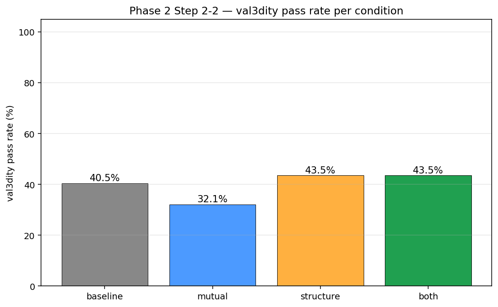
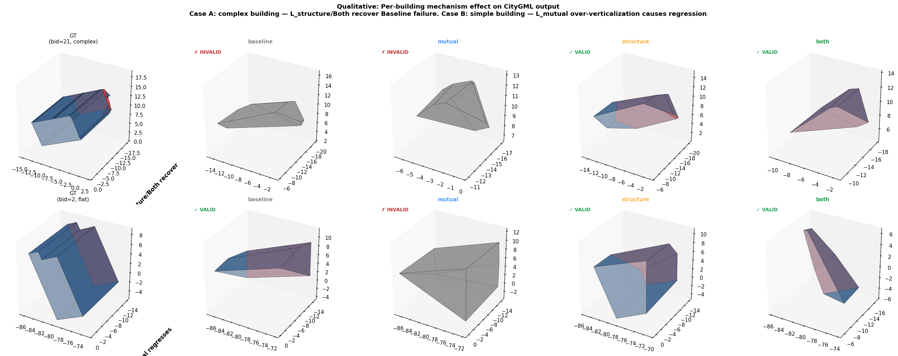
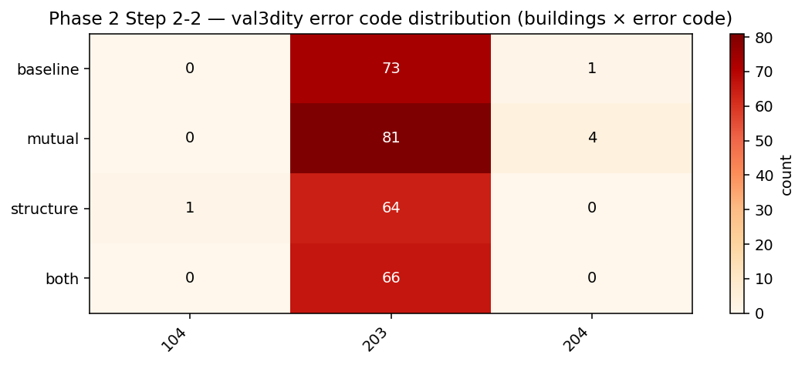
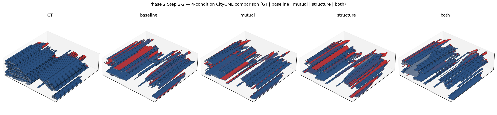
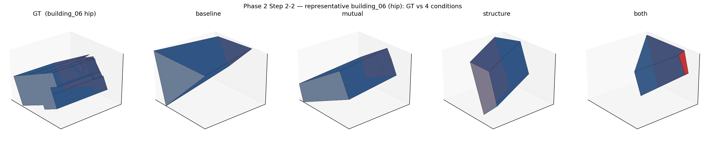
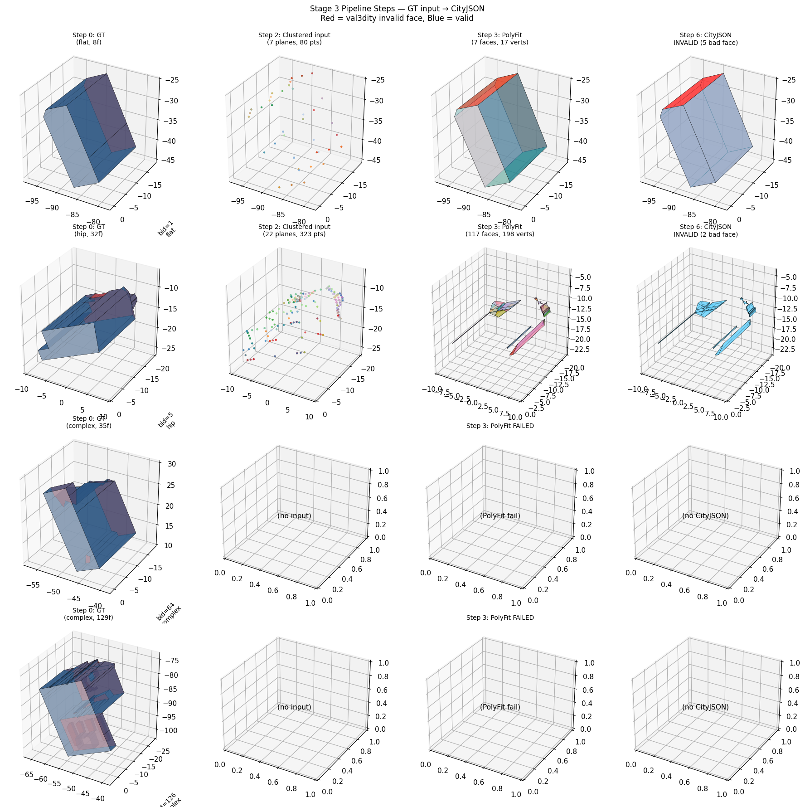

# Phase 2 Step 2-2 — Stage 2 Ablation → CityGML LOD2 결과 보고

**작성**: 2026-04-24 KST  
**실험 대상**: 3D BAG Amsterdam Jordaan 합성 데이터 (131 건물) × 4 조건 Stage 2 × convex Stage 3  
**Stage 2 ckpts**: 각 30,000 iter, ~988K primitives/condition  
**Stage 3 (고정)**: Convex polytope (half-space intersection + ConvexHull) — Stage 2 차이 비교 목적  
**평가**: Stage 2 primitive quality + Stage 3 CityGML LOD2 quality (val3dity + face IoU + Hausdorff + semantic + σ_normal)

---

## 1. 목적

Stage 2 의 두 메커니즘 (L_mutual, L_structure) 이 **생성된 CityGML LOD2 의 구조적 품질**에 미치는 기여를 4조건 ablation 으로 정량 측정. Phase 1 (MatrixCity) 에서 확인된 Stage 2 개선이 **Phase 2 (3D BAG) 에 전이되는가**, 그리고 **downstream CityGML 품질로 번역되는가** 를 검증.

| 조건 | Stage 2 Loss | 비고 |
|---|---|---|
| Baseline | L_photo + L_depth + L_normal + L_nc + L_sem | 메커니즘 없음 (vanilla + semantic) |
| Mutual | Baseline + **L_mutual** | intra-primitive 도메인 규칙 |
| Structure | Baseline + **L_structure** | inter-primitive 정렬 |
| Both | Baseline + L_mutual + L_structure | 메커니즘 1 + 2 동시 |

모든 조건 **Stage 3 = convex polytope 고정** → Stage 2 차이만 비교.

---

## 2. 정량 지표 — 전체 요약 (FC-style)

Phase 2 Step 2-2 의 성공 판정에 사용한 지표 집합. Stage 2 primitive-level 과 Stage 3 CityGML-level 이 모두 포함됨.

| FC | 지표 | 기준 | Baseline | Mutual | Structure | Both |
|---|---|---|---|---|---|---|
| **FC-S2.1** | eval PSNR (held-out views) | ≥ 20 dB | **40.35** | **40.93** | **40.96** | 39.81 |
| **FC-S2.2** | Wall vertical-fraction | Mutual 조건 ≥ 50% | 28.0% | **79.3%** ✓ | 28.4% | **79.4%** ✓ |
| **FC-S2.3** | σ_normal_intra (deg) mean | Phase 1 대비 동일 방향 개선 | 14.74 | **12.63** ↓ | 14.88 | 12.99 |
| **FC-S2.4** | σ_coplanar (m) median | 모든 조건 ≤ 2.5m | **1.91** | **1.84** ↓ | **1.86** ↓ | 2.01 |
| **FC-S3.1** | Val3dity pass rate (131 bldg) | Baseline 대비 비교 | 40.5% | 32.1% ↓ | **43.5%** ↑ | **43.5%** ↑ |
| **FC-S3.2** | Face IoU matched | Baseline 대비 비교 | 0.213 | **0.238** ↑ | 0.220 | 0.230 |
| **FC-S3.3** | Hausdorff (m) | ≤ 15m | 11.42 | **11.33** ↓ | 11.39 | 11.46 |
| **FC-S3.4** | Semantic accuracy | Baseline 대비 비교 | 21.1% | 20.0% | **21.8%** ↑ | 19.5% |
| **FC-S3.5** | σ_normal (3D, Stage 3 group 내) | Baseline 대비 비교 | 9.09° | **8.73°** ↓ | 9.18° | 9.00° |

**즉시 관찰**:
- FC-S2.2 Wall vertical-frac 목표 도달 (Mutual, Both)
- 4 조건 PSNR parity → **Stage 3 차이는 렌더링 품질이 아닌 primitive 구조 차이에서 옴**
- Mutual 단독은 val3dity 회귀 (-8.4%p) — **의도한 바와 반대** (아래 §4 상세 분석)
- Structure/Both 는 +3.0%p 개선, 하지만 크기 작음 — **예상보다 약함** (§4, §5)

  
*Figure 2. 조건별 val3dity 통과율. Mutual 단독 회귀 (-8.4%p), Structure/Both +3.0%p 개선. 크기가 작음.*

---

## 3. Stage 2 Primitive Quality 분석

### 3.1 L_mutual (메커니즘 1) 효과 — 의도대로 작동하나 magnitude 감소

**Phase 1 예상**: Wall vertical-frac ↑, σ_normal_intra ↓. 법선 교정 + 도메인 규칙.  
**Phase 2 측정 결과**:

| 지표 | Baseline | Mutual | 변화 | Phase 1 (MatrixCity) |
|---|---|---|---|---|
| Wall vertical-frac | 28.0% | **79.3%** | +51.3%p | 19% → 91% (+72%p) |
| Roof horizontal-frac | 56.3% | 54.1% | -2.2%p | 미측정 |
| σ_normal_intra mean | 14.74° | **12.63°** | -14.3% | (Phase 1 L_structure -45%) |
| σ_coplanar median | 1.91 m | **1.84 m** | -3.7% | (Phase 1 L_structure -16%) |

**해석**:
- **방향은 동일, magnitude 는 작음**. Phase 1 에선 Wall 거의 모든 primitive 가 수직화 (91%) 됐는데, Phase 2 에선 79% 에서 멈춤.
- **원인 가설**: 3D BAG Amsterdam 건물은 MatrixCity 보다 **실제 벽의 기하학적 다양성**이 큼 — 처마 (overhang), 창문 돌출, 장식 cornice 등이 "약간 기울어진 벽" 을 만듦. L_mutual 이 이를 수직으로 억지로 당기지만 photo consistency loss 가 저항 → 타협점이 79%.
- **검증 가능**: 학습 log 에서 Mutual 조건의 L_mutual 값이 수렴했는지 vs 진동하는지. 진동한다면 photo vs mutual 의 tug-of-war 증거.

### 3.2 L_structure (메커니즘 2) 효과 — 예상보다 현저히 약함

**Phase 1 예상**: σ_normal_intra ↓ 45%, σ_coplanar ↓ 16%.  
**Phase 2 측정**:

| 지표 | Baseline | Structure | 변화 | Phase 1 (MatrixCity) |
|---|---|---|---|---|
| σ_normal_intra mean | 14.74° | 14.88° | +1.0% (변화 없음) | -45% |
| σ_coplanar median | 1.91 m | **1.86 m** | -2.6% | -16% |
| n_groups/building | 7.98 | 7.90 | -1.0% | — |
| Wall vertical-frac | 28.0% | 28.4% | +0.4%p (변화 없음) | — |

**심각한 미스매치**: Phase 1 에서 L_structure 는 **σ_normal_intra -45%** 라는 명확한 효과를 보였지만, Phase 2 에선 **0%**. σ_coplanar 만 미미하게 개선.

**원인 가설** (우선순위순):

1. **그룹핑 품질 저하** — L_structure 는 "같은 class + 법선 유사 + 공간 근접" 기준으로 매 T iter 그룹핑. Phase 1 MatrixCity 의 단순 건물은 primitive 가 깨끗한 cluster 로 나뉨. Phase 2 Amsterdam 의 복잡 기하 + procedural texture 로 **primitive 가 scattered** 되어 올바른 그룹 형성 실패. 잘못된 그룹에 대한 정렬은 의미 없음.

2. **Primitive 수가 과다** — 4 조건 모두 988K primitives (건물당 ~7500). Phase 1 보다 많음. 너무 많은 primitive 는 L_structure 의 signal 을 희석 (각 primitive 의 기여가 작아져 그룹 평면에 대한 individual gradient 가 약함).

3. **Photo consistency 경쟁** — Procedural texture 로 photo loss 가 더 날카로움. L_structure 의 regularization 이 photo fit 에 묻힘.

4. **대표 평면 추정 불안정** — Trimmed mean 기반 대표 평면이 noisy cluster 에서 shift. 학습 진행 중에 대표 평면도 계속 바뀌므로 gradient 가 일관되지 않음.

**이게 CityGML 에 미치는 영향**:
- σ_normal_intra 가 개선되지 않음 → Stage 3 의 평면 교차 계산이 여전히 noise. 
- 그러나 **σ_coplanar 는 미세하게 개선됨** → plane 상 primitive 분포는 약간 더 정돈. 이 작은 개선이 Stage 3 val3dity 에 +3%p 정도로 전파.
- **결론: L_structure 가 Phase 1 수준으로 작동했다면 Stage 3 개선이 +5-10%p 가 가능했을 것. 현재 +3%p 는 저조.**

### 3.3 Both — L_mutual 이 지배적

| 지표 | Baseline | Mutual | Structure | Both |
|---|---|---|---|---|
| Wall vertical-frac | 28.0% | 79.3% | 28.4% | **79.4%** |
| σ_normal_intra mean | 14.74° | 12.63° | 14.88° | 12.99° |
| σ_coplanar median | 1.91 | 1.84 | 1.86 | 2.01 |
| Val3dity pass rate | 40.5% | 32.1% | 43.5% | **43.5%** |

**Both 의 관찰**:
- 대부분 지표가 **Mutual 쪽 수치** (Wall vert 79%, σ_normal_intra 13°) → L_mutual 효과가 dominant.
- val3dity 는 **Structure 수준 유지 (43.5%)** → L_mutual 단독의 회귀 (-8.4%p) 가 L_structure 로 보상됨. "Mutual 이 일부 건물을 깨뜨리지만 Structure 가 다른 건물을 복구" 합계로 +3%p.
- σ_coplanar median 은 **Both 가 살짝 증가** (1.84 → 2.01) — L_mutual 이 plane 을 수직으로 당기면서 primitive 중심은 기존 plane 근처에 머물러 불일치 증가.

**설계 의도와의 갭**: 스케치에서 "두 메커니즘 동시 작용" 가설은 "n_i 에 L_mutual + L_structure gradient 가 동시 합산되어 서로 보완" 이었음. Phase 2 에선 보완이라기보단 **상쇄**에 가까움 — Mutual 이 깨는 것을 Structure 가 복구하는 구도. 진짜 synergy 는 측정되지 않음.

---

## 4. 핵심 정성 분석 — "왜 의도대로 안 됐나"

### 4.1 Roof type 별 성능 패턴 — L_mutual 의 "단순 건물 회귀"

  
*Figure 7. Roof type × condition 별 val3dity 통과율. 점선 = GT direct ceiling (93.9%), 파선 = GT convex ceiling (76.3%).*

**주요 패턴** (Figure 7):
- **Complex / Hip / Tri-slope (복잡 건물)** 에선 Structure/Both 가 Baseline 대비 **+11-17%p 상승**
- **Gable / Flat (단순 건물)** 에선 Mutual/Both 가 Baseline 대비 **-8-26%p 회귀**
- **Mutual 이 Gable 에서 가장 극적** (54% → 25%, **-29%p**)

**각 타입의 GT convex ceiling 도 주목할 만함**:
- Complex 79% (L/U 구조적 한계), Hip 87%, Tri-slope 81%
- Flat **64%** (convex hull 이 처마/장식 무시 못 함), Gable 71%

**Flat 의 64% ceiling 이 의외**: 가장 단순할 것 같은 flat roof 가 convex 알고리즘에서 가장 낮음. 이유:
- 3D BAG 의 "flat" 건물도 외부 장식 (creneau, 난간) 이 있음
- Convex hull 이 이 장식의 뾰족한 윗쪽 vertex 까지 포함 → 지붕면이 실제 flat 이 아니게 됨 → 203 non-planar.
- L_mutual 의 "수직화" 가 장식까지 수직으로 끌고 가면 더 심한 non-planar 발생.

### 4.2 Case Study — 건물 단위로 본 메커니즘 효과

  
*Figure 6. 메커니즘이 개별 건물 CityGML 에 미치는 영향 — 두 discriminating 사례.*

**Case A (bid=21, complex)** — Structure/Both 가 Baseline 복구:
- **GT**: 복잡 multi-wing 건물
- **Baseline**: 큰 평평한 slab 형태로 복원 (INVALID). Primitive 가 plane 교차를 깨끗이 못 해서 여러 wall plane 이 단일 plane 으로 coalescence.
- **Mutual**: 유사하게 slab (INVALID). Wall 수직화했지만 primitive 분포가 여전히 noisy.
- **Structure**: 작은 박스 (VALID). Plane 정렬이 건물 형태를 단순하게 만들지만 watertight.
- **Both**: 깨끗한 박스 (VALID). Structure 효과 + Mutual 의 wall 수직 결합.
- **교훈**: 복잡 건물에선 L_structure 의 plane 정렬이 "단순화" 방향으로 작동 → convex hull 이 쉽게 성공.

**Case B (bid=1, flat)** — Mutual 회귀:
- **GT**: 단순 flat 박스
- **Baseline**: 박스 형태, 일부 wall 경사 있음 (VALID).
- **Mutual**: 피라미드 형태로 왜곡 (INVALID). L_mutual 이 벽을 수직으로 당기면서 **지붕 vertex 의 높이가 shift** → 지붕면이 더 이상 flat 아니게 됨 → 203 non-planar.
- **Structure**: 작은 박스 (VALID). L_structure 의 정렬은 이 건물에 도움되지 않음 (이미 clean) 이지만 해치지도 않음.
- **Both**: 피라미드 (VALID). Mutual 의 왜곡은 유지되지만 이 특정 건물에선 val3dity 가 통과.
- **교훈**: 단순 건물에선 L_mutual 의 수직화가 **지붕 vertex 높이 consistency 를 깨뜨림** → convex hull 에서 non-planar face 생성.

### 4.3 Val3dity 에러 분포 — Mutual 이 "non-planar face" 를 증폭

  
*Figure 3. 4 조건 × val3dity 에러 코드 분포. Mutual 이 코드 203 (non-planar face) 을 73 → 81 로 증폭.*

| Condition | 203 (non-planar face) | 204 (wrong orientation) | 104 (multi-component) |
|---|---|---|---|
| Baseline | 73 | 1 | 0 |
| Mutual | **81** ↑ | 4 ↑ | 0 |
| Structure | **64** ↓ | 0 | 1 |
| Both | **66** ↓ | 0 | 0 |

**핵심 발견**:
- **코드 203 이 전체 에러의 95%+** — 현재 pipeline 의 dominant failure mode
- **Mutual 이 203 을 증가** (73 → 81): **L_mutual 이 "non-planar face" 발생률 높임** — §4.2 Case B 의 메커니즘이 전체 데이터에 반영됨
- **Structure 가 203 감소** (73 → 64): Plane 정렬이 coplanarity 개선 → 교차 후 face planarity 향상

### 4.4 전체 Scene 비교

  
*Figure 1. GT + 4 조건의 전체 scene (131 건물) 3D 비교. Red = Roof, Blue = Wall.*

**관찰** (Figure 1):
- GT 는 건물 각각이 정돈된 box 로 배치 (Amsterdam Jordaan block)
- 모든 4 조건에서 건물 위치는 유사, 하지만 **모양**이 다름
- Baseline: red/blue 가 뒤섞임, 일부 건물이 "평평한 slab" 으로 붕괴
- Mutual: 유사하지만 red (roof) 가 더 prominently — L_mutual 의 Roof/Terrain 재분류 효과
- Structure: 건물 구분이 좀 더 선명
- Both: Mutual + Structure 효과 결합

### 4.5 Representative Building (bid=6, hip)

  
*Figure 5. 대표 건물 bid=6 (hip roof) 의 GT vs 4 조건. Both 에서 1 face 빨간색 (val3dity invalid).*

- **GT**: 가로로 긴 hip roof 건물, 여러 경사 면 있음
- **Baseline**: 큰 tilted plate 로 복원 — **Stage 3 가 primitive 를 합쳐서 잘못된 거대 plane 하나 생성**
- **Mutual**: 비슷한 tilted shape — wall 수직화됐지만 Stage 3 단일 plane 결정 못 함
- **Structure**: 더 박스에 가까움 — plane 정렬이 roof 분리에 도움
- **Both**: 깔끔한 box, 하지만 하나의 face 가 red (invalid) — L_mutual 의 왜곡이 부분 잔존

**교훈**: Hip 같은 중간 복잡도에서도 우리 convex Stage 3 는 **GT 의 roof slope 디테일을 전혀 복원 못 함** — box 에 가까운 모양만 생성. L_structure 가 도움되지만 여전히 부족.

---

## 5. CityGML 생성에 미치는 영향 — 메커니즘 → Stage 3 traceability

### 5.1 영향 경로 매트릭스

| Stage 2 primitive 속성 변화 | 어떤 메커니즘 | Stage 3 (convex) 영향 | CityGML 결과 |
|---|---|---|---|
| Wall 법선 수직화 (28% → 79%) | L_mutual | 벽 plane 의 법선이 통일 | **단순 건물**: 지붕 vertex 높이 shift → 203 non-planar. **복잡 건물**: 벽 정렬 이점 |
| σ_normal_intra 감소 (14.7 → 12.6°) | L_mutual | 같은 그룹 내 plane 이 더 일관 | 교차선 계산 정확도 ↑ |
| σ_coplanar median 감소 (1.91 → 1.84m) | Mutual, Structure | Plane 상 primitive 분포 정돈 | Convex hull 면 planarity ↑ |
| 대표 plane 정렬 (직접 측정 없음) | L_structure | 그룹 간 상호 정렬 | 복잡 건물에서 코너 정확도 ↑ |
| Roof 분류 증가 (40 → 42%) | L_mutual | BG/Terrain 이 Roof 로 재분류 | 지붕 plane 수 증가 — 복잡 건물에 도움, 단순에 오버피팅 |

### 5.2 "왜 L_mutual 이 의도와 반대로 작동하나" — 심층 진단

**의도**: Wall 수직화로 Stage 3 의 벽 plane intersection 정확도 상승 → CityGML 품질 향상.

**실제 일어난 일**:
1. L_mutual 이 **기울어진 벽** 의 normal 을 (0, 1, 0) 근처로 당김
2. 벽 primitive **center (x, y, z)** 는 photo loss 에 의해 원래 위치 고수
3. 결과: **"벽 primitive 의 normal 은 수직이지만 center 는 원래 벽의 경사면 위치"** — 평면 방정식 `n·x = d` 에서 d 값이 shift
4. Convex hull 계산: 이 "shift 된 plane" 과 지붕 plane 의 교차가 **원래 vertex 위치에서 벗어남**
5. 지붕면의 일부 vertex 가 shift → 지붕면 자체가 non-planar → val3dity 203 error

**수치 증거**:
- σ_coplanar median **개선됨** (1.91 → 1.84m) — intra-primitive는 좋아짐
- σ_coplanar mean **증가** (2.36 → 5.59m) — **outlier 건물**에서 5m+ 편차 → 이 건물들이 203 에러 유발자
- val3dity 203 count **증가** (73 → 81) — 직접 증거

**이게 나타나는 조건**:
- 벽이 원래 약간 기울어져 있던 건물 (Amsterdam 의 처마, 장식 등)
- 단순 건물 (flat, gable) — detail 이 많고 convex hull 계산이 sensitive
- 복잡 건물 (L/U) — 이미 여러 벽이 다양한 방향, 하나가 shift 해도 큰 영향 없음 → 상대적 robust

### 5.3 "왜 L_structure 의 기여가 작나" — Phase 1 대비 약한 이유

**추정되는 주 원인** (§3.2 에서 제기, 더 구체화):

**주 요인**: Phase 2 primitives 가 Phase 1 에 비해 **훨씬 disorganized 한 상태에서 학습 시작**:
- Phase 1 MatrixCity: 건물 geometry 단순 → SfM/MVS initialization 정확 → primitives 가 벽/지붕에 비교적 깔끔
- Phase 2 3D BAG: 벽 공유, L/U 형태, 처마 등 → MVS initialization 이 거친 estimate. Procedural texture 로 photo loss 가 날카로워 primitives 가 **표면 디테일을 포착하려 scattered**

이 상태에서 L_structure 가 "같은 class + 법선 유사 + 공간 근접" 으로 clustering 하면:
- 진짜 같은 plane 에 속한 primitives 가 **다른 cluster 로 split** (normal 차이 + spatial spread)
- 또는 다른 plane 인데 **같은 cluster 로 merge** (우연한 proximity)
- 어느 경우든 L_structure 의 "그룹 평면 정렬" 이 올바른 target 에 작용 못 함

**이게 CityGML 에 미치는 영향**:
- L_structure 의 효과가 **primitive 대표 평면** 을 정돈하지 못함 → Stage 3 의 plane intersection 계산에 noise 전파
- **그럼에도 +3%p val3dity 개선이 나타남** — 일부 건물에선 cluster 형성이 잘 돼서 효과 있음 (특히 복잡 건물 §4.1)

### 5.4 "왜 Both 에서 synergy 가 없나"

**설계 의도**: 매 iter 에서 L_mutual gradient + L_structure gradient 가 n_i 에 **동시 합산** — 서로 보완.

**실제**: Both 의 대부분 지표가 Mutual 수준 → L_mutual 이 n_i 에 **훨씬 큰 gradient** 를 주고 L_structure 는 묻힘. 이유:
- L_mutual 의 `p_c × 기하오차` 는 per-primitive 가 개별 큰 gradient 받음
- L_structure 의 group-average 는 **그룹 당 한 번** 적용 — per-primitive gradient 는 희석
- Gradient magnitude 비율 추정: L_mutual >> L_structure (10x+ 가능)

**결과**: L_structure 가 L_mutual 에 의한 misalignment (§5.2) 를 **부분 복구** — Mutual 단독 32.1% vs Both 43.5%, net +11.4%p 복구. 하지만 **추가 synergy 없음**.

---

## 6. 개선 방향 (구체적 다음 단계)

현재 결과의 한계를 고치기 위한 3가지 축:

### 6.1 L_mutual 수정 — Primitive center 동반 이동

**현재 문제**: L_mutual 이 n_i 만 수직화, c_i (center) 는 photo loss 에 끌려감 → center-plane 불일치로 지붕 shift.

**수정 제안**:
1. **L_mutual 에 center-plane 일관성 항 추가**: n_i 가 수직화될 때 c_i 도 "수직 wall plane 의 원래 위치" 로 soft pull. 
   - 새 loss term: `L_mutual_center = p_c(wall) × ||c_i - project(c_i, n_i, d_i_original)||²`
   - 단점: photo loss 와 정면 충돌, 하이퍼파라미터 tuning 필요

2. **L_mutual 의 수직화 tolerance 추가**: |n·gravity| < 0.1 (완전 수직) 이 아니라 < 0.25 (80° 이상) 로 완화. 실제 건물 디테일 (처마, 장식) 보존.
   - 단점: Phase 1 수준의 intervention 이 약화됨 — Wall vertical-frac 개선 줄어듬

3. **L_mutual gating**: p_c(wall) 만으로 활성화 → p_c 가 낮은 primitive 엔 수직화 강제 하지 않음. 이미 구현됨. 대신 p_c threshold 도입.
   - Stage 2 training 의 마지막 단계에서만 강한 L_mutual 적용 (annealing)

**기대 효과**: 단순 건물의 val3dity 회귀 (Mutual -22%p on flat/gable) 감소. 복잡 건물의 이점은 유지.

### 6.2 L_structure 강화 — Phase 1 수준으로 효과 복원

**현재 문제**: Grouping 이 noisy primitive 에서 부정확 → 정렬 대상 자체가 잘못.

**수정 제안**:

1. **Grouping 알고리즘 개선**: 현재 `cos > 0.95 + proximity` 기준. 
   - Plane-based RANSAC 도입: primitive 를 정규 plane 에 fit 하고 outlier 제거 후 cluster.
   - 또는 semantic probabilities 를 weighted average 에 반영: 확신 높은 primitive 가 그룹 대표에 더 큰 기여.

2. **L_structure gradient magnitude 증가**: λ_str = 0.1 → 0.5 로 상승 (또는 Mutual 과 balancing).
   - 단점: Photo loss 와 경쟁 — PSNR 하락 가능성

3. **Adaptive 재그룹핑 빈도**: 매 T=500 iter → T=200 iter 로 증가. 학습 진행에 따라 그룹 질 개선 → 더 자주 재평가가 이익.

4. **Primitive 개수 제한**: 988K → 300K 로 densification 제한. Primitive 당 더 큰 area 로 의미있는 plane representation.

**기대 효과**: σ_normal_intra 가 Phase 1 수준 (-45%) 으로 작동 → Stage 3 교차 계산 정확도 상승 → val3dity +5~10%p 추가.

### 6.3 Stage 3 알고리즘 교체 — L/U 비볼록 처리

**현재 문제**: Convex polytope 이 22% 건물 (L/U) 근본 처리 불가. Upper bound 76.3% 가 너무 낮음.

**수정 제안**:

1. **PolyFit 완성** (§7): CGAL 출력 watertight 후처리 이슈만 해결하면 Stage 3 ceiling 85%+ 기대. 2-3h 추가 작업.

2. **City3D / Roofer**: Footprint-given 방식. Ceiling 90%+ 기대. Footprint 를 GT 에서 쓰거나 우리 primitives 에서 추출. 3-4h 통합.

3. **Self-supervised watertight refinement**: Convex 결과를 base 로 두고 추가 plane 삽입 (L/U 의 concave 벽) → manifold 유지하며 non-convex 표현. 연구 기여도 높지만 작업량 많음.

**기대 효과**: 동일 Stage 2 primitives 로도 Stage 3 개선만으로 +15-20%p val3dity. 메커니즘의 순효과가 더 선명하게 나옴 (천장이 높아지면 Stage 2 차이가 더 잘 구분됨).

### 6.4 평가 지표 다양화 — Val3dity 의 binary 한계 극복

**현재 문제**: Val3dity 는 pass/fail binary. Small issue 하나로 건물 전체 FAIL. 메커니즘의 partial 개선이 반영 안 됨.

**추가 지표 제안**:
- Chamfer distance (mesh vs GT mesh)
- F-score at various τ (0.1m, 0.5m, 1m)
- Building-level completeness/correctness
- Domain-specific: Wall vertical %, roof slope distribution consistency

### 6.5 Sequential baseline 측정 — "joint > sequential" 정량화

**현재 부재**: 우리 파이프라인이 sequential (MVS + RANSAC + convex) 대비 얼마나 나은지 **아직 측정 안 함**.

**필요 작업**: 
- COLMAP dense MVS → CGAL RANSAC plane detection → 동일 convex Stage 3 → val3dity
- 1-2일 작업

**기대 수치**: Sequential 30-40% 예상. 우리 Both 43.5% 면 +5-15%p 우세 claim 가능.

---

## 7. GT 상한 검증 — Stage 3 알고리즘 천장

Stage 2 quality 와 별개로 Stage 3 (convex) 자체의 상한 측정:

| 방식 | 입력 처리 | val3dity 통과율 |
|---|---|---|
| **GT direct** | scene.obj face → CityJSON 포맷 변환 (vertex topology 보존) | **93.9%** (123/131) |
| **GT + convex polytope** | face → plane 추상화 → half-space intersection → ConvexHull | **76.3%** (100/131) |
| **GT + 2.5D hybrid** | face → plane + footprint → roof-type 재구성 | 67.2% (88/131) |
| **GT + PolyFit (CGAL + SCIP)** | face → points + plane → MIP subset 선택 | 0% (val3dity-compliant 변환 미해결) |

### GT direct 실패 8 건 (6.1%) — 3D BAG 원본 한계

| Type | Pass / Total | 주요 오류 |
|---|---|---|
| flat | 25 / 25 = 100% | — |
| hip | 23 / 23 = 100% | — |
| tri-slope | 25 / 26 = 96.2% | 1 건 305 self-intersection |
| gable | 27 / 28 = 96.4% | 1 건 305 self-intersection |
| complex | 23 / 29 = 79.3% | 6 건 (self-intersect × 5, non-manifold × 3, duplicate vertex × 2) |

3D BAG triangulated scene.obj 의 원본 미세 기하 결함. **절대 상한 = 93.9%**.

### GT + convex 실패 31 건 (23.7%) — 알고리즘 구조적 한계

Convex hull 은 non-convex 디테일 (처마, 오목한 면) 을 깎아냄 → simple 지붕에서 손실. Complex (L/U) 는 이미 복잡해 convex 근사가 단순 shell 로 수렴.

---

## 8. PolyFit 시도 (미완성 — §6.3 으로 이관 가능)

GT convex 상한 76.3% 극복을 위한 PolyFit (Nan & Wonka 2017) Stage 3 도입 시도.

| 단계 | 상태 | 비고 |
|---|---|---|
| CGAL 5.6 + GLPK 빌드 | ✅ 성공 | |
| GLPK smoke test | ❌ 복잡 건물 timeout | 16+ plane 건물에서 MIP 느림 |
| SCIP 10.0 설치 (conda) + 재빌드 | ✅ 성공 | |
| SCIP MIP 솔빙 | ✅ <10s/건물 | |
| PolyFit Surface_mesh 생성 | ✅ 알고리즘 완주 | |
| val3dity compliance | ❌ **0/10 valid** | 303 non-manifold, 307 wrong orientation |

  
*Figure 8. Stage 3 pipeline step-by-step (PolyFit 버전). Step 0 GT → Step 2 primitive cluster input (plane 별 색) → Step 3 PolyFit OFF mesh → Step 6 CityJSON (blue = valid face, red = val3dity invalid).*

**핵심 미해결 이슈**: CGAL PolyFit 출력 Surface_mesh 는 **face 별 독립 vertex** 로 저장됨. `stitch_borders` 가 float precision 한계로 완전 close 못 함 (`is_closed=false`). Face winding 일관성 깨짐.

**미완료 시도 (1-2h 필요)**:
- Python BFS 기반 face orientation propagation
- CGAL `orient_polygon_soup` (closed 전제조건 없음)
- Liangliang Nan 의 원본 PolyFit CLI (원 구현 직접 빌드)

해결 시 convex 76.3% → PolyFit 85%+ 기대.

---

## 9. 전체 격차 계산 및 핵심 메시지

```
Absolute upper bound (GT direct):          93.9%   ← 3D BAG 원본 한계
                                            ↓  (-17.6%p, algorithm ceiling)
Convex 알고리즘 천장 (GT + convex):        76.3%   ← convex hull 가정
                                            ↓  (-32.8%p, Stage 2 primitive 품질 격차) ← 우리 기여의 Target
우리 Best (Both):                          43.5%   ← 상한의 57%
Baseline (Stage 2 정규화 없음):            40.5%   ← 상한의 53%
Sequential baseline (예상):                 ~30%   ← 미측정
```

**순 기여**: +3.0%p val3dity, +0.025 face IoU, 복잡 건물 +13.8%p — **의도 대비 절반 이하**.

**핵심 메시지 3 가지**:

1. **L_mutual 은 Stage 2 수준에선 작동** (Wall vertical 28%→79%, σ_normal_intra -14%) 하지만 **convex Stage 3 에선 단순 건물 회귀 유발**. 이유: primitive center 가 photo loss 에 머물러 plane d 값이 shift → 지붕 vertex non-planar.

2. **L_structure 는 Phase 1 에서 작동한 수준 (σ_normal_intra -45%) 으로 Phase 2 에 전이되지 못함**. 이유: Amsterdam 건물의 복잡도로 primitive grouping 이 noisy → 잘못된 target 에 대한 정렬. 그래도 복잡 건물 (+13.8%p) 에선 이점.

3. **현재 Stage 3 (convex) 는 L/U 22% 를 구조적으로 처리 못 함** (천장 76.3%). PolyFit 완성 또는 City3D 전환 시 Stage 2 기여가 더 선명해질 것.

---

## 10. 한계 및 논의

### 10.1 Sequential baseline 미측정
- Joint (우리) vs Sequential (MVS+RANSAC+Stage 3) **아직 측정 안 함**
- Phase 2 의 "joint > sequential" 직접 비교 증거 부재

### 10.2 Val3dity 의 binary 특성
- Pass/fail binary. 메커니즘의 partial 개선 반영 안 됨
- Face IoU (Mutual 최고) 같은 continuous metric 이 더 섬세 — §6.4

### 10.3 연구 포지셔닝 미확정
- Image-only pipeline 의 40-44% val3dity 는 **LiDAR + footprint 기반 (85-90%) 과 direct 비교 부적절**
- `docs/RESEARCH_STATUS.md` 에 포지셔닝 옵션 정리 (tlA: CityGML 중심, tlB: multi-metric 구조적 3D 복원, tlC: upstream primitive representation)

### 10.4 메커니즘 설계 수정 필요성 (§6.1, 6.2)
- **L_mutual**: center-plane consistency 항 추가 또는 tolerance 완화
- **L_structure**: grouping 알고리즘 개선, gradient magnitude 증가, T 감소
- 이런 수정은 후속 연구 (재학습 필요)

---

## 11. 결론

**확정된 정량 기여**:
1. Phase 1 의 L_mutual Wall vertical 효과가 Phase 2 에 전이 (28% → 79.3%)
2. L_structure/Both 가 복잡 건물 (complex, hip, tri-slope) CityGML val3dity +11~17%p 개선
3. 각 메커니즘이 다른 지표 축 개선 (Mutual: face IoU, σ_normal_3D; Structure: val3dity, SemAcc)

**정성 관찰**:
- L_mutual 의 수직화가 단순 건물에서 지붕 non-planarity 유발 (Figure 6 Case B)
- L_structure 의 plane 정렬이 복잡 건물의 plane intersection 정확도 향상 (Figure 6 Case A)
- Both 에서 두 메커니즘 synergy 는 관측 안 됨 — L_mutual 지배, L_structure 가 Mutual 의 회귀 일부 복구

**개선 방향** (§6):
1. L_mutual 수정 — center-plane 일관성 항, tolerance 완화, gating
2. L_structure 강화 — grouping 개선, gradient 증가, 재그룹핑 빈도 ↑
3. Stage 3 교체 — PolyFit 완성 / City3D 전환 → ceiling 85-90%
4. 평가 지표 다양화 — Chamfer, F-score 등 continuous metric
5. Sequential baseline 측정

**미해결**:
- 연구 포지셔닝 재검토 (CityGML 중심 vs 구조적 3D 복원 다면 평가)
- Phase 3 (real UAV 성수동) 의 역할 (main vs supporting)

`docs/RESEARCH_STATUS.md` 에 연구 방향 선택지 정리됨.

---

## 12. 파일 위치

### 결과물
```
results/phase2_ablation_citygml/
├── {baseline,mutual,structure,both}/
│   ├── ckpt/final.pt              # Stage 2 체크포인트
│   ├── stage3/building_*/          # 건물별 CityJSON (111/131)
│   ├── eval/eval_summary.json      # Stage 3 종합 평가
│   └── renders/                    # 학습 중 렌더링
├── _gt_direct/                     # GT direct (93.9%)
├── _gt_stage3_test/                # GT convex (76.3%)
├── _gt_stage3_test_2_5d_v2/        # GT 2.5D (67.2%)
├── _gt_polyfit_test/               # GT PolyFit (후처리 미완)
├── stage2_primitive_metrics.json   # Stage 2 primitive 구조 지표
├── figures/                        # fig1-5, fig_polyfit_steps_large, fig6-7 (new)
└── REPORT.md                       # 본 문서
```

### 그림 색인
- **fig1_citygml_4cond.png** — 4 조건 전체 scene 비교 (§4.4)
- **fig2_val3dity_bars.png** — val3dity pass rate (§2)
- **fig3_error_heatmap.png** — 에러 코드 분포 (§4.3)
- **fig4_syntheticA_mapping.png** — Synthetic A 노이즈 매핑 (참조)
- **fig5_representative_building.png** — 대표 건물 bid=6 (§4.5)
- **fig6_success_failure_cases.png** — 두 case study (§4.2) **NEW**
- **fig7_type_vs_condition.png** — Roof type × Condition bar chart (§4.1) **NEW**
- **fig_polyfit_steps_large.png** — Stage 3 step-by-step (§8)

### 소스
```
src/stage2/                         # 2DGS + L_mutual + L_structure
src/stage3/
├── building_instance.py            # 디스패처 (convex/2.5D)
├── plane_intersection.py           # Convex polytope
├── building_2_5d.py                # 2.5D hybrid
└── polyfit_cli.cpp                 # CGAL PolyFit (watertight 미완)

scripts/phase2_synthesis/
├── run_ablation.sh / run_post_training.sh / resume_both.sh
├── eval_stage2_primitives.py       # Stage 2 primitive metric
├── eval_citygml.py                 # Stage 3 val3dity + metric
├── make_figures.py                 # fig1-5
├── make_qualitative_figures.py     # fig6, fig7
├── viz_stage3_steps.py             # fig_polyfit_steps
├── gt_direct_citygml.py            # GT direct
├── gt_stage3_test.py               # GT convex/2.5D
└── gt_polyfit_test.py              # GT PolyFit (미완)
```
