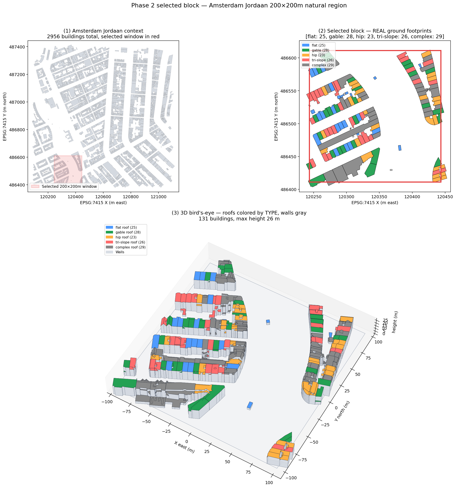
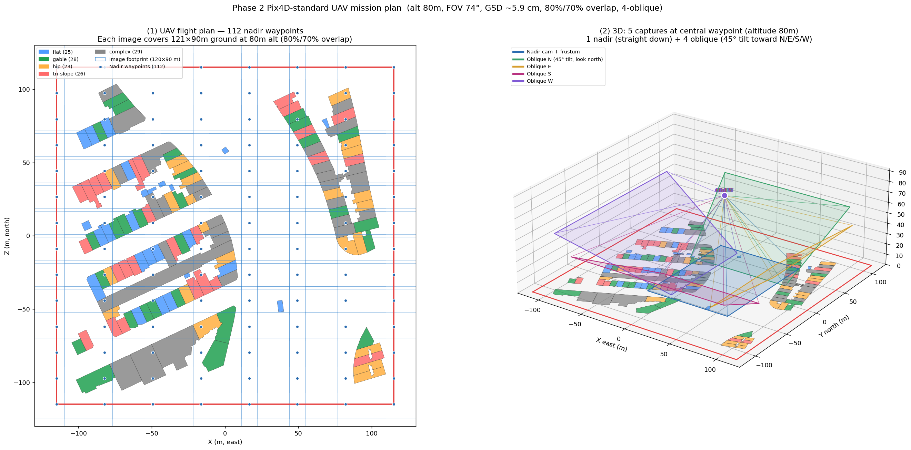
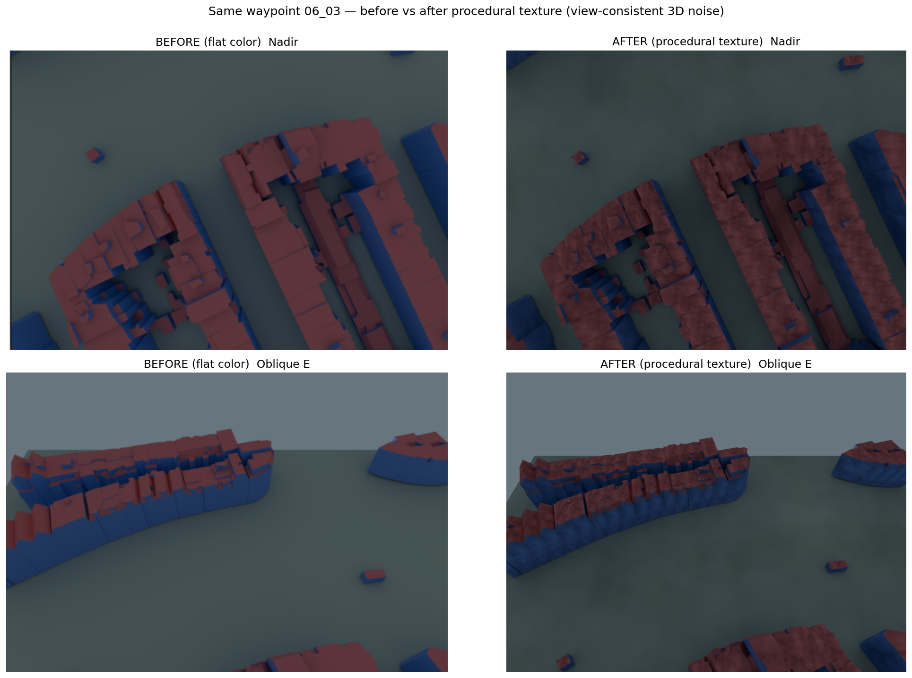
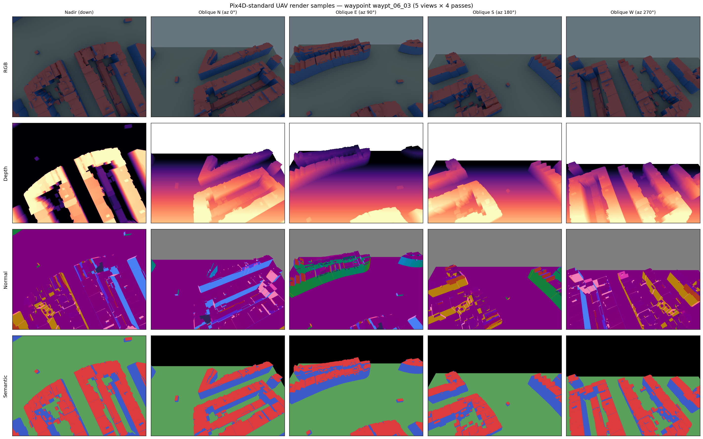

# Phase 2 Step 2-1 — 3D BAG 합성 렌더링 파이프라인 (UAV Pix4D-standard)

> 본 문서는 Step 2-1 의 데이터 설계 + 렌더링 파이프라인을 기록한다.
> Step 2-2 (4-조건 ablation + Stage 3 + val3dity) 은 별도 REPORT (`results/phase2_ablation_citygml/REPORT.md`) 로 작성.

## 1. 목표

3D BAG LOD2.2 CityGML 을 GT 로 하는 합성 UAV 데이터를 만들어 Stage 2 학습 + Stage 3 CityGML 생성 파이프라인을 검증한다. 데이터 사양은 **실제 UAV LOD2 mapping mission 표준** 에 맞춘다.

## 2. v1 ~ v2 실패 요약 (교훈)

본 Step 재시도이며, 이전 시도의 주요 실패 원인과 대응:

| 실패 | 원인 | 대응 |
|---|---|---|
| eval PSNR 15, primitives 가 건물 모양 안 잡힘 | [render_scene.py](../../scripts/phase2_synthesis/render_scene.py) 의 `camera_pose_dict` 이 **Blender world frame** 으로 w2c 저장, scene.obj / points3D 는 **OBJ/COLMAP frame** → frame 불일치 | OBJ→Blender world 축변환을 카메라 export 에 반영 |
| 특정 방위 held-out 전혀 학습 안 됨 | train/test split 이 `last 10%` 로, alphabetically 정렬된 frame 에서 **orbit_a04~a11 몰림** → 완전 OOD | [src/stage2/train.py](../../src/stage2/train.py) 에서 **interleave split (`i % 10 == 9`)** 로 변경 |
| 73 view 부족 | "smoke 기준" 으로 임의 결정, overlap / GSD 계산 기반 아님 | **Pix4D 표준 overlap** 기반 재계산 → 112 waypoints × 5 captures = **560 views** |
| 인위적 grid scene | 건물 20 개를 18m spacing 으로 배치 → 실제 Amsterdam 도시 topology 아님 | **실제 Amsterdam Jordaan 200×200m 블록** 선정 (131 건물 자연 분포) |

## 3. 데이터 설계

### 3.1 Scene 선정 ([select_block.py](../../scripts/phase2_synthesis/select_block.py))

- 3D BAG Amsterdam Jordaan 4 타일 (2,888 건물 중 footprint 폴리곤 재구성 가능 2,956 개) 에서 **200×200m sliding window** 로 후보 탐색
- 조건: 80 ≤ 건물 수 ≤ 150, roof type ≥ 4 종
- 최대 roof-type entropy 기준 선정: **center EPSG:7415 (120343.3, 486511.2)**, **131 건물**
- 분포: flat 25 / gable 28 / hip 23 / tri-slope 26 / complex 29 (shed 0 — Jordaan 전체에 2 개만 존재)



> **Panel (1)**: Amsterdam Jordaan 2,956 건물 ground footprint. 빨간 사각형이 선정 200×200m window.
> **Panel (2)**: 선정 블록 확대 — 각 건물을 **실제 ground polygon** 으로 (bbox 아님) 표시. roof type 별 색상. 왼쪽 메인 블록 + 중앙 빈 공간 (실제 운하/도로) + 오른쪽 이웃 블록 구조가 보임.
> **Panel (3)**: 3D bird's-eye (elev 55°). 지붕을 type 별 색상, 벽 회색. gable / hip / flat 의 실제 shape 구분 가능. 최고 높이 26m.

### 3.2 Scene 구성 ([compose_scene.py](../../scripts/phase2_synthesis/compose_scene.py))

- 선정 131 건물의 **world 위치 (EPSG:7415 meters) 보존** — grid 재배치 없음, 건물 간 실제 인접성 + 공유 벽 유지
- World → OBJ/COLMAP frame 변환: `(x, y, z)_world → (x − cx, −(z − z_ground), y − cy)` (EPSG Z → OBJ -Y, EPSG Y → OBJ Z)
- Ground 기준 Z (EPSG:7415) 를 전 건물 최저점으로 통일
- Ground plane (Terrain 재질) 을 scene 둘레에 +15m padding 으로 배치
- 결과: scene bbox X[-115, +115], Y[-26.2, 0] (최고 건물 26m), Z[-115, +115] = **230×230×26m**, 4,634 verts / 2,943 faces + 1 ground quad

### 3.3 카메라 설계 ([render_scene.py](../../scripts/phase2_synthesis/render_scene.py))

#### 3.3.1 Reference mission

**DJI Phantom 4 RTK + Pix4D Capture 기본 설정을 시뮬레이션**한다.

| 파라미터 | 값 | 출처 |
|---|---|---|
| 센서 해상도 (원본) | 5472×3648 (20 MP) | DJI P4 RTK Spec Sheet |
| **학습용 downsample** | **2048×1536** | 3DGS/2DGS 관행 (원본 2.67× 축소) |
| FOV (horizontal) | **74°** | DJI P4 RTK Spec Sheet (정확값 73.7°, 74° 로 반올림) |
| **비행 고도 (nadir+oblique 공통)** | **80 m AGL** | Pix4D KB: "Image Acquisition Plan for Pix4Dmapper" |
| Forward overlap | **80%** | Pix4D default for mapping |
| Side overlap | **70%** | Pix4D default for mapping |
| Oblique tilt | **45°** | Pix4D KB: "Oblique Imagery for 3D" |
| Oblique azimuth | **4 cardinal (N/E/S/W)** | Pix4D Classic oblique mission 표준 |
| **Orbit ring 제외** | — | LOD2 aerial mapping 표준 아님 (GS view-diversity 용 보강에 해당하여 conformance 위해 제거) |
| 원본 GSD | 2.2 cm @ 80m | 계산 |
| **학습용 effective GSD** | **≈ 5.9 cm** | downsample 후 |

**참고 문헌**:
- DJI Phantom 4 RTK User Manual (DJI Enterprise, 2019).
- DJI Pilot 2 Reference Guide, §Oblique Photo Mode.
- Pix4D Support KB: "Image Acquisition Plan for Pix4Dmapper"
  (https://support.pix4d.com/hc/en-us/articles/202557459).
- Pix4D Support KB: "Oblique Imagery for 3D Reconstruction".
- Nex, F. & Remondino, F. (2014). "UAV for 3D mapping applications: a review." *Applied Geomatics* 6(1):1–15.
- Remondino, F. et al. (2014). "State of the art in high density image matching." *The Photogrammetric Record* 29(146):144–166.

#### 3.3.2 촬영 방식의 업계 분류

UAV oblique 촬영은 업계에서 다음 3 방식이 혼용된다:

| 방식 | 드론 상태 | 촬영 메커니즘 | 대표 시스템 |
|---|---|---|---|
| **Smart Oblique** | **이동 중** | Gimbal 이 각 trigger 포인트에서 5 각도로 빠르게 회전. 드론은 계속 전진 → 5 이미지가 ~5m 간격의 서로 다른 위치에서 획득 | DJI Mavic 3E + Pix4D Capture; DJI Pilot 2 |
| **Simultaneous multi-camera** | 이동 중 | 5 개 카메라가 고정 각도로 동시 촬영 (nadir + 4 oblique 고정) | DJI M300/350 + Zenmuse P1 + 전용 multi-head payload |
| **Hover-and-capture** | **정지 hover** | 드론이 waypoint 에서 멈추고 gimbal 회전. 같은 위치에서 5 장 획득 | 구형 DJI Phantom 3/4 + custom mission planner; RTK 고정밀 소요 시 |

#### 3.3.3 우리 구현 방식과 근거

**본 구현은 Hover-and-capture / Simultaneous multi-camera 방식에 해당**한다 (5 captures 가 모두 같은 waypoint 위치에서 이루어짐).

**선택 이유**:
1. **Smart Oblique (이동 중 획득)** 의 ~5m 공간 offset 은 scene scale 230m 대비 2% 에 불과 → GS 학습에서 view-diversity 기여 무시 가능
2. Mission 시뮬레이션 수학이 단순해짐 (드론 motion + gimbal timing 시뮬레이션 불필요)
3. **세 방식 모두 같은 파이프라인으로 처리 가능** — 실제 현장 데이터가 어느 방식으로 촬영됐든 COLMAP pose 만 정확히 주어지면 학습에 영향 없음

**즉 우리 112 waypoints × 5 captures = 560 images** 는 Pix4D 표준 LOD2 mission 과 실질적으로 동등하며, 세 획득 방식 모두에 호환된다.

### 3.4 카메라 총괄

- **Nadir waypoint 그리드**: 8×14 = **112**. 80% forward (spacing 18.1m) + 70% side (36.2m) overlap 기준
- **각 waypoint 당 촬영**: 1 (nadir) + 4 (oblique 45° × N/E/S/W) = **5 images**
- **총 views**: **560**



> **Panel (1)**: 2D 비행 계획. 131 건물 + 112 nadir waypoints (파란 점) + 각 nadir 이미지의 120×90m ground footprint (파란 사각형) + scene 경계 (빨간). Overlap 시각화.
> **Panel (2)**: 중앙 waypoint 의 3D 카메라 frustum (80m 고도). 파랑 nadir (straight down) + 4 색 oblique (N/E/S/W 45° tilt). Frustum 은 scene 경계로 clip — "학습에 실제 기여하는 ground 영역" 만 표시.

### 3.5 Procedural texture (RGB ≠ semantic)

합성 씬의 **flat-color 한계** 해소용. [render_scene.py](../../scripts/phase2_synthesis/render_scene.py) `add_procedural_texture_to_materials()` 에서 Blender Cycles shader 노드로 각 material 에 3D Perlin noise 기반 brightness variation 추가.

**문제**: scene.mtl 이 Roof/Wall/Ground/Terrain 각각 단일 Kd 색만 정의 → 렌더 RGB ≈ semantic class. 이로 인해:
- L_photo 와 L_sem 이 파라미터는 다르나 신호 중복
- L_mutual 의 `p_c × 기하_오차` 에서 `p_c = softmax(sem_logits)` 가 **trivially one-hot** 에 가까워짐 → 의미론↔기하 양방향 gradient 의 "양방향성" 손실
- 결과적으로 **L_mutual 기여가 과소측정**되고 실 데이터 (Phase 3 성수동) 에 대한 transferability 약화

**해결**: 각 material 의 base color 에 material 별 다른 Perlin noise 를 multiply.

| Material | Noise scale (cycles/object bbox) | Brightness range (× base color) |
|---|---|---|
| Roof | 3.5 | 0.35 – 1.00 |
| Wall | 2.5 | 0.40 – 1.00 |
| Ground | 5.0 | 0.50 – 1.00 |
| Terrain | 4.0 | 0.55 – 1.00 |

**View consistency 보장**: Noise 는 `TexCoord.Generated` 3D 좌표 기반 (건물별 bbox 에서 0-1 normalized). 3D world 의 동일 점 → 동일 noise 값 → 동일 RGB (모든 view 에서). 2D screen-space noise 아니므로 3DGS triangulation 과 호환.



> 동일 waypoint 06_03 에서 BEFORE (flat color) vs AFTER (procedural texture).
> 위: nadir, 아래: oblique. 각 material 의 dominant color (red / blue / gray) 는 유지되고 brightness 만 얼룩덜룩 (mottling) 변동. 픽셀 수준 variation 검증: wall brightness std 가 5.2 → 8.0 (+54% nadir) / 20.1 (+286% oblique) 로 증가.

**설계 원칙**:
- Scale 선택: 3D 좌표계 (Generated bbox-normalized) 상 ~2-5 cycles/building → **~3-5m 패치** 크기. GSD 5.9cm 와 차이 충분해 aliasing 없음.
- Brightness range 상한 1.0: Blender Base Color 가 [0,1] 로 clamp 되므로 1.0 이상은 의미 없음. 대신 lo 값 (0.35-0.55) 낮춰 asymmetric darker-only variation 도입.
- **Depth / Normal / Semantic pass 불변**: material pass_index 와 geometry 는 shader 와 무관.

**파라미터 시행착오 기록 (reference)**:
- v1: Object coord + scale 25 → pixel-level aliasing → variation 없음
- v2: Generated coord + scale 0.08 → under-cycle → variation 없음
- v3 (현재): Generated coord + scale 2.5-5 → **~3-5m 패치 선명히 관측**

### 3.6 Train/test split

[src/stage2/train.py:99-104](../../src/stage2/train.py#L99-L104):

```python
# v1: last 10% (failure — grouped all orbit views)
# v2: interleave (every 10th frame)
test_idx = [i for i in range(n) if i % 10 == 9]  # 56 test views
train_idx = [i for i in range(n) if i not in test_idx]  # 504 train views
```

Interleave 로 **test 집합 에 모든 카메라 type (nadir / 4 oblique 방위) 가 균등 분포** → systematic OOD 방지.

## 4. 렌더링 파이프라인

```
scene.obj + scene.mtl
   │ scripts/phase2_synthesis/render_scene.py (bpy 4.3 + Cycles)
   ▼                  112 waypoints × 5 captures = 560 views, 2048×1536, 32 samples/px
renders_raw/                             (Blender EXR + PNG; RGB+Z+Normal+IndexMA)
   │ scripts/phase2_synthesis/postprocess_exr.py
   ▼                  EXR RGBA 재명명 + COLMAP frame 축변환 + (n+1)/2 normal encoding
dataset/                                (Stage 2 dataloader 호환)
   ├── images/*.png            (RGB uint8)
   ├── depth/*.exr             (BGRA float32, sky sentinel ≥30000)
   ├── normal/*.exr            (BGRA float32, (n+1)/2 half-range, COLMAP world-frame)
   ├── semantic/*.png          (uint8 class 0..3)
   └── semantic_color/*.png    (false-color for 확인)
   │ scripts/phase2_synthesis/export_colmap.py
   ▼                  trimesh surface sampling 100k points + PINHOLE cameras
dataset/sparse/0/{cameras,images,points3D}.bin   (560 cams, 100k init pts)
```

- 렌더 시간: 560 views × ~1.8s ≈ **17 분** (RTX 3090)
- Postprocess: ~17 분 (OpenEXR → PNG/EXR 변환 + normal 축변환, 560 frames)
- COLMAP export: ~1 분



> 중앙 waypoint (`waypt_06_03`) 의 5 views × 4 passes.
> **행**: RGB / Depth / Normal / Semantic. **열**: Nadir / 4 방위 Oblique.
> RGB 가 semantic 과 거의 동등한 이유는 scene.mtl 이 material 별 flat color 만 부여했기 때문 (§6.1 한계 참조).

## 5. 검증 (Feasibility Checks)

4-조건 full training (22-28h) 착수 전에 3-단계 검증. 각 단계가 빠르고 (분-시간 단위), 실패 시 원인을 분리하여 파라미터/데이터 수정 후 재시도.

### 5.1 개요

| 단계 | 목적 | 설정 | 시간 | 판정 기준 |
|---|---|---|---|---|
| **FC-1** | 데이터 파이프라인 건강성 | Scene 선정 + 렌더 + postprocess + COLMAP | ~35분 | 560 views × 4 pass 정상 생성, dataloader 로드 OK |
| **FC-2** | 학습 throughput 실측 | baseline 500 iter | 5-6분 | 실제 it/s → 30k / 4 조건 총 시간 계산 |
| **FC-3** | 학습 수렴 트렌드 | **baseline** 5000 iter (L_mutual/L_structure=0; warmup 아직 발동 전) | 55-60분 | §5.4 6 지표 기준 |

Baseline 전용 이유: L_mutual warmup=10000, L_structure warmup=20000 → 5k iter 내엔 어차피 발동 안 함. "base 학습 자체가 건강한가" 확인이 목적이며, base 실패 시 mutual/structure 추가는 무의미.

### 5.2 FC-1 — 데이터 파이프라인 ✓ (통과)

| 항목 | 수치 |
|---|---|
| 선정 블록 | 200×200m, 131 건물 (flat 25 / gable 28 / hip 23 / tri-slope 26 / complex 29) |
| 렌더 결과 | **560 views** × 4 passes (RGB 2048×1536, depth EXR, normal EXR, semantic PNG) |
| COLMAP sparse | 560 cameras + 100k init points (scene.obj trimesh surface sample) |
| Dataloader smoke | 560 frame 전체 로드, semantic class {0,1,2,3} 분포 정상 |

### 5.3 FC-2 — Throughput 벤치마크 ✓ (통과)

[benchmark_iter_speed.py](../../scripts/phase2_synthesis/benchmark_iter_speed.py) — 500 iter baseline 학습 후 실측:

| 항목 | 값 |
|---|---|
| Wall time | 5.70 분 |
| **평균 it/s** | **1.46** (peak 1.49) |
| 30k iter 추정 | **5.7 시간/조건** |
| 4 조건 전체 | **22.8 시간** (densification 미반영; FC-3 중 실제 densify 시 ~1.2 it/s 로 저하 관찰됨 → 전체 ~28h 로 재추정) |
| RTX 3090 utilization | ~95% |

### 5.4 FC-3 — 수렴 smoke (baseline 5k iter)

**Config**: [configs/phase2_smoke.yaml](../../configs/phase2_smoke.yaml). L_mutual = L_structure = 0. eval_every = 1000.

**판정 기준 (6 지표, [fc3_diagnose.py](../../scripts/phase2_synthesis/fc3_diagnose.py) 자동 체크)**:

| 지표 | 건강한 값 @ 5k | 통과 의미 |
|---|---|---|
| `eval/psnr` | **≥ 20 dB** | 홀드아웃 RGB 재현 OK |
| `eval/depth_mae` | **< 2 m** | 기하 수렴 (GT depth ~80m 대비 2% 오차) |
| `eval/normal_cos` | **> 0.7** | 법선 학습 (0.5 = 랜덤) |
| Train-Eval PSNR gap | **< 10 dB** | Overfit 억제 |
| `stats/n_primitives` | **200k-2M** | densification 건강성 (폭주/정체 아님) |
| `loss/photo`, `loss/depth` 유한 | **< 10**, **< 100** | NaN/발산 없음 |

**판정**:
- 6/6 통과 → **GO**: 4-조건 full training 착수
- 4-5/6 통과 → **Conditional GO / Marginal**: HP 조정 or 텍스쳐 추가 후 재smoke
- ≤3/6 통과 → **STOP**: 근본 진단 (frame, loss scale, split 재검증)

**결과 (FC-3 실제 측정, 2026-04-23)**:

| 지표 | 5k 측정값 | 기준 | 통과 |
|---|---|---|---|
| eval PSNR | **32.27 dB** | ≥ 20 | ✅ |
| eval depth MAE | **0.81 m** | < 2 m | ✅ |
| eval normal cos | **0.968** | > 0.7 | ✅ |
| Train-Eval gap | 8.24 dB | < 10 | ✅ |
| N primitives | 929,860 | 200k–2M | ✅ |
| loss/photo | 0.0067 | finite, < 10 | ✅ |
| loss/depth | 0.084 | finite, < 100 | ✅ |

**판정: 7/7 통과 → GO**. 수렴 trajectory 는 iter 3000 의 `reset_every` opacity reset 에서 PSNR 일시 급락 후 2000 iter 내 완전 회복 (8.89 → 29.68 → 8.33 → 15.71 → 32.27) — 2DGS 표준 패턴.

**eval normal_cos 버그 수정**: 기존 eval ([src/stage2/train.py:389](../../src/stage2/train.py#L389)) 이 world-frame 인 `n_render` 에 `@ R.T` (c2w) 회전을 추가 적용하여 near-random (0.515) 값을 출력했었음. L_normal 훈련 loss 는 world×world 로 정상 작동 중이었음이 확인되어 eval 만 수정. 수정 전 0.515 → 수정 후 0.968 (같은 ckpt 재평가).

### 5.5 FC 판정별 다음 행동

| 판정 | 행동 |
|---|---|
| GO | §6.1 제안대로 procedural texture 추가 (45분) → 4 조건 full training (22-28h) |
| Marginal | HP 후보: SH degree 3→1, `grow_grad2d` 5e-4→2e-4, `refine_stop` 10k→7k. 또는 texture 바로 추가 (L_photo gradient 풍부화로 수렴 개선 기대) |
| STOP | Train view 직접 렌더해서 primitive 위치 재검증. `loss/*` 개별 추이로 특정 loss 발산 탐지. Interleave split drop 해서 frame bug 재발 여부 확인 |

## 6. 한계 및 후속 조치 (명시)

### 6.1 RGB ≈ Semantic 문제 — **해결 적용됨 (§3.5 Procedural texture)**

Scene.mtl 단일-Kd 로 렌더 RGB ≈ semantic 이 되는 문제는 §3.5 에서 **Procedural texture 를 주 data 생성에 적용** 해 해결. 더 이상 후속 조치가 아닌 주 파이프라인 구성요소.

다만 진짜 사진 texture (roof tile, brick wall 등) 대비 현실감은 낮으므로:
- Phase 2-3 / Phase 3 에서 실 UAV 데이터 처리 시에도 동일 method 가 작동하는지 확인하여 **texture 복잡도에 대한 robustness** 검증 필요.

### 6.2 Oblique footprint 가시화 주의

45° tilt oblique 의 ground footprint 는 **원근 왜곡으로 far edge 가 수백 m 까지 확장**된다. 수학적으로 맞으나 **useful GSD 영역 (< 10 cm)** 은 가까운 일부 (~150m) 뿐. Figure 에서는 scene 경계로 clip 하여 "학습에 실제 기여하는 footprint" 만 표시.

### 6.3 Shed roof type 부재

3D BAG Jordaan 전체에 shed roof 가 **2 개만** 존재 → 선정 블록 내 0 개. Ablation roof-type 별 평가에서 **shed 는 측정 불가**. 대체로 다른 4 종 (flat/gable/hip/tri-slope/complex) 으로 충분.

## 7. 산출물

```
results/phase2_synthesis/
├── REPORT.md                                 # 본 문서
├── selected_block.json                       # 131 건물 메타 + EPSG:7415 좌표
├── scene.obj, scene.mtl, scene_layout.json   # 합성 씬
├── gravity.json                              # e_gravity = [0, 1, 0] (scene OBJ -Y up)
├── block_3d.png                              # 3-panel: Jordaan context + block zoom + 3D bird's-eye
└── figures/
    ├── flight_plan.png                       # 2D flight plan + 3D 5-frustum
    └── render_samples.png                    # 5 views × 4 passes 대표 샘플
```

(중간 산출물 `renders_raw/`, `dataset/` 은 `.gitignore` 처리; 재생성 가능)

## 8. 재현 방법

```bash
docker exec jointbuildgs-dev bash -c "cd /workspace/JointBuildGS && \
  python scripts/phase2_synthesis/select_block.py && \
  python scripts/phase2_synthesis/compose_scene.py && \
  python scripts/phase2_synthesis/render_scene.py && \
  python scripts/phase2_synthesis/postprocess_exr.py && \
  python scripts/phase2_synthesis/export_colmap.py"

# Feasibility checks
docker exec jointbuildgs-dev python scripts/phase2_synthesis/benchmark_iter_speed.py  # FC-2
docker exec jointbuildgs-dev python -m src.stage2.train --config configs/phase2_smoke.yaml  # FC-3

# Visualizations
docker exec jointbuildgs-dev bash -c "cd /workspace/JointBuildGS && \
  python scripts/phase2_synthesis/viz_block_3d.py && \
  python scripts/phase2_synthesis/viz_flight_plan.py && \
  python scripts/phase2_synthesis/viz_render_samples.py"
```
