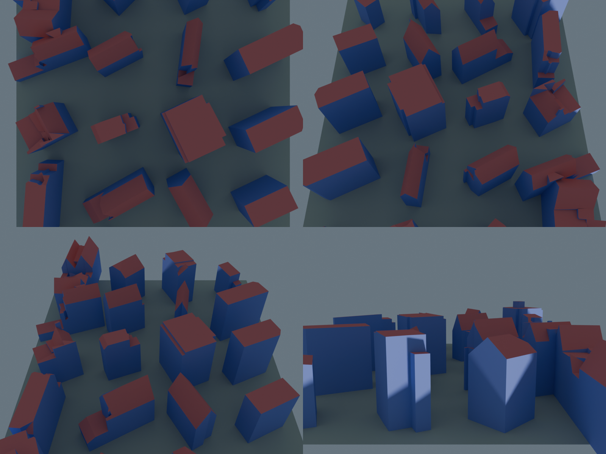
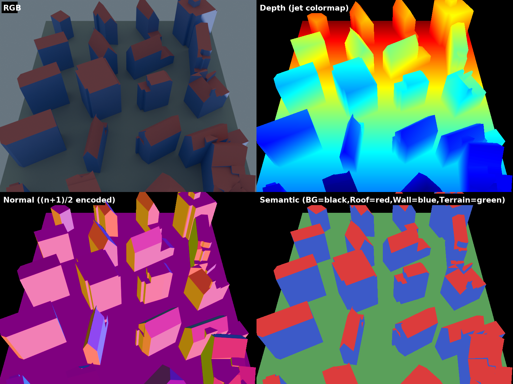
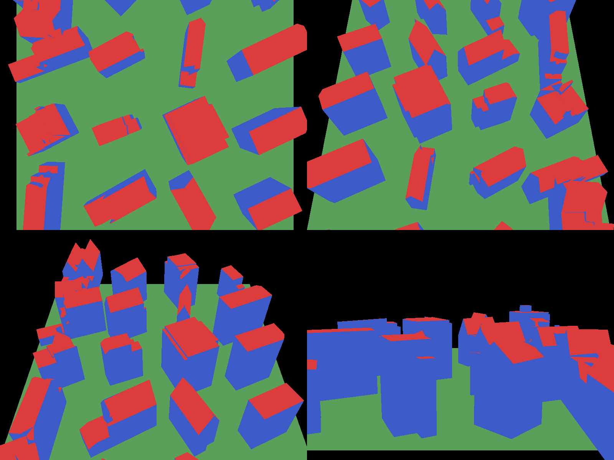

# Phase 2 Step 2-1 — 3D BAG 합성 렌더링 파이프라인

## 1. 목표와 범위

Phase 2 Step 2-1 은 **3D BAG LOD2.2 CityGML 을 소스로 하는 합성 학습 데이터를 생성**하는 파이프라인
을 구축한다. 산출물 = Stage 2 (2DGS 공동 최적화) 학습 입력 (RGB / depth / normal / semantic /
sparse COLMAP).

Step 2-1 의 승인 기준 (파이프라인 검증) :
1. CityGML → OBJ 변환, 건물별 semantic material 유지
2. Blender 합성 렌더 (aerial + oblique + perimeter 카메라)
3. 출력이 Stage 2 dataloader 호환 포맷
4. Stage 2 학습 루프가 crash 없이 돌아감 (100 iter smoke)

Stage 3 (CityGML 재구성 평가, val3dity, 폴리곤 F1) 은 Step 2-2 로 이관.

## 2. 파이프라인 구성

```
CityJSON (Amsterdam Jordaan 2888 건물, LOD2.2)
   │  scripts/phase2_synthesis/select_buildings.py
   ▼                  5 roof-type × 4 = 20 건물 (area 66–423 m² 균등)
selected_buildings.json
   │  scripts/phase2_synthesis/compose_scene.py
   ▼                  5×4 그리드 (18 m spacing) + ground plane
scene.obj + scene.mtl + scene_layout.json   (COLMAP 규약: -Y up, 92 × 74 × 19 m)
   │  scripts/phase2_synthesis/render_scene.py (bpy 4.3 + Cycles)
   ▼                  73 카메라 (25 nadir + 36 oblique + 12 orbit), RGB+Z+Normal+IndexMA
renders_raw/                                  (Blender EXR, V/X/Y/Z 채널)
   │  scripts/phase2_synthesis/postprocess_exr.py
   ▼                  채널 RGBA-rename + world-frame 변환 + (n+1)/2 encoding
dataset/                                      (dataloader 호환)
   ├── images/*.png            (RGB uint8)
   ├── depth/*.exr             (BGRA float32, sky sentinel ≥28000)
   ├── normal/*.exr            (BGRA float32, (n+1)/2 half-range, world-frame)
   ├── semantic/*.png          (uint8 class 0..3)
   └── semantic_color/*.png    (시각 확인용 false-color)
   │  scripts/phase2_synthesis/export_colmap.py
   ▼                  trimesh surface sampling (100k points)
dataset/sparse/0/{cameras,images,points3D}.bin   (PINHOLE, 73 cams, 100k init pts)
```

## 3. 환경

- Docker `jointbuildgs:dev` (CUDA 12.1, torch 2.4.1, Python 3.11, gsplat 1.4.0)
- bpy **4.3.0** (`pip install bpy==4.3.0`) — 기존 bpy 5.0 의 compositor API 변경으로 재작업 필요했던
  문제를 LTS 로 해결
- OpenEXR 3.4.10 (`pip install OpenEXR`) — cv2 가 읽지 못하는 single-channel EXR 후처리용

## 4. 씬 구성

**선정 (20 건물)** — [scripts/phase2_synthesis/select_buildings.py](../../scripts/phase2_synthesis/select_buildings.py)
- Amsterdam Jordaan LOD2.2 에서 roof type 5 종 × 4 개 = 20 건물
- roof type 정의: flat / gable / hip / tri-slope / complex (각 4개씩)
- area 66–423 m², median ≈ 140 m²

**배치** — [scripts/phase2_synthesis/compose_scene.py](../../scripts/phase2_synthesis/compose_scene.py)
- 5×4 그리드, 18 m spacing
- GROUND_PAD=10m 여유 포함한 대형 ground quad (Terrain material)
- Per-face material: Roof / Wall / Ground / Terrain
- 최종 bbox (OBJ, COLMAP -Y up): X ±46, Y [−18.6, 0], Z ±37 → 92 × 74 × 19 m, 425 faces + ground quad

## 5. 렌더링 구현

[scripts/phase2_synthesis/render_scene.py](../../scripts/phase2_synthesis/render_scene.py)

### 5.1 카메라 샘플링 (73 뷰)

| 그룹 | 수 | 배치 | 목적 |
|---|---|---|---|
| Nadir grid | 5×5 = 25 | 지붕 상공 ~70% scene width 고도, 8° inward tilt | top-down coverage |
| Oblique rings | 3 × 12 = 36 | tilt 30°/45°/60° × 12 azimuth, scene center 향함 | 측면 / 지붕-벽 joint |
| Perimeter orbit | 1 × 12 | roof 높이, 1 × radius 환상 궤도 | 건물 측면 closeup |

카메라 정렬은 `Matrix((right, up, -forward)).transposed()` 로 up-hint 명시 (이전 `rotation_difference`
는 roll 불확정으로 영상 기울어짐 문제 → 수정).

### 5.2 렌더 설정

- Cycles GPU, 32 samples, 800×600
- Sun (energy 3.0, angle 5°) + world bg (sky blue 0.25 strength)
- Passes: Depth (clamp ≤ 29000), Normal (world frame raw), IndexMA (material pass_index)
- Flat shading 강제 (face 법선이 그대로 normal pass 에 출력되도록)

성능: 73 뷰 × 1.5s ≈ **2 분** (RTX 3090).

### 5.3 렌더 결과 샘플 (RGB)

네 카메라 그룹 대표 뷰 (좌상 nadir_02_02, 우상 oblique_t30_a00, 좌하 oblique_t60_a06, 우하 orbit_a00):



- Nadir: 지붕 탑뷰 위주, 그리드 주변부 terrain 보임
- Oblique 30°: 거의 탑뷰 + 약간의 측면 (roof + wall 혼합)
- Oblique 60°: 지붕과 벽 면적 균형
- Orbit: 건물 측면 위주 (wall 주류)

### 5.4 4-pass 통합 시각화 (oblique_t45_a00)



- RGB: 합성 렌더
- Depth: 45.0–139.0 m jet colormap (sky → 검정)
- Normal: `(n+1)/2` 인코딩을 RGB 로 직접 시각화 (R=world X, G=Y, B=Z; BG → 검정)
- Semantic: false-color

## 6. EXR 후처리 — cv2 호환 변환

**OpenEXR 채널 명명 규약 배경**: EXR 포맷은 채널을 문자열 이름으로 구분함.
- Multi-channel RGBA: `R`/`G`/`B`/`A`
- Single-channel grayscale: `V` (Value) 또는 `Y` (luminance)
- Vector 데이터: `X`/`Y`/`Z`

Blender compositor 는 depth/semantic 을 `V`, normal 을 `X,Y,Z` 로 명명 출력. 반면 cv2 의
OpenEXR 디코더는 `R/G/B/A` 이름만 인식 (MatrixCity 규약도 이것). 그래서 후처리에서 RGBA 재명명 +
축 변환 + `(n+1)/2` encoding 수행.

[scripts/phase2_synthesis/postprocess_exr.py](../../scripts/phase2_synthesis/postprocess_exr.py)

### 6.1 Depth
Blender 의 `V` 채널 (float32, meters) → RGBA 4-ch (모든 채널 동일한 depth 값 복제). sky clamp 는
렌더 단계에서 처리 (≥ 29000).

### 6.2 Normal — 축 변환 검증 (Blender 의 `X,Y,Z` 채널 → COLMAP world RGBA)
Blender OBJ import 의 기본 축 매핑: **OBJ (x, y, z) → Blender (x, −z, y)**. 이로 인해 OBJ 의
"COLMAP −Y up" 이 Blender 에서는 **−Z up** 으로 표현됨. 역변환 (Blender-world → COLMAP-world):

```
nx_cv = nx_bl
ny_cv =  nz_bl
nz_cv = -ny_bl
```

유효 pixel 에만 `(n+1)/2` half-range encoding, BG 는 `0.5` (decoded 0, mask 실패).

**검증**: 73 뷰 평균
- Terrain: `nY < −0.85` (upward) **99.7–99.9%**
- Wall: `abs(nY) < 0.15` (horizontal = 중력 수직) **93.7–98.9%**
- Roof: flat roof type 비율에 비례하여 일부 `nY < −0.85`, 경사지붕은 경사 방향

### 6.2.1 Semantic 분리 확인 (false-color)

동일 4 카메라의 semantic 출력. 색 일관성은 모든 뷰에서 동일 material (지붕=red, 벽=blue,
지면=green) 이 유지되는지 확인.



### 6.3 Semantic
Blender 의 `V` 채널 (float pass_index) → PNG uint8 class id {0=BG, 1=Roof, 2=Wall, 3=Terrain}.
`semantic_color/` 하위에는 시각 확인용 false-color PNG (Roof=red, Wall=blue, Terrain=green, BG=black)
도 출력.

### 6.4 Camera pose
Blender camera `matrix_world` → OpenCV 규약으로 축 flip (`diag(1,-1,-1,1)`) → `w2c` + intrinsic
(PINHOLE fx=fy, cx=W/2, cy=H/2). 뷰별 JSON 저장.

## 7. COLMAP sparse/0/ 생성

[scripts/phase2_synthesis/export_colmap.py](../../scripts/phase2_synthesis/export_colmap.py)

- `cameras.bin`: PINHOLE model × 73 (뷰 당 1개 cam_id)
- `images.bin`: (qvec from w2c, tvec, cam_id, name=`{view}.png`, empty points2D)
- `points3D.bin`: trimesh `sample_surface` 로 OBJ 메시에서 면적 비례 샘플링 (100k 점), 재질별 대표
  RGB 부여

**dataloader 로딩 검증** ([src/stage2/dataloader.py](../../src/stage2/dataloader.py)): 73 frame 로드, 100k init 점 읽기, 첫 sample 에서 모든
키 (rgb / depth / depth_mask / normal / normal_mask / semantic / K / w2c) 가 정상 tensor 로 반환
되고 semantic unique = {0, 1, 2, 3} 확인.

## 8. Stage 2 smoke (100 iter)

**목표**: dataloader + loss + optimizer 가 crash 없이 동작하는지만 검증 (수렴은 아님).

설정: [configs/phase2_synth_smoke.yaml](../../configs/phase2_synth_smoke.yaml) — Phase 1 Step 1-3 hyperparam 복사 + `depth_scale=1.0` + `max_iter=100`.

실행 결과 (RTX 3090):
- 100 iter in **16 초** (~9.5 it/s)
- Loss 18.76 → 24.18 (7 loss sum, 초기 수렴 단계 fluctuation 정상)
- PSNR 10.04 → 10.20 (densification 아직 미작동, SH upgrade 미작동 — 100 iter 는 warm-up 전)
- N (Gaussian 수) = 99998 (유지), 어떤 loss 도 NaN 없음

**의미**: **전체 학습 파이프라인 crash 없이 순환**. 실 학습 수렴은 Step 2-2 의 30k iter 에서.

## 9. 승인 기준 결과

| 기준 | 결과 | 근거 |
|---|---|---|
| CityJSON → OBJ + material 유지 | ✓ | §4, [scene.obj](scene.obj) |
| Blender 렌더 (4 pass × 73 views) | ✓ | §5, [renders_raw/](renders_raw/) |
| 출력이 dataloader 호환 | ✓ | §7 마지막 문단, Stage 2 smoke 로딩 성공 |
| Stage 2 smoke 학습 crash 없음 | ✓ | §8 |

**Step 2-1 통과. Step 2-2 (4조건 × 30k iter + Stage 3 + val3dity) 착수 준비 완료.**

## 10. 향후 튜닝 (Step 2-2 에서 검토)

- **조명**: 현재 median ≈ 61–103 (view 별 편차). GS 는 뷰간 일관성이 우선이라 학습에는 지장 없으나,
  Step 2-2 본 학습에서 필요 시 world bg strength 상향 (0.25 → 0.4) 으로 median 목표 ~110 조정.
- **카메라 수**: 73 뷰는 smoke 기준. 본 학습에서 overfitting / coverage gap 확인 후 nadir grid 7×7
  또는 oblique 24 azimuth 로 확장 여지.
- **Sparse init 밀도**: 100k 점으로 충분한지 Step 2-2 수렴 비교 후 결정.

## 11. 산출물 (커밋 대상)

```
results/phase2_synthesis/
├─ REPORT.md                         (본 문서)
├─ selected_buildings.json           (20 건물 metadata)
├─ scene_layout.json                 (배치 + bbox)
├─ scene.obj + scene.mtl             (합성 씬 — 본 파이프라인 소스)
└─ figures/                          (REPORT 내 embed 용 PNG)
   ├─ rgb_samples.png                (4 카메라 그룹 대표 RGB 2×2)
   ├─ passes_oblique_t45.png         (4-pass 통합 시각화)
   └─ semantic_samples.png           (4 뷰 semantic false-color)
```

## 12. 재생성 방법 (커밋 제외된 중간/최종 산출물)

`renders_raw/`, `dataset/`, `smoke_test/`, `smoke_stage2/` 는 재생성 가능이므로 `.gitignore`
처리. 동일 환경에서 아래 순서 실행 시 결과 동일:

```bash
# 1) Blender 렌더 (73 뷰, ~2 min)
python scripts/phase2_synthesis/render_scene.py

# 2) EXR 후처리 → dataloader 호환 포맷 (~40s)
python scripts/phase2_synthesis/postprocess_exr.py

# 3) COLMAP sparse/0/ 생성 (~10s)
python scripts/phase2_synthesis/export_colmap.py

# 4) Stage 2 smoke 학습 검증 (~16s, 100 iter)
python -m src.stage2.train --config configs/phase2_synth_smoke.yaml
```
