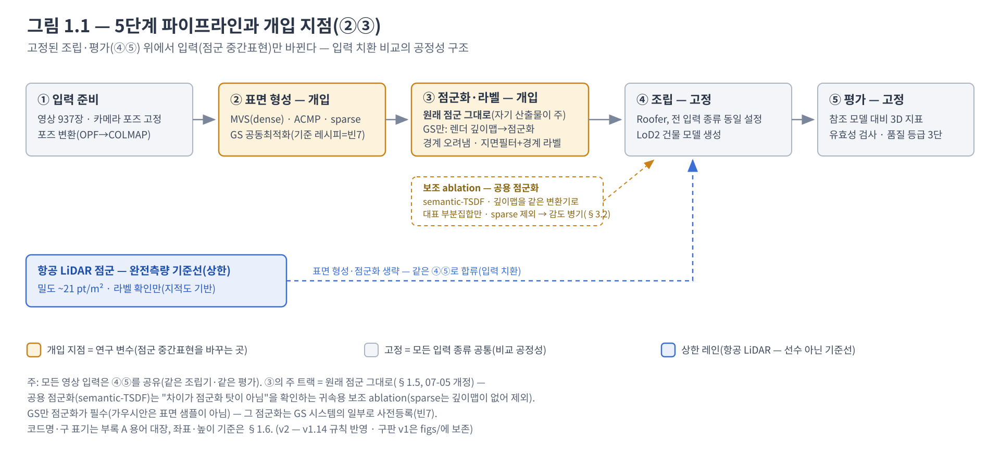
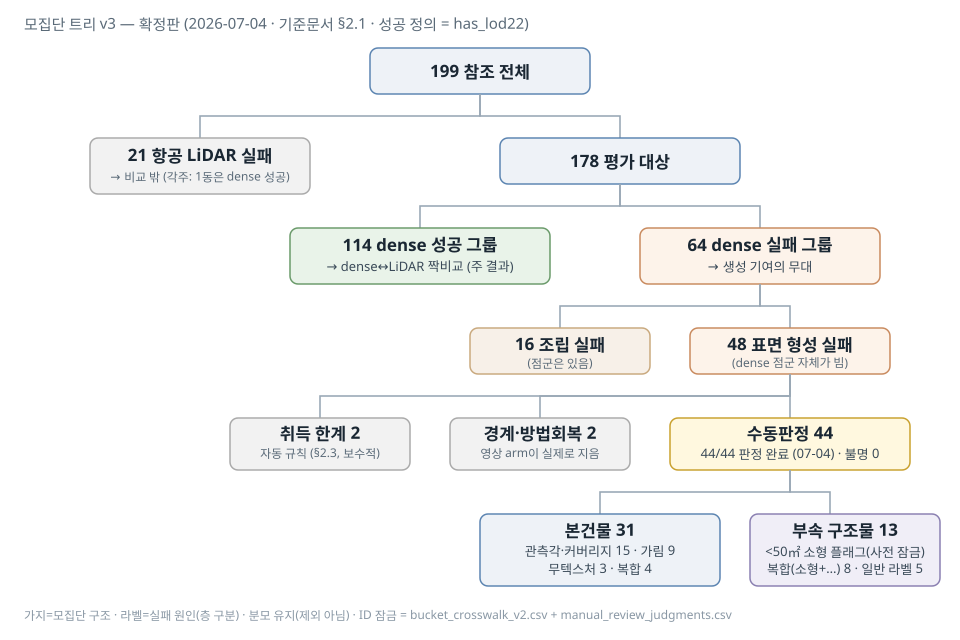
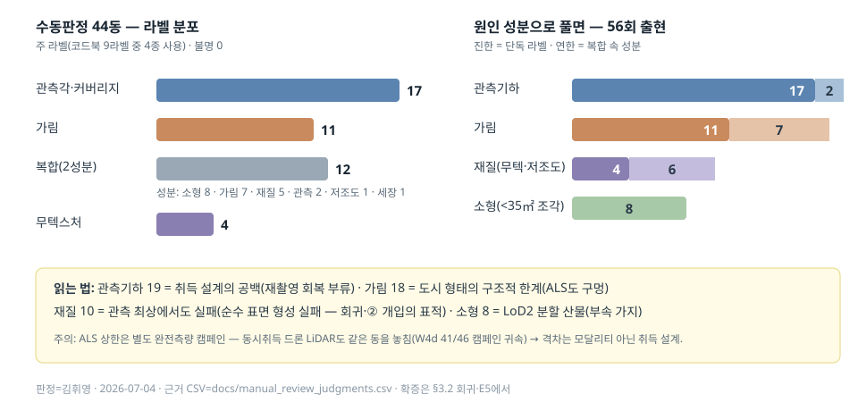

# 기준 문서 — 방법론 · 모집단 · 비교설계 v1.25 (2026-07-06)

> - **성격**: 결과 주장 문서가 아니라, 모든 숫자가 딛고 설 바닥(정의·분모·규약)을 잠그는 문서.
> - **독자**: 김휘영 + 에이전트(새 세션 부트스트랩). 논문 Ch3·Ch4의 재료.
> - **정본 규약**: 이 문서와 충돌하는 서술은 이 문서가 이긴다. 판정은 항상 김휘영.
> - **표현 원칙(1순위)**: 본문·그림은 쉬운 말. 코드명·약어는 괄호 한 번 + 부록 A 대장.
> - **빈칸 규약**: `⟦대기: 소스⟧` = 산출물 도착 후 채우는 자리. 아래 대장이 트래커.
> - **행동 트래커**: 작업 순서·상태는 `다음계획_트래커_20260703.md` — 빈칸 대장(내용)과 1:1 연동.

## 이 문서를 읽는 법 (안내도)

**의도: 방법 개입(②③)의 효과를 주장하기 전에, 그 주장이 딛고 설 바닥 세 가지를 잠근다 — ①비교가 공정한가(방법론) ②누구를 세는가(모집단) ③무엇으로 판단하는가(비교설계).**

| 부 | 답하는 질문 | 핵심 산출 | 상태 |
|---|---|---|---|
| 1부 방법론 | 결과 차이를 ②③(표면 형성·점군화)의 공으로 귀속해도 되는가 | 단계×입력 종류 격자 · 점군화 규칙(주=원래 점군, §1.5 v1.13) · 높이 기준(ζ=45.7) | 잠금(§1.5만 07-05 개정) |
| 2부 모집단 | 어떤 건물을 세고, 실패는 왜였나 | 트리 199→…→44(라벨 완비) · §2.6 해석 재료 | **확정(07-04)** |
| 3부 비교설계 | 무엇을 재서 어떻게 검정하나 | 속성 5축 · 속성→결과 회귀 · 층화 렌즈 | **회귀 완주·판정=부분 지지·정량+정성 쌍 완결(07-06)** — 남은 것: 절차서 승격((c) 기준) |
| 4부 방법 설계 | 어떤 레시피로 개선을 시험하나 | 기준 레시피(D4)·파일럿 게이트 · ablation 순서 | **확정(07-06 — 사전등록서 잠금)** |

- 연결 사슬: **1.3(왜 중요) → 3.1(어떻게 잼) → 3.2(정말 중요한지 검증)** — 같은 다섯 행. 2부의 라벨 확정본 = 3.2의 층화 재료.

## 빈칸 대장 — 열린 것 0건, 전부 닫힘 (07-06 #8 사전등록서로 마감)

정본 상세 = `사전등록서_본비교실험E5·기준레시피_v1_20260706.md`(판정 7건 완료·잠금).

**닫힌 빈칸** (값만 요약 — 상세는 해당 절):

| 빈칸 | 확정값 | 위치 |
|---|---|---|
| 빈1 | 카메라 높이 = 타원체고, ζ = 45.7 | §1.6 |
| 빈2 | 공용 점군화 = semantic-TSDF(최소관측 3·복셀 0.05 m) + Roofer(eps 0.3·minpts 15·complexity 0.888). 역할은 v1.13에서 주→보조 ablation로 | §1.5 |
| 빈3 | 트리 하층 2·2·44 잠금 + 수동판정 라벨 44/44 완료 | §2.1–2.2 |
| 빈4 | 관측 임계 0.124 / 38.92 / 1.461 | §2.3 |
| 빈5 | 회귀 통제 변수 = population_aux_v4 (199동) | §3.2 |
| 빈6 | lowtex-v5는 참고로 강등 — 층화는 수동판정 라벨 사용 | §3.3 |
| 빈8 | ⓐ 레시피 명칭 = 성분 문자열 · ⓑ 과거 raw 입력 = 원래 점군(주 트랙과 일치) · ⓒ ③′ 라벨 미통일 → read-out 필드 필수 | §1.2·§1.5 |
| 빈7 | 기준 레시피 = GS(D4; …; gssem) + 파일럿 게이트 2단 — 사전등록서 §3 | 4부·§1.5 |
| 빈9 | 씨드 경로 −556 → **−558.3**(신규 canonical부터·과거 런 보존) — 사전등록서 §8 | §1.6 |

---

# 1부 — 방법론

## 1.1 파이프라인 개관



(그림 v2 — §1.5 개정·새 용어 반영, 07-05. 구판 v1은 figs/에 보존.)

**한 줄 요지: 조립·평가(④⑤)를 고정해 두고, 점군 중간표현을 만드는 ②③만 바꾼다 — 그래서 결과 차이는 ②③의 공으로 귀속된다.**

- ① 입력 준비 — 영상 937장 + 카메라 포즈 고정(OPF→COLMAP 변환).
- ② 표면 형성(개입) — MVS(dense) · ACMP · GS 공동최적화.
- ③ 점군화·라벨 — raw 입력(sparse·MVS·ACMP)은 **자기 산출물 그대로(원래 점군)**. GS만 렌더 깊이맵→점군화(사전등록 확정 07-06 — 사전등록서 §3.2).
  이후 공통: 건물 경계 오려냄 → 지면/건물 라벨. 공용 점군화는 보조 ablation(§1.5).
- ④ 조립(고정) — Roofer, 전 입력 종류 동일 설정.
- ⑤ 평가(고정) — 참조 모델 대비 3D 지표 · 유효성 검사 · 품질 등급 3단(§3.3).
- 상한 레인 — 항공 LiDAR(~21 pt/m²)는 ②③ 생략, 라벨 확인만 하고 같은 ④⑤로 합류.
- **현존 산출물(혼동 방지, 07-06)**: 기준선의 CityGML 모델(LoD2.2 CityJSON)은 **이미 존재한다** — P0에서 Roofer가 생성:
  항공 LiDAR·DIM 각 199동(정본 런 w2_1) + ACMP 64동. 이번 §3.2 회귀의 결과 변수가 바로 그 모델들의 성패다.
  **아직 없는 것 = 우리 방법(GS 공동최적화) 점군으로 만든 CityGML** — 빈7(기준 레시피) 확정 후 본 비교 실험(E5)에서 생성.

## 1.2 단계 × 입력 종류(arm) 격자

| 단계 | 항공 LiDAR(상한) | raw-sparse | raw-dense(MVS) | raw-acmp | GS-sparse/dense/acmp |
|---|---|---|---|---|---|
| ① 입력 | 바이에른 LAZ | 영상 937+포즈 고정(공통) | 〃 | 〃 | 〃 |
| ② 표면 형성 | — (측량 그대로) | COLMAP 삼각측량 점 | MVS densify | ACMP | GS 공동최적화(씨드=각 좌열) |
| ③ 점군화 | — | **원래 점군 그대로**† | **원래 점군 그대로** | **원래 점군 그대로** | 렌더 깊이맵→점군화(GS 시스템 일부 — 확정 07-06) |
| ③′ 경계·라벨 | 기존 라벨(ALKIS) 검증 | 경계 오려냄+지면/건물 라벨(공통‡) | 〃 | 〃 | 〃 |
| ④ 조립 | Roofer 동일 설정(공통) — 입력 종류별 튜닝 금지 | 〃 | 〃 | 〃 | 〃 |
| ⑤ 평가 | 공통 프로토콜(§3) | 〃 | 〃 | 〃 | 〃 |

- † 세 raw 입력(sparse·dense·acmp)의 ③은 **모두 동일** — 각 방법이 자기 방식으로 뽑은 점군 그대로(원래 점군, §1.5). sparse만 깊이맵이 없어 보조 ablation(공용 점군화)에서 제외(사전 선언).
- ‡ **③′ 라벨의 구현**: 지면 = SMRF 지형 필터, 건물 = 건물 경계 안 비지면 점(P0 T4 검증 구현).
  **GS의 의미(semantic) 채널이 아니다** — 그건 ② 안의 학습 신호(레시피 성분)다. 라벨 채널은 arm별 자기 시스템으로 확정(raw=SMRF+경계 · GS=GS-의미 점군화) —
  모든 GS 수치에 점군화·라벨 방식(read-out) 명기 의무(빈8ⓒ 해소, 07-06 사전등록서 §3.2·§9).
- ‡ 공정성: 항공 LiDAR의 건물 라벨도 지적도(ALKIS) 윤곽 기반 → 영상 입력에 경계 기반 라벨은 같은 정보를 쓰는 공정한 처리(Roofer는 라벨 필수, 경계는 오려냄에만).
- GS 기준 레시피 **확정(07-06)** = GS(D4; seed-protect; pho1·sem0.1·nc0.05·dep0.03·nrm-off·str1[g2;na0.08;cp0.01;warm15k]; gssem) + 파일럿 게이트 2단 — 사전등록서 §3.

## 1.3 적합성 조건 — Roofer 직접 요구 vs 우리 가설

**한 줄 요지: 다섯 조건 중 둘은 Roofer가 요구하는 사실, 셋은 우리의 가설 — 가설은 §3.2 회귀로 검증한다.**
연결 사슬: **1.3(왜 중요) → 3.1(어떻게 잼) → 3.2(정말 중요한지 검증)** — 같은 다섯 행, 같은 순서.

**다섯 조건의 유래 — 왜·어떻게 이 다섯이 됐나(07-06 명시)**

- 원천 ①, **도구 요구**(밀도·라벨): 조립기(Roofer)가 사양으로 직접 요구하는 입력 조건 — 분류 점군(지면=2/건물=6) 필수,
  밀도 하한 논거는 Peters 2022. 우리가 고른 게 아니라 번역기(④)가 강제하는 전제.
- 원천 ②, **P0 관찰**(완전성·노이즈·부유점): P0 audit에서 실패·격차의 원인으로 **관찰된** 성분을 가설로 승격 —
  빈/구멍 점군의 생성 절벽(→완전성), survivor 품질 격차의 표면 거칢(→노이즈), 영상 점군의 공중 인공물(→부유점, 4907019 사례).
- 각 조건은 표준 문헌 지표에 앵커(Seitz·Pauly·Lague·GS floater 계열 — 아래 표)하고, 집합의 임의 추가·삭제는 금지 —
  변경은 §3.2 검증 결과를 근거로 사전등록서 변경 절차(§11)로만. **조건별 근거 관찰의 감사 추적 = 부록 D**(P0의 어떤 수치·그림이 각 가설을 낳았는지).

| 조건 | 근거 구분 | 측정 지표(레퍼런스) |
|---|---|---|
| 밀도 | **Roofer 직접 요구** | pt/m² (Peters, Roofer) |
| 라벨 정확도 | **Roofer 직접 요구** | 지면/건물 라벨 정확도 |
| 완전성·커버리지 | 우리 가설 | 구멍 비율, completeness (Seitz 2006) |
| 노이즈·거칢 | 우리 가설 | 평면 잔차(Pauly 2002), M3C2(Lague 2013) |
| 부유점 | 우리 가설 | 뜬 점 비율(GS floater 문헌) |

- 속성 추출(5축) = **attr-v1.2 수용(07-06)** — 프레임 수리·게이트 통과로 5축 완성(DIM·LiDAR 199 짝), §3.2 회귀 투입·완주.
- **사슬의 결말(07-06, §3.2 판정 = 부분 지지)**: 다섯 조건 중 관측 통제 후에도 살아남은 것 = **라벨(→조립) · 노이즈(→형상 적합)**.
  완전성은 회귀 밖의 절벽(빈 점군 48동 = 조립 실패 48/48), 부유점은 이 표본에서 무신호, 밀도는 지표 성질 각주(§3.2).
- 최종 집합 **확정 완료(07-06, 사전등록서 §7)**: 라벨·노이즈 = 지목 축 승격 · 완전성 = 문턱 조건 · 부유점 = 측정 유지·E5 재측정 ·
  밀도 = 측정 유지·가설 강등 · 추가·삭제 없음(부록 D 확정 열).

## 1.4 촬영 조건 (사실만)

- 2024-12-17 겨울 **단일일**, 3블록(09/10/11시대). 캡처 962 / 포즈 937.
- 고도: 이륙고 대비 중앙 43.3 m (p10 34.6 / p90 75.0) — 다고도.
- 카메라 기울기 **이봉**: 수직 근처 392장(≤20°) + 강한 기울기 296장(>45°) = 수직 격자 + 기울기 비행 혼합.
- **북서 블록 공백**: 지붕 바로 위 뷰 0인 69동 — 최근접 수직 카메라 4.4배 원거리(66.0 vs 14.9 m), 더 주변부.
  → "수직 뷰 0"은 건물 속성이 아니라 촬영 설계의 공백. 2부 취득 한계의 물리 서사.
- 센서 FULL_OPENCV 5280×3956, focal ~3717 px. (출처: `docs/flight_meta_summary.md`)

## 1.5 점군화 규칙 — 주 비교는 "각자 원래 방식 그대로" ⟦v1.13 개정, 07-05 판정⟧

**한 줄 요지: 각 방법이 자기 방식으로 뽑은 점군(원래 점군)을 그대로 Roofer에 넣는 것이 주 비교다.
공용 점군화(semantic-TSDF)는 "차이가 점군화 탓이 아님"을 확인하는 보조 ablation다.**

| 트랙 | Roofer에 넣는 것 | 지위 |
|---|---|---|
| **원래 점군** | raw 입력(sparse·MVS·ACMP): 자기 산출물 그대로. GS: 렌더 깊이맵→점군화(GS 시스템의 일부 — 사전등록 확정 07-06, 사전등록서 §3.2) | **주 비교** — P0 canonical과 같은 트랙 |
| 공용 점군화 | 깊이맵을 같은 semantic-TSDF로 점군화(최소관측 3·복셀 0.05 m = 구 빈2 확정값) | 보조 ablation — 대표 부분집합만. sparse 제외(깊이맵 없음) |

**왜 뒤집었나** — 구 규칙은 "주=공용 점군화"(②③ 성분 분리 목적)였다. 07-05 판정(김휘영)으로 역전, 이유 셋:

1. **기준선은 출고 상태 그대로가 분야 표준.** "영상 기반 점군"의 통념 = 각 방법의 자체 산출물. 시스템 대 시스템 비교가 관례(GS4Buildings 동일). 기준선을 우리 변환기에 통과시키면 "기준선 변조" 공격 지점이 된다.
2. **공용 점군화는 중립이 아니다.** 각 방법의 자체 융합은 자기 깊이맵에 맞게 다듬어진 것. 공용화는 한 교란(③ 상이)을 없애는 대신 다른 교란(기준선 약화 — 우리에게 유리한 방향)을 들여온다.
3. **우리 delta는 성분이 아니라 시스템.** "GS 깊이 > MVS 깊이"는 주장하지 않는다(관련연구 v1: 무텍스처 깊이는 backend 무관 한계). 주장은 공동최적화+prior 통합이라는 시스템 수준.

**불변 규칙(측정)**: 점군 속성(§3.1)은 "그 실험에서 조립기가 실제 먹은 점군"을 잰다.

- 과거 raw 입력 런들도 원래 점군이었다(빈8ⓑ) — 개정과 실제 런 이력이 일치.
- 기타: 기준면=참조 모델(§2.4 부정합 목록 연동·로버스트) · 오라클 의미 라벨은 상한 명시.

## 1.6 좌표·높이 기준 — 높이 맞추기(datum tie)

**한 줄 요지: 카메라 높이 = 타원체고(실측 검증으로 정의), 변환 = 표준 절차(해발 DHHN2016 + 공식 지오이드 GCG2016), ζ = 45.7 — 높이 사가 종결(07-03, 김휘영 확정).**

| 데이터 | 수평 | 수직 기준(자) |
|---|---|---|
| 바이에른 ALS·참조 모델·경계 | 25832 | 해발(DHHN2016), 지반 ~514 m |
| 카메라 포즈(OPF) | 32632 | **무선언**(4326+숫자만) → 실측 검증으로 **타원체고** 정의(잔차 +0.06±0.05 = 허용 0.3의 1/5) |
| TUM 동시취득 ULS | 32632 | "above MSL" — 모델 미상(EGM96 관례 의심) |
| COLMAP/GS-LOCAL | 로컬 | 카메라 세계 −604 |
| P0 W2 투입 DIM classified LAZ(w2_1) | 25832 | **해발−0.174**(ALS 정렬 Z보정 — **타원체 아님**; 07-06 attr-v1.1 프레임 오인 사고로 확인·정본화) |

**왜 실측으로 정했나**

- 카메라 채널은 높이 기준 선언이 없고, 주변 선언은 서로 어긋난다(ULS 미상 · Photogrammetry LAZ는 EGM96).
- 그래서 측량 관행대로 검사점 대조(ALS = 조밀한 컨트롤 표면)로 묶었다. 선언이 있었어도 검사점 대조는 표준 QA다.
- 실제로 관례값 48.0은 실측 결과 2.24 m 오류였다.

**판정 근거 (요약 — 상세 경과는 이력 v1.4~v1.6)**

- 같은 표면 실측(지면 패치 36 + 지붕 24): Δ̂ = +0.060±0.050 → 유효 ζ = 45.7 (45.760은 QA 기록).
- 48.0 관례·LS 48.126은 기각(~2.3 m 과대). 어긋남의 지문이 갈랐다 — 48 계열은 오버레이 12뷰에서 각도 비례(2.43·tanθ)로
  일제히 이탈(상수 오차의 지문), 45.7 잔차는 요소별 제각각·±1 m 이내(참조 모델 공차의 지문).
- 측위는 RTK+SAPOS cm급 → "GPS 편차" 가설 기각. 게이트 이력: v1 철회 → v2 측정불능(매칭 σ~160px) → **v3 측량 방식 통과**.

**경로 규약 (코드가 쓰는 상수)**

- 이미지-투영 경로 = −604 + ζ̂ (설정 인자).
- 3D/씨드 경로 = −556(48 관행, ~2.3 m 과대) → **확정(07-06, 빈9 닫힘): 신규 canonical부터 −558.3**(= −604 + 45.7, 유효 ζ 정합 —
  구 검토 표기 −558.24는 QA 기록값 45.76 파생이라 폐기). 과거 런은 기록 보존(재해석 시 geoid flag 명기).
  연동 상수 한 세트 전환(라벨 shift_z·band geoid·raw 통일 포함)·영향권 런 목록 = 사전등록서 §8.

**오차 3층 (서술 규약 — 층을 섞지 말 것)**

1. ζ 잔여 ±0.05 m — 확정 층.
2. 참조 모델 일반화 공차 ±1 m급 + 처마 미모델 — 품질 등급·부정합 잎·로버스트로 관리.
3. 렌더 표현 — 그림 규약(부록 B)으로 관리.

**재발 방지 5칙**

1. 새 투영 코드는 높이 기준 인자 필수.
2. 게이트 통과 전에는 투영-파생 측정의 본계산 금지.
3. 산출물별 허용오차 명시 — 관측기하는 ζ±2 m면 충분, 픽셀 마스크는 서브미터.
4. **ζ̂는 블록 상수**(937장 단일 조정의 속성) — 새 촬영 블록·포즈 재조정·타 데이터셋은 재실측.
5. **재사용하는 점군·클립은 계산 전에 높이 이력(z_datum_history)부터 읽는다** — 파일마다 높이 자가 다르다(위 표). 실례: attr-v1.1의 45 m 프레임 오인(07-06).

---

# 2부 — 모집단 (상·하층 확정, 07-04 마감)

## 2.1 모집단 트리

**한 줄 요지: 상층은 3D 사실로 확정, 하층 숫자만 관측기하 재계산(A3a)과 수동판정을 기다린다.**
그림 = `docs/figs/기준문서_모집단트리_v3_확정_20260704.svg` (확정판 · 구 v2는 figs/에 보존).



```
199 참조 전체
├─ 21  항공 LiDAR 실패 → 비교 밖 (각주: 1동은 dense 성공)
└─ 178 평가 대상
    ├─ 114 dense 성공 그룹 → dense↔LiDAR 짝비교
    └─ 64  dense 실패 그룹 → 생성 기여의 무대
        ├─ 16 조립 실패
        └─ 48 표면 형성 실패
            ├─ 취득 한계   2 (확실 2·경계 0 — v4 잠금 07-03)
            ├─ 경계·방법회복 2 (v4 잠금 07-03)
            └─ 수동판정     44 (판정 완료 07-04 — 44/44, 불명 0)
                ├─ 본건물       31: 관측각·커버리지 15 · 가림 9 · 무텍스처 3 · 복합 4
                │   (복합 4 = 저조도+가림 / 세장+관측각 / 스침각+가림 / 재질+가림 각 1)
                └─ 부속 구조물  13 (<50㎡ 소형 플래그 = 사전 잠금 기준; 가지 분리 판정 07-04):
                    복합(소형+가림) 4 · 복합(소형+재질) 4 · 가림 2 · 관측각·커버리지 2 · 무텍스처 1
```

**읽는 규칙**

- 성공 정의 = has_lod22 하나. 품질 채점은 지어진 모든 모델에(짝비교만 114 전용).
- **가지와 라벨은 층이 다르다.** 가지(본건물/부속)는 모집단 구조이고, 기준은 사전 잠금된 소형 플래그(<50㎡)다. 라벨은 실패 원인이다.
  그래서 부속 13동 중 5동(34~49㎡)이 일반 라벨(가림·관측각·무텍스처)을 갖는 것은 모순이 아니다. 분모는 유지(제외 아님·전수 회계).
- 참조 부정합(§2.4)은 **품질 분모에서만 제외** — 이 트리는 생성 회계라 그대로 센다.

**숫자의 출처**

- **관측각·커버리지 17(수동) vs 취득 한계 2(자동)**: 자동 규칙(§2.3)은 두 지표 모두 "대조 p10 미만 + 최솟값 미만"을 요구하는 보수 규칙.
  그 그물을 빠져나간 동들을 판정 3원칙 ①(§2.2)로 수동 포착한 것이 17동이다. 합치면 관측기하 결손 = 19동(§2.6).
- **하층 재편 이력**: v4 재계산으로 15·6·27 → 2·2·44 잠금(07-03). 21후보 전원 + 신규 4동 전원 DIM 밀도 0·수직 뷰 0 재확인.
  기제 = 오염 투영 정정으로 대조군(114) 분포가 전체 하향(최솟값 31.8→1.461) → "대조군보다 확실히 나쁨"의 범위 축소.
  민감도: 의심 대조동(4959320·4907024) 제외해도 43~44로 동일.

**귀속 선언 (07-05 판정)**

- 이 트리는 **기준선 실험(원래 점군, P0 canonical)의 회계**다.
- 본 비교 실험(§1.5)은 같은 분모 199 위에 새 입력 종류(GS 등)의 성공/실패를 **겹쳐 셀 뿐**, 트리를 다시 만들지 않는다.
- 모든 부분집합 실험(예: 과거 "11동·8동 실험")은 이 트리의 **어느 가지에서 뽑았는지 명명·인용 의무** — "모집단 흔들림" 재발 방지 규칙.

## 2.2 서브클래스별 건물 ID 잠금 표

- **ID 잠금** = docs/bucket_crosswalk_v2.csv(상층) + docs/manual_review_judgments.csv(수동 44 — 동별 라벨·근거·플래그·판정자·날짜 완비, **07-04 마감**).
- **운용 도구**: 판정 키트 v4(4칸 카드+manifest, 수용 07-03) · 코드북 9라벨 · 자동 플래그 3종(소형<50㎡ 13동 / 세장 1동=눈 확인 병행 / 저증거 ALS<500점 10동=동일 우선+플래그).
- **판독 이력**: 카드 v3는 판독 실패로 v4로 대체. 구관찰(07-02)의 사진 근거는 오염 투영 크롭이라 무효 — 전면 재검·정정(예: 4907015 "백색 평지붕" → 실제 붉은 기와).
- **판정 논리 3원칙(07-04 잠금)** — 관측점수는 카메라-지붕 기하만 보고 **가림을 모른다**:
  ① 점수 바닥 + 재질 정상 = 관측각·커버리지 ② 점수 충분한데 실패 = 눈 확인(recessed 가림 / 스침각=경사뷰비율 / 재질) ③ 요인 병존·분리 불가 = 복합.
  근거 축: 가림 판정 11동 점수 40~86 vs 관측각 판정 17동 중 14동 0~12(스침각 예외 3동만 46~61).
- **링 신뢰성 검증(07-04)**: 4908162·170 의심 → 42364607 3중 교차검증(좌표 인접·상호 이웃 링·높이 정합) 통과. 경사지붕 링의 모양 이질감 = 수평 단면 드레이핑(부록 B 높이 시차의 실례) — 건물 오인 아님.
- 수치 각주: 4907199 DIMdens 10.67=버퍼 잔재(키트 클립 n=2) · 4908049 DIM 154점=전부 지면 높이 누출(길바닥 패턴).

## 2.3 기준-근거 표 (3겹 앵커: 문헌 > 제품·도구 사양 > 우리 데이터)

| 임계 | 값 | 앵커 층 | 근거 |
|---|---|---|---|
| 뷰쌍 시차각 | 10–60° | 문헌 | Schönberger |
| 입사각 | ≤60° | 문헌 | Soudarissanane |
| 지붕 높이 허용 | ≤1 m (0.3 m 보조) | 제품 사양 | LDBV LoD2 |
| 점군 라벨 요건 | 지면=2/건물=6 | 도구 사양 | Roofer |
| 관측 충분성 | reconstructability(Smith 2018식) | 문헌+데이터 | 정준값 없음 명시 |
| 취득 한계 규칙 | 입사각 조건 뷰 비율<대조 p10 AND 관측점수<대조 p10; 확실=관측점수<대조 최솟값 | 우리 데이터 | **v4 확정(07-03): 0.124/38.92/1.461** (v3 0.315/103.6/31.8 = 오염 투영 산출, 폐기) |
| 사실 거부권 | 어떤 영상 입력이든 지었으면 취득 한계 제외 | 원칙 | 프록시 분류·사실 거부권 |

- 텍스처는 임계 클래스가 아니라 **연속 공변량**. 무텍스처 라벨은 수동판정으로만.
- **각주(07-04) — 대조군 최솟값(1.461)의 정체**: 그 값을 제공한 4959320은 AOI 가장자리의 상위 1% 대형(4,782㎡).
  dense "성공"이라지만 nodata 94%·RMSE 8.6 m의 경계 사례(성공 정의 has_lod22의 한계 예시)이고, ALS 쪽은 지붕 51면 복잡도로 유효성 탈락.
  실물 확인으로 시간차는 아님. 관측점수 하한의 해석에 주의하되, 잠금 재론은 불필요(민감도: 제외해도 43~44).

## 2.4 참조 부정합 잎

- 시간차(철거·신축) **확정 0 · 후보 1 = 104586480**(07-06 판정, 김휘영): ALS 취득(2022-02/06) 시점엔 발자국 내부가 지면뿐(175점·77% 지면 라벨)
  ↔ UAV(2024-12)·LoD2 모델(creationDate 2025-04)엔 +17 m 구조물 — **ALS만 구시점(신축 후보)**. 기존 4동 실존 확인은 유지(creationDate=모델 빈티지).
- 형상 부정합 **확정 1 = 42364663**(곡면 홀↔평지붕 참조, LiDAR조차 RMS 8.3 m) · 유력 42364667 · 후보 7(양측 RMS>3 m).
- 처리: **품질 분모 제외(각주 공개) · 생성 분모 유지**.
- 시간차 후보(104586480)의 특수성: 참조·DIM은 같은(현재) 시점 편이라 참조 대비 채점은 유효하고, 오염되는 것은 **LiDAR(상한) 수치와 M3C2(대 LiDAR)** —
  회귀 로버스트 재추정에서는 전 입력 종류 일괄 제외(단순·보수적, 07-06).

## 2.5 옛 버킷 크로스워크

- `docs/bucket_crosswalk.csv`(v3) → v2 잠금(빈3 닫힘). 옛 이름은 크로스워크로만 인용.

## 2.6 숫자가 말하는 것 — 해석 재료 (Ch4 초안; 관찰 수준, 확증은 §3.2 회귀·E5에서)

**성분 집계** — 단독 라벨 + 복합 성분 출현(44동, 복합 12는 2성분씩 → 총 56회):

| 원인 성분 | 출현 | 구성 | 한 줄 성격 |
|---|---|---|---|
| 관측기하(관측각·스침각) | 19 | 단독 17 + 복합 2 | 촬영 설계의 공백(§1.4 북서 블록·스침각) — 건물 속성 아님 |
| 가림(도시 형태) | 18 | 단독 11 + 복합 7 | recessed 발코니·안마당 뒤채·고층에 낀 저층 띠 |
| 재질(무텍스처·재질·저조도) | 10 | 단독 4 + 복합 6 | 멤브레인·골판 금속·유리 천창·어두운 균일 기와 |
| 소형(<35㎡ 조각) | 8 | 복합 성분으로만 | LoD2 분할 산물(채광정 12㎡·창고 모서리 5.8㎡ 등) |



**네 서사(관찰)**:

1. **취득 설계 공백이 최대 축(19).** 수직 뷰 0·시차 짝 부재·전 뷰 스침 — 재촬영으로 회복 가능한 부류.
   8-way에서 LiDAR 36/36이 같은 동들을 전부 지은 것과 합치한다(취득 한계 서사).
   - **플랫폼 혼입 주의**: 그 LiDAR(바이에른 ALS)는 별도의 완전측량 캠페인이다. 동시취득 드론 LiDAR(ULS) 대조(W4d, 06-24)에서
     같은 드론 비행의 ULS도 no_points 46동 중 2동만 커버 — 격차의 주범은 센서가 아니라 **취득 캠페인 설계**(41/46 캠페인 귀속).
     서술 시 "ALS = 완전측량 기준선" 딱지 필수. "영상이라서 진다"로 쓰지 말 것.
2. **가림(18)은 도시 형태의 구조적 한계.** ALS조차 구멍 낸 동이 있다(4908157·42364607 등) — 항공 관측의 공통 한계이지 영상만의 결함이 아님.
   - 단 ACMP 회복 사례가 반복됨(방법 차이 각주) — 방법 개선 여지는 병기.
3. **재질(10)은 관측이 최상급이어도 실패.** 수직 뷰 보유 동들(8568391 골판, 4908167 점수 164)에서 발생 —
   "관측 탓"과 분리되는 순수 표면 형성 실패. §3.2 회귀의 표적이자 ② 개입(GS 계열)의 후보 무대. 단정 금지, E5 확증 필요.
   - **구현 의존 각주**: 재질 실패 중 3동(4908049·8568391·4908169)과 4906999는 독립 MVS(Pix4D dense)가 커버(W4d i-갈래 4동) —
     재질 민감도에는 backend 구현 의존 성분이 있다. 회귀 보고 시 보조 ablation(§1.5)과 함께 읽기.
4. **부속 구조물 13은 본건물과 다른 모집단.** 별도 가지 분리(분모 유지)로 본건물 서사의 희석을 방지. 부속의 실패는 크기+재질+가림의 복합.

- 사용처: ①·②는 Ch4 취득 한계 절, ③은 방법 기여 절의 동기 문단, ④는 모집단 정의 절. 라벨 확정본은 §3.2 회귀의 층화 변수로 즉시 사용 가능.

---

# 3부 — 점군 비교분석 설계 (사전등록)

## 3.1 속성 지표 표 (§1.3과 같은 다섯 행·순서)

| 속성 | 지표 | 레퍼런스 | 비고 |
|---|---|---|---|
| 밀도 | pt/m²(경계 클립) | Peters/Roofer | 즉시 가용(rf_pt_density) |
| 라벨 정확도 | 지면/건물 라벨 | Roofer | 경계 기반 공정(§1.2 ‡) |
| 완전성 | 구멍 비율·nodata_frac | Seitz 2006 | 즉시 가용(rf_nodata_frac) |
| 노이즈·거칢 | 평면 잔차 RMS·M3C2 | Pauly·Lague | 점군에서 산출 |
| 부유점 | 상공 뜬 점 비율 | GS floater | 점군에서 산출 |

- raw 점군 속성: **attr-v1.2 수용(07-06)** — 5축 완성(`docs/pointcloud_attributes_v1_2.csv`), §3.2 회귀 완주.
  GS 점군 속성은 같은 잣대·같은 스크립트로 측정 — 기준 레시피 확정 완료(07-06, 사전등록서 §4).
- **측정 사양(확정)**: 격자 0.5 m · 국소 평면 반경 0.75 m · M3C2 normal/proj 1.0/0.75 m · 부유점 여유 3 m(07-06) ·
  라벨 프록시 = 참조 지붕高−1 m 위의 지면 라벨 점, **분모 = frac_all 주지표·frac_ground 참고(07-06)** ·
  no_points 행 = 분석 단계에서 밀도 0·커버리지 0 재코딩, 노이즈·부유·라벨은 미정의 유지(07-05).

## 3.2 속성 → 결과 회귀 — 설계 · 판정 기준 · 결과

**질문 한 줄: 촬영 조건이 비슷한 건물끼리 비교해도, 점군이 좋은 건물이 조립도 잘 되는가?**
(그렇다면 "점군을 고치는 방법"의 존재 이유가 서고, 아니라면 결과는 촬영 조건의 몫이다.)

### 3.2a 설계 (사전등록)

- 결과 변수: 조립 성공(roofer_ok·roof_surfaces>0) · 유효성 통과 · rf_rmse_lod22 · rf_roof_planes(과분할).
- 설명 변수: §3.1 속성 5축.
- 통제 변수: 관측기하(입사·시차·수직 뷰수·관측점수 = aux_v4 ⟦빈5⟧) — "관측 탓"과 "점군 탓"의 분리.
- 보고: 건물 단위 · 층화별(§3.3) · 로버스트(부정합 제외 §2.4) · **감도: 원래 점군(주) vs 공용 점군화(보조 ablation) 병기(§1.5 v1.13)**.
- **측정 대상 불변 규칙**: 속성은 "그 실험에서 조립기가 실제 먹은 점군"을 잰다(§1.5) — 본 회귀의 주판 = 원래 점군(P0 canonical과 같은 트랙).
- **결과 변수 정본 런(07-06 판정)**: **w2_1**(`w2_1_roofer_default_20260612_152729`, ALS·DIM 각 199 전수) — run_2(93동 반복성 실험)는 감도 재추정 전용.
  근거: 커버 199 vs 93 · 정상 건물 조립 플립 0(유일 예외 42364663 = §2.4 형상 부정합 확정 건물) · 유효성 플립 5+5는 감도로 관리. 지문 표 = 회귀 발주문(20260706).
- **축 투입 규칙(07-06 판정)**: 속성 5축 전부 설명변수(사전 강등·임계 없음). 대신 보고 의무 — 축별 비영 비율 공개 ·
  영향점 진단(Cook's distance>4/n 목록+제외 재추정) · 로버스트↔일반 추정 부호 불일치 축은 "소수 사례 의존" 명시.

### 3.2b 판정 기준 — 두 갈래 사전등록 ⟦07-06 잠금(결과 미열람 상태에서 작성) · 표현은 쉬운 말로 재서술(기준 불변, 원문=v1.17 이력) · 판정=김휘영 · 사전등록서 §6으로 이관 완료(강등은 다이어트 잔무)⟧

- 이 회귀가 묻는 것: **촬영 조건이 비슷한 건물끼리 비교해도, 점군이 좋은 건물이 조립도 잘 되는가?**
- **갈래 A — "점군이 문제다"로 읽는 경우**: 촬영 조건을 감안한 뒤에도 다섯 속성 중 하나 이상이 결과를 일관되게 가른다.
  "일관되게"의 세 검사 — ① 우연으로 보기 어렵다(신뢰구간이 0을 안 걸침) ② 방향이 가설과 같다(§1.3 — 예: 라벨 오류가 많을수록 실패)
  ③ 검사 방식을 바꿔도 남는다(다른 실행의 결과로 / 다른 라벨 분모로 / 극단 건물을 빼고 다시 추정해도).
  → 그러면: 그 속성이 방법(GS)이 공략할 표적이 되고, #8 사전등록서와 #9 ablation 우선순위에 반영한다.
- **갈래 B — "촬영이 문제다"로 읽는 경우**: 촬영 조건을 감안하고 나면 어떤 속성도 세 검사를 통과하지 못한다 —
  점군 속성은 촬영 조건의 그림자였다는 뜻.
  → 그러면: 논거를 "점군 품질을 고친다"에서 "같은 촬영에서 정보를 더 뽑는다(prior 통합·공동최적화)"로 바꿔 서술한다
  (P2 관측가능성 프레임 접속). E5의 성공 기준(조립 결과가 좋아져야)은 갈래와 무관하게 그대로.
- **중간 — 결과 변수마다 다르게 나오면**: "지어지느냐"(조립)와 "얼마나 잘 지어지느냐"(품질)를 나눠 변수별로 서술한다
  (P0의 생성/품질 이원 교훈). 단정 금지, 확증은 E5.
- 함께 볼 것: 표본 수·결측·공선성(VIF). "검사 통과 못함 = 효과 없음"이 아니라 "이 표본으로는 안 보임"으로 쓴다.

### 3.2c 결과와 판정 — **부분 지지** (07-06 밤, 김휘영 · 3.2b의 '중간' 조항 적용)

아래 표가 사슬의 결산이다(1.3 왜 중요한가 → 3.1 어떻게 재나 → 3.2c 실제로 중요했나 — 같은 다섯 행·같은 순서).
정성 열의 그림은 전부 이 폴더 안에 있다(경로 링크).

| 속성 | 결과 — 촬영 조건을 감안해도 | 정량 근거 | 정성 근거 | 읽는 법 |
|---|---|---|---|---|
| 밀도 | 점이 많을수록 잔차가 **오히려 커졌다** | +0.299 (0.17..0.43) | — | 해로움의 증거가 아니다 — 이 잔차 지표는 "모델과 입력 점군 사이 거리"라서, 점이 많으면 어긋남도 더 많이 잡히는 성질 때문(각주) |
| 라벨 정확도 | 라벨 오류가 많은 건물일수록 **조립에 실패했다** | −1.01 (−1.58..−0.45) · 극단 제외·더미·다른 실행에서도 유지(93동 부분집합 1건만 표본 특성상 판별 불능) | [대비 쌍(라벨×조립)](docs/figs/attr_outcome_regression_v1/representative_buildings.png): 108247351(라벨 97백분위·11점·실패) ↔ 4908023(라벨 0·17,000점·성공) — 캡션에 계수 병기 | **지목 축(의미 채널 ③′)** — 지붕점이 지면으로 잘못 라벨되면 조립기가 지붕 증거를 잃는다 |
| 완전성 | 점군이 아예 비면 **예외 없이 실패했다** | 빈 점군 48동 = 조립 실패 **48/48**(속성값이 없어 회귀 모델 밖) | [실패 라벨 층화](docs/W_attr_outcome_regression.md): 실패 전 계층에서 커버리지 ~0 · P0 그림 1.1(`G1_package/`) | **1차 결정자** — "지어지느냐"의 문턱은 회귀 이전에 완전성이 정한다 |
| 노이즈 | 표면이 거친 점군일수록 **모델 적합이 나빴다** | +0.167 (0.07..0.26) · 여섯 검사 변형 전부 유지(0.157~0.397) · LiDAR에서도 같은 축이 가장 강함(+0.365) | [대비 쌍(노이즈×적합)](docs/figs/attr_outcome_regression_v1/representative_buildings.png): 4959320(RMS 90백분위·rf_rmse 8.58) ↔ 104583447(RMS 1백분위·0.05) · P0 그림 B(`G1_package/`) | **지목 축(기하 채널 ②)** — 입력이 거칠면 평면 적합부터 흔들린다 |
| 부유점 | 이 표본에서는 **결과를 가르지 못했다** | 전 사양에서 신뢰구간이 0을 포함 | ACMP 층화의 꼬리 사례만 | 무신호 ≠ 무해 — E5(GS)에서 재측정 유지(GS의 대표 병리 축이므로 자를 치워두면 안 됨) |

- 결과 변수 쪽 각주: 유효성 = 전 축 탈락(갈래 B) · 면수 = 유보(참조면수 대비 후 해석).
- 병기 사실: 밀도→rmse 양의 방향 역설 = 내부 적합 지표의 기계적 성질 · ACMP 로지스틱(n=26)은 완전 분리로 해석 제외.
- **지목 축 = 라벨(의미 채널, ③′)·노이즈(기하 채널, ②)** → 사전등록서(07-06 잠금)의 E5 가설·채널 귀속(§1·§5)과 #9 ablation 우선순위(4부 4.4)로 반영 완료. 확증은 E5.
- 근거 산출 = `docs/W_attr_outcome_regression.md`(커밋 regression-v1) + 계수·감도·영향점 CSV 3종.
- **정성 근거(07-06 밤 도착·수용 — regression-v1.1)**: 계수 숲(퇴화 계수 제외 명기 · CI 0-배제 = 채움 마커)과
  지목 축별 대비 쌍 2조가 **판정과 같은 방향을 보였다 — 판정 유지 확인**. 캡션에 대응 계수 병기(쌍 규칙 §3.4의 크로스링크 이행).
  경로 = `docs/figs/attr_outcome_regression_v1/`(교체 전 원본 *_old 보존). ACMP 완전 분리·LiDAR 라벨 준분리 딱지도 보고서에 반영.
  소소 관찰: 노이즈 쌍의 4959320은 §2.3 각주 건물(관측점수 하한 해석 주의)이지만 노이즈·적합 수치는 실측이라 대표 사용 유효.

## 3.3 층화 4렌즈 (겹침 허용)

- 복잡도 = 참조 지붕면수 3단(경계값은 분포 확인 후) · 크기 = 바닥 면적 · 텍스처 = 저텍스처 비율(유효 플래그만 ⟦빈6⟧) · 관측 = reconstructability.
- 5번째 렌즈 **채택 확정(07-06, 김휘영)**: **실패 원인 라벨**(§2.2 확정본, 44동) — **생성 무대 전용**(라벨은 실패 44동에만 존재,
  품질 무대 적용 불가 명시). 사전등록서 §2.3.
- 1층 주 결과 = 표준 연속 지표. 2층 해석 = **품질 등급 3단: ①유효(솔리드 성립) → ②높이(지붕 ≤1 m) → ③형상(면수·경사·방위)**.
  "LiDAR급" = 건물별 등급 일치율로 번역. (구 '사다리 G/A1/A2' — 2026-07-03 개명 확정, 부록 A)

## 3.4 측정 유효성 플래그 규약

- 원칙: **잴 수 없으면 없다고 기록한다.**
- lowtex_valid=none(유효 뷰 부재) · 참조 부정합 플래그 · 투영-파생 값의 버전 열 필수(v3=오염/v4=재계산).
- 분석 기본값 = 유효 플래그 필터 적용.
- **결과 보고 쌍 규칙(07-06)**: 모든 결과 항목은 **정량(수치·구간)과 정성(그림·사례)을 쌍으로** 제시한다 —
  정량만이면 무엇을 만들려는지 보이지 않고, 정성만이면 정확도를 알 수 없다.
  한쪽이 비면 ⟦대기⟧로 명시하고 채울 발주를 지정한다(실례: §3.2 검증 표의 정성 열). 발주문 완료 기준에도 쌍을 요구한다.

---

# 4부 — 방법 설계 (확정 07-06 — 정본 상세 = 사전등록서)

**정본 상세 = `사전등록서_본비교실험E5·기준레시피_v1_20260706.md`(판정 7건 완료·잠금). 여기는 요약과 포인터.**

## 4.1 레시피 대장

- 감사 원본 = `docs/recipe_registry.md`(07-03, 코드·versions 전수 대조) — 성분 문자열·해시·옛 이름 매핑·불일치 목록.
- 별명 규칙(07-06): 공식 별명은 **"기준 레시피" 하나**. 식별자 = 성분 문자열 + config/run/versions + ckpt sha256.
- 폐기 라벨(07-06): **D7·D8·v5** — 실체 확인 불가, 인용 금지(숫자는 config/run명 직접).
  D5a/b/c·B1은 변형 실험(ablation, 계열 아님), C2·D9·D11·D12는 진단·분석 자산명(새 학습 레시피 아님).

## 4.2 기준 레시피 (빈7 닫힘)

- **GS(D4; seed-protect; pho1·sem0.1·nc0.05·dep0.03·nrm-off·str1[g2;na0.08;cp0.01;warm15k]; gssem)** — 항별 근거·해시 = 사전등록서 §3.1.
- 점군화·라벨 방식(read-out) = **GS-의미 점군화(gssem)**: semantic-TSDF(최소관측 3·복셀 0.05 m) → GS 의미 분류 → Roofer 기본값 —
  GS 시스템의 일부로 사전등록(사전등록서 §3.2). **모든 GS 수치에 점군화·라벨 방식 명기 의무.**
- 실행 2단: **파일럿 게이트**(재현 2회·일반화 — 학습 무대 밖 소블록, 판정=김휘영) → 통과 후 199 전수 신규 canonical(사전등록서 §3.3).

## 4.3 본 비교 실험(E5) 스코프·성공 기준 (요약)

- GS 세 입력 종류 모두 주(씨앗 sparse·dense·acmp, 07-06 판정) + 기준선 보강 2건(raw-ACMP·raw-sparse 199 전수 조립) — 사전등록서 §2.
- 성공 기준(잠금): **조립 결과 자체의 개선** — 3축(생성·유효성·품질) + 완전성 관문,
  성공 = "생성·품질 중 한 축 이상 세 검사 통과 AND 나머지 축·유효성 비악화". 속성 개선은 설명 고리로만 — 사전등록서 §5·§6.

## 4.4 ablation 우선순위 (#9 사전등록 예정 — 지목 축 대응)

- ① 기하 채널(depth/normal — 노이즈 표적) → ② 의미 채널(의미-마스킹 TSDF·라벨 표적) → ③ cp/곡면(형상 적합 후속).
- 근거 = §3.2c 지목 축(라벨=의미·노이즈=기하). 관련연구 후보 메모(`관련연구_무텍스처prior_후보메모_20260705.md`)는 #9에서 심층.

## 4.5 씨드 상수 (빈9 닫힘)

- 신규 canonical부터 **−558.3**(= −604 + 45.7). 연동 상수 한 세트 전환·과거 런 영향 목록 = 사전등록서 §8.
  지오이드 사용처 전수표 = recipe_registry §5(§1.6과 이중 장부 금지 — 상수 정본은 §1.6).

---

# 부록

## 부록 A — 용어 대장 (쉬운 표현 ↔ 코드명)

| 쉬운 표현(본문 사용) | 코드명/구 표기 | 정의 |
|---|---|---|
| dense 성공/실패 그룹 | (구 "품질축/생성축" 폐기) | 참조 LoD2 생성 여부 이분(114/64) |
| 취득 한계 — **확실/경계** | 구 취득-A1/A2 | 관측기하 규칙 분류(§2.3) |
| 경계·방법회복 | — | 프록시는 취득 한계인데 영상 입력이 실제로 지은 동 |
| 수동판정 | — | 코드북 9라벨(§2.2), 44/44 완료(07-04), 판정=김휘영 |
| **본건물 / 부속 구조물** | 모집단 가지(§2.1) | 수동 44의 두 가지 — 부속=<50㎡ 소형 플래그 13동. 가지(구조)≠라벨(원인) |
| 무텍스처 / 저텍스처 비율 | textureless / lowtex | 라벨(수동판정) / 연속 공변량 |
| 참조 부정합 | — | 참조가 실물과 다름 — 품질 분모 제외·생성 유지 |
| 레시피 / **기준 레시피** | 코드명 D4 — **확정 07-06** | GS 학습 성분 문자열 / 공식 별명은 "기준 레시피" 하나(사전등록서 §3·§9) |
| **품질 등급 3단: 유효/높이/형상** | 구 사다리 G/A1/A2 | §3.3 |
| **공용 점군화** | 구 "공용 융합기"·TSDF 프로토콜·동일-융합기 트랙 | 깊이맵→점군 표준화 — v1.13에서 보조 ablation로 강등(§1.5) |
| **원래 점군** | 구 "직접-점 (감도) 트랙" | 각 방법이 자기 방식으로 뽑은 점군 그대로 — v1.13 주 트랙(§1.5) |
| **입력 종류** | arm | Roofer에 넣는 점군의 출처 구분(LiDAR/MVS/ACMP/GS…) |
| **본 비교 실험** | 구 "GS 캠페인" | GS 포함 전 방법을 같은 규칙(④⑤ 고정)으로 겨루는 방법 비교 실험(E5) |
| 지면/건물 라벨 | SMRF+경계 규칙 | §1.2 ‡ (GS semantic 아님) |
| 관측기하 / 관측점수 | aux / recon_score | 입사·시차·뷰수 / reconstructability |
| **관측각·커버리지** | 코드북 9라벨(07-04 신설) | 재질 정상인데 수직 뷰 부재·스침 각·나쁜 시차 기하로 지붕 관측 불성립 — 자동 취득한계 규칙 미포착분(§2.2) |
| **지목 축** | 회귀 생존 축(07-06) | §3.2c 세 검사(우연 아님·방향 일치·검사 바꿔도 남음)를 통과해 방법이 공략할 표적으로 지목된 속성 — 라벨(의미)·노이즈(기하) |
| **점군화·라벨 방식** | read-out | 점군을 어떤 변환·분류로 뽑았는지 — 모든 GS 수치 인용에 명기 의무(07-06 확정) |
| **GS-의미 점군화** | gssem — "gssem 정본" 구표현은 이 행으로 흡수(레시피 별명 아님) | 기준 레시피의 점군화·라벨 방식: semantic-TSDF(최소관측 3·복셀 0.05 m) → GS 의미 분류 |
| (폐기 라벨) | D7 · D8 · v5 | 실체 확인 불가(07-06 확정) — 인용 금지, 숫자 인용은 config/run명 직접 |

**개명 확정(2026-07-03, 김휘영)**: 사다리 G/A1/A2 → 품질 등급 "유효/높이/형상" · 취득 한계 A1/A2 → "취득-확실/취득-경계".
A1/A2 표기 충돌 해소. 이후 모든 산출물은 새 이름, 구 표기는 이 대장으로만.
**개명 확정(2026-07-05, 김휘영)**: arm → 입력 종류 · 직접-점 트랙 → 원래 점군 · 공용 융합기 → 공용 점군화 · GS 캠페인 → 본 비교 실험.
**개명 확정(2026-07-06, 김휘영)**: read-out → 점군화·라벨 방식 · gssem → GS-의미 점군화 — 본문·표·그림은 직관적 표현, 코드명은 괄호 한 번(판정 ⑦ 부속).

## 부록 B — 그림 규약

- 그림은 스스로 설명(문맥컷+화살표+색 규약, 칸별 수치 캡션). 라벨도 쉬운 말 1순위.
- **오버레이 합격은 인상이 아니라 오프셋 수치로.**
- 카드 4패널(문맥/지붕 클로즈업/DIM/LiDAR top-view) · 점군 거칢=면-거리 색칠(파랑 밀착↔빨강 이탈).
- 원근 사진 위 경계 오버레이는 높이 시차 주의(지붕 높이에서 투영).
- **판정 키트 v4 규약(07-03)**: 동당 4칸 — locator(대상=굵은 빨강 링·이웃=회색 링+ID, 지붕 높이 재투영) / 지붕 클로즈업(같은 뷰 tight crop) / DIM top-view / ALS top-view(색=높이). 사진 위 점 오버레이 없음 — 점 증거는 top-view로 분리(v3의 강기울기 산개 교훈). **top-view Z 색은 타원체고**(지반 ~560 m; 해발 ~514와 혼동 금지). ALS<500점 동은 마커 3배.
- **오버레이 렌더 규약(corner zoom 교훈)**: 강기울기 확대에는 가림 처리(안 보이는 뒷면 모서리 제거) 필수 ·
  판정 채널은 LiDAR 점(실측), LoD2 링은 공차 ±1 m 명기 · "봐야 할 에지"를 화살표로 지목.

## 부록 C — 교훈 체크리스트

1. 자(척도·투영)부터 검증 — 정답 아는 앵커로 측정 도구 먼저.
2. 그림은 스스로 설명.
3. 오버레이 합격은 오프셋 수치로.
4. 프록시는 분류, 사실은 거부권.
5. 용어 증식 금지 — 개명은 한 번, 대장 기록.
6. 진단→처방→검증 세 박자.
7. 좋은 질문 다섯: 어느 모집단·어느 레시피 숫자야? / 반대 증거는? / 지금 결정 안 하면 뭐가 막혀? / 논문 한 문장은? / 심사위원 첫 질문은?

## 부록 D — 적합성 조건 유래 대장 (P0 관찰 → 가설 → 검증 → 확정 상태)

**읽는 법**: §1.3의 다섯 조건이 각각 어디서 왔고, 어떤 관찰이 근거였고, 지금 어느 상태인지의 감사 추적.
**확정 완료(07-06)**: 검증(§3.2c) 결과를 근거로 사전등록서 §7에서 다섯 조건의 지위를 확정했다(아래 "확정" 열).
추가·삭제 없음 — §1.3에 사전 선언된 절차대로 마감.

| 조건 | 유래 | 근거 관찰 — 정량 | 근거 관찰 — 정성 | 검증 결과(§3.2c) | 확정 |
|---|---|---|---|---|---|
| 밀도 | 도구 요구 | Roofer 밀도 논거(Peters 2022 — 8 pt/m² 기준 최소 면적 논리; 본 ALS 실측 ~21) | — | 방향 역설 = 지표 성질 각주 | **측정 유지·가설 강등**(07-06) |
| 라벨 정확도 | 도구 요구 | Roofer 입력 사양: 지면=2/건물=6 분류 필수(없으면 실행 불가) — P0 T4가 검증한 구현 | — | **조립을 가른다(생존)** | **지목 축 승격 — 의미 채널**(07-06) |
| 완전성 | P0 관찰 | 표면 형성 실패 48동 전원 점군 빈/희박(밀도 0·수직 뷰 0 재확인 07-03) · 취득 귀속 41/46(W4d 동시취득 대조) · 이번 회귀 절벽 48/48 | P0 그림 1.1 — 무텍스처 동의 DIM 빈 점군 vs ALS 꽉 참(`G1_package/`) | **절벽(1차 결정자)** | **문턱 조건(1차 결정자)**(07-06) |
| 노이즈 | P0 관찰 | survivor 품질 격차: plane F1 −0.095 · 내부 Hausdorff 1.19× · 높이 NMAD 1.34×(P0 W3, `사전실험P0_결과보고_v7`) | P0 그림 B — 거리-색칠에서 ALS 얇은 파란 면 vs DIM 부풀어 붉은 구름(RMS ~2 vs ~12 cm, `G1_package/`) | **형상 적합을 가른다(생존)** | **지목 축 승격 — 기하 채널**(07-06) |
| 부유점 | P0 관찰 + GS 문헌 | 4907019: 입력 106점 중 부유 88.7%인데 유효 솔리드 성립(rf_rmse 31 m — 껍데기) · ACMP 부유 중앙 0.5%·꼬리 12%+(attr-v1.2) | 대표 패널 108247351(부유·라벨 최상위·조립 실패, `docs/figs/attr_outcome_regression_v1/`) | 이 표본 무신호(E5 재측정 유지) | **측정 유지·본 비교 실험 재측정**(07-06) |

- 원칙 리마인드: 조건 집합의 추가·삭제는 관찰(§2.6·이 대장)을 근거로, 사전등록 변경 절차(사전등록서 §11)로만 — 결과를 보고 몰래 빼거나 넣지 않는다.

---

## 문서 이력

- v1.25 (07-06 밤, #8 마감): **4부 확정 + 빈7·빈9 닫힘(빈칸 대장 열린 것 0건)** — 사전등록서
  `사전등록서_본비교실험E5·기준레시피_v1_20260706.md`(판정 7건, 김휘영) 연동: 기준 레시피 = GS(D4;…;gssem) + 파일럿 게이트 2단
  (§1.1·§1.2·§1.5·4부) · 씨드 상수 −558.3 확정(§1.6 — 구 −558.24 검토 표기는 QA 기록값 파생이라 폐기) · 본 비교 실험 스코프 =
  GS 세 입력 종류 모두 주 + 기준선 보강 2건 · 성공 기준 잠금(조립 결과 자체 개선, 3축+관문) · 적합성 조건 지위 확정(§1.3·부록 D 확정 열) ·
  라벨 렌즈 5번째 채택(§3.3, 생성 무대 전용) · 빈8ⓒ 해소(§1.2 — 라벨 채널 arm별 자기 시스템+명기 의무) ·
  부록 A 개명 2건(read-out→점군화·라벨 방식 · gssem→GS-의미 점군화)+폐기 라벨(D7·D8·v5) 등재 · 안내도 3부 stale 1곳 수리(정성 쌍 완결 반영).
- v1.24 (07-06 자정): **§3.2c 정성 근거 완결(regression-v1.1 수용)** — 계수 숲 재생성(퇴화 계수 제외·0-배제 채움 마커)과
  지목 축별 대비 쌍 2조(라벨×조립: 108247351↔4908023 / 노이즈×적합: 4959320↔104583447, 캡션에 계수 병기) 도착·검수 통과,
  **그림이 판정과 같은 방향 = 판정 유지 확인**. §3.2c 표의 ⟦대기⟧ 2칸을 실제 경로로 교체 — 검증 표의 정량+정성 쌍 완성(쌍 규칙 §3.4).
  ACMP 완전 분리·LiDAR 라벨 준분리 딱지 4곳 반영 확인. #7 완전 종결.
- v1.23 (07-06 밤): §1.1에 **현존 산출물 명시** — 기준선 CityGML(LoD2.2 CityJSON)은 P0에서 이미 생성됨(ALS·DIM 각 199 + ACMP 64),
  없는 것은 GS 점군의 CityGML(E5에서 생성) — "CityGML이 아직 없다"는 혼동 방지.
- v1.22 (07-06 밤, 표현·근거 점검 2차 — 김휘영 지시 3건): ① **부록 D 신설 — 적합성 조건 유래 대장**(조건별: 유래 2원 ·
  근거 관찰 정량/정성 · 검증 결과 · 확정 상태 — "다섯은 아직 후보 집합, 확정은 #8"을 명문화; P0의 어떤 수치·그림이
  각 가설을 낳았는지 감사 추적) ② **§3.2 소제목 재편**(3.2a 설계 / 3.2b 판정 기준 / 3.2c 결과와 판정 — 블록 나열 해소) +
  검증 표 쉬운 말 재서술("방향 역설"→"점이 많을수록 잔차가 오히려 커졌다: 지표 성질" 등) + 정성 열에 그림 경로 링크
  ③ 부록 A에 "지목 축" 등재. §1.3에 부록 D 참조.
- v1.21 (07-06 밤, 표현 점검 반영 — 김휘영 지시 4건): ① §1.3에 **다섯 조건의 유래** 명시(원천 2원: 도구 요구=밀도·라벨 /
  P0 관찰=완전성·노이즈·부유점 + 문헌 앵커 + 집합 변경은 #8에서만) ② §3.2 판정을 **검증 결과 표**로 재구성 —
  사슬(1.3→3.1→3.2)의 결산을 같은 다섯 행·같은 순서로, 정량·정성 근거 열 분리(정성 빈칸은 ⟦대기⟧ 공개)
  ③ §3.4에 **결과 보고 쌍 규칙** 신설(모든 결과 = 정량+정성 쌍, 빈쪽은 ⟦대기⟧+발주 지정, 발주문 완료 기준에도 요구)
  ④ 수리 쪽지 보강(계수 숲에 0-배제 마커 · 패널 캡션에 대응 계수 병기 = 쌍 규칙의 크로스링크).
- v1.20 (07-06 밤, 정합 점검): **#7 완주가 문서에 덜 반영된 stale 3곳 수리** — 안내도 3부 상태("A단계 발주"→"회귀 완주·부분 지지") ·
  §1.3 attr 상태("v1.2 수리 중"→"v1.2 수용·완주") + **사슬의 결말 신설**(1.3→3.1→3.2 연결 사슬을 판정 결과로 마감: 생존 축=라벨·노이즈,
  완전성=절벽, 부유점=무신호, "힘없는 조건" 확정은 #8) · §3.1 attr 상태 동기화 · §3.2에 **정성 근거 대기 항목 명시**(판정의 정성물이
  패널 1장뿐이었음을 공개하고 지목 축별 대비 쌍 그림을 수리 쪽지로 발주 — 수치만으로 결론 금지 원칙의 이행 장치).
- v1.19 (07-06 밤): **§3.2 회귀 판정 기록(김휘영) = 부분 지지** — 조립←라벨(A) · 형상 적합←노이즈(A, 6변형 생존·LiDAR 교차) ·
  유효성 불지지(B) · 면수 유보. 빈 점군 절벽 48/48 병기. 지목 축 = 라벨(의미)·노이즈(기하) → #8·E5·#9로.
- v1.18 (07-06 밤): §3.2 두 갈래 문안을 **쉬운 말로 재서술(기준·내용 불변, 원문=v1.17)** — 세 검사(우연 아님/방향 일치/검사 바꿔도 남음)와
  갈래별 다음 행동을 평문으로. 표현 원칙(부록 A 1순위) 적용.
- v1.17 (07-06 밤): **회귀 판정 문안 두 갈래 사전등록(§3.2)** — B단계 회귀 실행 중·결과 미열람 상태에서 잠금(P0 부분지지 교훈:
  판정 기준은 결과 전에). 갈래 A(지지: CI 0 배제+가설 방향+3중 감도 생존→지목 축을 E5·#9에 반영) / 갈래 B(불지지→서사 전환:
  관측 조건 지배·정보 추출 확대 정당화, E5 기준은 유지) / 부분 지지(결과 변수별 분리, 생성 vs 품질 이원). #8 사전등록서로 그대로 이관 예정.
- v1.16 (07-06 저녁): **A단계 판정 3건 반영** — §2.4 시간차 "확정 0·후보 1=104586480"(ALS 2022 구시점 신축 후보 · 특수성: 참조 대비 채점은
  유효, 오염은 LiDAR 수치·M3C2 · 로버스트는 전 입력 종류 일괄 제외) · §3.2 결과 변수 정본 런 = w2_1(199 전수, run_2=감도 —
  근거: 커버 199 vs 93·정상 건물 조립 플립 0) · §3.2 축 투입 규칙(5축 전부, 임계 스크리닝 폐기 — 대신 비영 비율 공개·영향점 진단·
  로버스트 부호 대조). B단계 실행 회신 = `원격회신_B단계실행_20260706.md`.
- v1.15 (07-06): **attr-v1.1 부분 수용 반영 + 높이 함정 정본화** — §1.3·§3.1 상태 갱신(부분 수용·v1.2 수리 중) · §1.6 높이 표에
  w2_1 DIM classified LAZ 행 추가(해발−0.174, ALS 정렬 — attr-v1.1이 타원체로 오인해 dense 채움 149행의 부유·라벨·M3C2가
  인공물이 된 사고의 재발 방지) · 재발 방지 5칙(재사용 점군은 높이 이력 먼저) · §3.1 측정 사양 확정 잠금(부유 3 m ·
  라벨 frac_all 주지표 · no_points 재코딩 — 07-05·06 판정) · 안내도 3부 상태 갱신(회귀 A단계 발주). 판정 대기 2건(결과 정본 런
  w2_1 vs run_2 · 104586480 연혁)은 A단계 산출 후 — 확정 시 §3.2(정본 런 지문)·§2.4(시간차 후보) 갱신 예약.
- v1.14 (07-05): **가독성 전면 정비(내용·수치 변경 없음)** — 닫힌 빈칸 한 줄 뭉치→표 7행 · §1.6을 소제목 5개(왜 실측/판정 근거/경로 규약/오차 3층/재발 방지 4칙)로 분해 ·
  §2.1을 "읽는 규칙/숫자의 출처/귀속 선언" 3묶음으로 재편 · §2.2 운용 기록 분리 · §2.6 네 서사의 각주를 들여쓰기 하위 항목으로 ·
  부록 C 번호 목록화 · 잔여 "arm" 표기 4곳→입력 종류/영상 입력. stale 정정 2건: §1.3·§3.1 attr-v1 상태 "수용 대기"→"조건부(07-05)·v1.1 대기".
  그림 1.1 v2 재생성(§1.5 개정·새 용어 반영 — 원래 점군이 ③ 주 경로, 공용 점군화는 점선 보조 상자·SVG 참조로 교체).
- v1.13 (07-05): **§1.5 점군화 규칙 뒤집기(사전등록 변경, 본 비교 실험 전 판정)** — 주 비교=각자 원래 방식 그대로(원래 점군, 시스템 대 시스템) ·
  공용 점군화(semantic-TSDF)=귀속용 보조 ablation로 강등. 근거 3: 출고 상태 기준선=분야 표준 / 공용화 비중립(기준선 약화 위험) /
  delta=시스템(성분 깊이 우위 주장 안 함). §1.1·§1.2·§3.2·안내도·빈2 항 연동 수정, "실제 먹은 점군을 재라" 불변 규칙 명문화.
  개명 4건(입력 종류·원래 점군·공용 점군화·본 비교 실험, 부록 A). §2.1 **귀속 선언** 추가(트리=기준선 실험 회계·부분집합 실험은 가지 명명 의무).
  배경: 기준문서 의도 점검(07-05) — §1.2 격자의 공용 융합기 등장과 "모집단 흔들림"이 혼동 사례로 지목됨.
  같은 날 가독성 정비: §1.5를 표(주/보조)+짧은 문단으로 재구조화 · §1.2 ③행 이름 통일("원래 점군 그대로" — 세 raw 입력 동일 명시).
- v1.12 (07-04): **정합 감사 반영** — ① 안내도 신설(의도·4부 로드맵) ② 그림 2장 신설(모집단 트리 v3 확정 SVG · 라벨/성분 SVG, §2.1·§2.6)
  ③ stale 정정 3건(§1.3·§3.1 attr-v1 도착 반영 · 부록 A "8라벨"→9라벨) ④ §2.1 각주 2건(자동 규칙↔관측각 17 관계 · 부정합=품질 분모만 제외)
  ⑤ §2.6에 **플랫폼 혼입 주의**(W4d: 동시취득 ULS도 2/46 — 격차는 캠페인 설계)와 **구현 의존 각주**(Pix4D 커버 4동) ⑥ §3.3 라벨 렌즈 후보(#8 확정) ⑦ §2.2 수치 정정(40~86·예외 3동 46~61).
- v1.11 (07-04): **가독성 정비(정의·숫자 변경 없음)** — 빈칸 대장을 "열린 2·닫힌 7"로 압축, §1.6 결론 우선 재구성(경과는 요약+이력 참조),
  §2.2 운용 기록 압축+판정 논리 3원칙 정리, **§2.6 신설 "숫자가 말하는 것"**(성분 집계 표+네 서사 = Ch4 해석 재료). v1.10 전문은 archive/기준문서_v1.10_아카이브_20260704.md.
- v1.10 (07-04): **2부 마감 — 수동판정 44/44 완료**(배치 3~8, 관측각 17·가림 11·무텍스처 4·복합 12·불명 0). §2.1 트리 하층 확정
  + **부속 구조물 가지 분리**(<50㎡ 플래그 13동, 판정 07-04). §2.2에 판정 논리 3원칙·링 교차검증 기록. 빈3 완료.
- v1.9 (07-04): **코드북 9라벨 신설(관측각·커버리지)** + 배치 1 판정 6/44 기록(관측각 3·가림 1·복합 2).
  구관찰 크롭 무효 확인(오염 투영이 v1 크롭 중심까지 틀음 — 예: 4907015 "백색 평지붕"→실제 붉은 기와). §2.3에 4959320 각주.
- v1.8 (07-03 밤): **판정 키트 v4 수용** — 결함 ①~⑥ 조치 확인(locator 80° 초과 0·이웃 링·마커 확대), §2.2 운용 확정·플래그 3종 등재,
  빨간 채널 정정(오검출 — v3 채널에 빨강 없음), 부록 B에 키트 규약·Z 타원체고 주의 추가. 수동판정 배치 1 재개.
- v1.7 (07-03 밤): **A3a·A3b·B 수용 세션** — 빈2·4·5·8 채움, 빈3 상층 잠금(2·2·44), 빈6 판정(lowtex-v5 참고 강등: 앵커 분리 실패).
  §2.1 트리 숫자 확정, §2.3 임계 v4 확정, §2.2 수동판정 운용 개편(판정 키트 v4 발주·자동 플래그·판정 CSV 뼈대).
  카드 v3 판독 실패 기록(발주문 = 원격프롬프트_판정키트v4_카드패치_20260703.md). 신규 판정 대기 2건(코드북 9라벨·초소형 가지).
  GS4Buildings 대비 각주 재료(선별 9클러스터·LoD2 prior 입력 — 전수 회계·실패 분류 없음 = 우리 공백 확인).
- v1.6 (07-03): **높이 사가 최종 종결** — 정성 확인(오버레이 12뷰) 통과 반영, ζ=45.7 최종 확정, A3a·A3b 해제.
  OPF 행 판독 결과 확정(무선언→실측 정의). 신설: 오차 3층 구분 규약(§1.6), 오버레이 렌더 규약(부록 B), 교훈 ⑧
  "어긋남의 지문"(부록 C). 행동 트래커 연동(`다음계획_트래커_20260703.md`).
- v1.5 (07-03): **높이 사가 종결(판정)** — 실측 검증(잔차 +0.06±0.05)으로 "카메라 높이 = 타원체고" 정의 채택,
  변환 = 표준 절차(공식 지오이드 GCG2016, ζ=45.7), 45.760은 QA 기록. 관례 48.0·LS 48.126 기각. 정성 확인(오버레이
  45.7 vs 48.126 병렬) 후 A3a·A3b 일괄 투입.
- v1.4 (07-03): **게이트 방식 전환(판정)** — 픽셀 매칭 게이트 폐지, §1.6을 "높이 맞추기(datum tie)" 절로 개편
  (①기준 표+RTK·해수면 선언 문서 증거 ②3D 벤치마크 실측 ③합격 기준). LS ζ̂은 참고로 강등, 코너 재측정은 예비.
  A3a·A3b = 게이트 v3 통과 후. 발주 = 원격프롬프트_게이트v3_높이맞추기_20260703.md.
- v1.3 (07-03): **가독성 개편(개조식·요지 문장)**. ③′ 라벨 구현 명시(SMRF+경계 규칙, GS semantic 아님 — 빈8ⓒ 신설).
  A1·A2 결과 반영: ζ̂=48.126±0.429(빈1 판정 대기), 게이트 v2=측정 불능(§1.6 이력), 빈칸 대장 상태 갱신.
- v1.2 (07-03): 개명 2건 확정(품질 등급 유효/높이/형상 · 취득-확실/경계). 게이트 진행 판정 반영.
- v1.1 (07-03): 표현 원칙 신설·그림 라벨 교체. §1.5 공용 융합기 근거+감도 트랙. §1.3↔3.1↔3.2 사슬. 부록 A 개편.
- v1 (07-03): 최초 작성 — 1부+부록, 2부 상층, 3부 틀, 빈칸 8개. §1.6·§3.4 신설.
